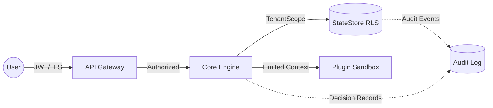

## 📋 Overview

Update the DVT Engine Threat Model to version 1.4 with comprehensive security enhancements aligned with Execution Semantics v1.9.

## 🎯 Objectives

1. **Add Security Invariants** - Testable security requirements (INV-01 through INV-10)
2. **Enhanced Trust Boundaries** - Visual Mermaid diagram with trust lines
3. **Plugin Security Model** - Trust Tiers (1-3) with permission matrix
4. **Compliance Updates** - SOC2, HIPAA, GDPR alignment
5. **Decision Records** - Mandatory justification for operator actions (v1.9)
6. **Supply Chain Security** - Cryptographic signing, SBOM, SLSA provenance

## 🔐 Key Security Invariants to Add

- **INV-01**: Tenant scope validation at every boundary
- **INV-02**: No plaintext secrets in plans, state, or logs
- **INV-03**: Append-only, tamper-evident audit log
- **INV-04**: Complete tenant isolation (no inference attacks)
- **INV-05**: Plugin permission allowlist with Trust Tiers
- **INV-06**: Engine determinism with explicit I/O boundaries
- **INV-07**: All authorization decisions audited
- **INV-08**: StateStore requires TenantScope parameter
- **INV-09**: Cryptographic signing for plugin bundles
- **INV-10**: Network egress restricted by allowlist

## 📊 Changes Summary

### New Sections

- ✅ Security Invariants (testable)
- ✅ Visual trust boundary diagram (Mermaid)
- ✅ Plugin Trust Tiers (1-3) with isolation levels
- ✅ Permission model matrix
- ✅ Supply chain controls (Sigstore, SLSA)
- ✅ PR Review Checklist for security changes

### Enhanced Sections

- ✅ StateStore boundary (RLS + TenantScope enforcement)
- ✅ Audit boundary (Decision Records v1.9)
- ✅ Compliance (HIPAA retention, GDPR erasure)
- ✅ Threat scenarios (updated for v1.9)

### Split Contracts (separate normative docs)

- `IAuthorization.v1.md`
- `AuditLog.v1.md`
- `ISecretsProvider.v1.md` (v1.9)
- `DecisionRecord.v1.md` (v1.9)

## 🎨 Visual Enhancements

## ✅ Acceptance Criteria

- [ ] THREAT_MODEL.md updated to v1.4
- [ ] Security invariants documented and testable
- [ ] Trust boundary diagram included
- [ ] Plugin Trust Tiers fully specified
- [ ] Compliance section updated (SOC2, HIPAA, GDPR)
- [ ] PR Review Checklist added
- [ ] All references updated
- [ ] No breaking changes to existing contracts

## 🔗 Related Contracts

- `ExecutionSemantics.v1.md` (v1.9 alignment)
- `IWorkflowEngine.v1.md`
- `IAuthorization.v1.md` (to be created)
- `AuditLog.v1.md` (to be created)

## 📅 Implementation Plan

1. **Phase 1**: Update THREAT_MODEL.md (this issue)
2. **Phase 2**: Create normative security contracts (separate issues)
3. **Phase 3**: Implement security tests for invariants
4. **Phase 4**: Add CI checks for security violations

## 🏷️ Labels

- `security` - Security-related changes
- `documentation` - Documentation updates
- `contracts` - Normative contract changes
- `enhancement` - New features/improvements

## 👥 Reviewers

- @dunay2 (architecture review required)
- Security team review recommended

## 📚 References

- HIPAA Security Rule: https://www.ecfr.gov/current/title-45/subtitle-A/subchapter-C/part-164
- GDPR Right to Erasure: https://ico.org.uk/for-organisations/uk-gdpr-guidance-and-resources/
- SLSA v1.2: https://slsa.dev/spec/v1.2/
- Sigstore: https://docs.sigstore.dev/

---

**Priority**: High  
**Milestone**: Phase 1 - Security Foundation  
**Estimated Effort**: 3-5 hours
