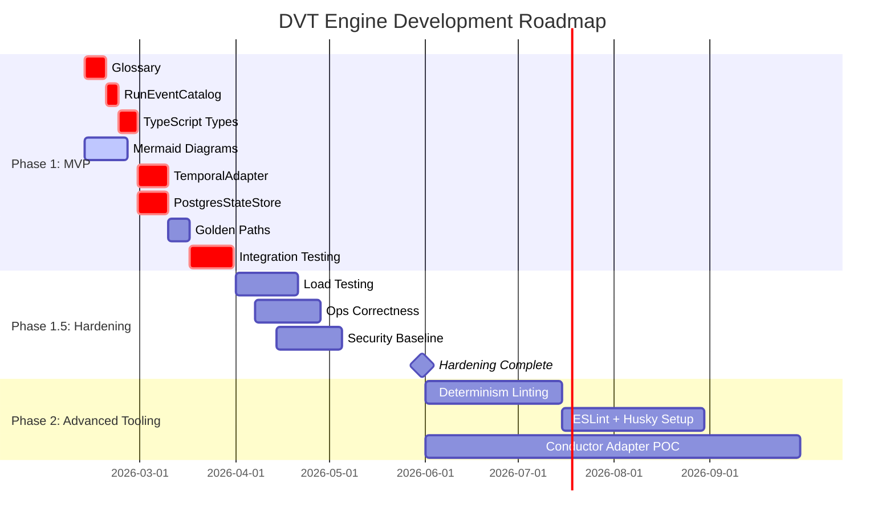

# DVT Engine - Roadmap

## Overview

Development of the **DVT Workflow Engine**, a deterministic workflow engine with support for distributed execution, robust state management, and advanced development tooling.

---

## 📅 Timeline



---

## 🎯 Phase 1: MVP (Due: 2026-03-31)

**Objective**: Implement core engine components with basic documentation for architecture validation.

### Issues

**Critical Path - Phase 1: MVP** (in order):

| #                                              | Title                                                          | Priority  | Status | Blocked By | Critical Path     |
| ---------------------------------------------- | -------------------------------------------------------------- | --------- | ------ | ---------- | ----------------- |
| [#8](https://github.com/dunay2/dvt/issues/8)   | GLOSSARY.v1.md normative contract                              | 🔴 High   | Open   | -          | ⚠️ **START HERE** |
| [#9](https://github.com/dunay2/dvt/issues/9)   | RunEventCatalog.v1.md event taxonomy                           | 🔴 High   | Open   | #8         | ⚠️ **CRITICAL**   |
| [#2](https://github.com/dunay2/dvt/issues/2)   | Implement TypeScript types                                     | 🔴 High   | Open   | #9         | ⚠️ **CRITICAL**   |
| [#14](https://github.com/dunay2/dvt/issues/14) | IWorkflowEngine + SnapshotProjector                            | 🔴 High   | Open   | #2, #9     | ⚠️ **CRITICAL**   |
| [#15](https://github.com/dunay2/dvt/issues/15) | Temporal Interpreter Workflow                                  | 🔴 High   | Open   | #14        | ⚠️ **CRITICAL**   |
| [#5](https://github.com/dunay2/dvt/issues/5)   | TemporalAdapter MVP                                            | 🔴 High   | Open   | #2, #15    | ⚠️ **CRITICAL**   |
| [#6](https://github.com/dunay2/dvt/issues/6)   | PostgresStateStoreAdapter MVP                                  | 🔴 High   | Open   | #2         | ⚠️ **CRITICAL**   |
| [#16](https://github.com/dunay2/dvt/issues/16) | Outbox delivery worker                                         | 🔴 High   | Open   | #6         | ⚠️ **CRITICAL**   |
| [#10](https://github.com/dunay2/dvt/issues/10) | Golden Paths examples                                          | 🔴 High   | Open   | #5, #6     | ⚠️ **CRITICAL**   |
| [#17](https://github.com/dunay2/dvt/issues/17) | CI contract testing pipeline                                   | 🔴 High   | Open   | #10        | ⚠️ **CRITICAL**   |
| [#3](https://github.com/dunay2/dvt/issues/3)   | Mermaid diagrams ExecutionSemantics                            | 🟡 Medium | Open   | -          | Parallel          |
| [#19](https://github.com/dunay2/dvt/issues/19) | Security documentation (Threat Model, Authorization, AuditLog) | 🔴 High   | Open   | -          | Parallel          |

**Why this order?** IDs + naming policies (Glossary) → event envelope fields (RunEventCatalog) → type definitions → engine core (IWorkflowEngine + Temporal Interpreter) → adapter implementations + outbox → contract test fixtures (Golden Paths) → CI validation. Security docs are parallel (design, not blocking implementation).

### Deliverables

- ⏳ **Glossary**: Canonical definitions for IDs, terminology, and naming policies (issue #8)
- ⏳ **Event Catalog**: Complete event taxonomy with state machine validation (issue #9)
- ⏳ **TypeScript Types**: Interfaces for normative contracts (EngineRunRef, ArtifactRef, ProjectorInput, StateStoreAdapter) (issue #2)
- ⏳ **IWorkflowEngine + SnapshotProjector**: Core engine orchestration and event sourcing (issue #14)
- ⏳ **Temporal Interpreter Workflow**: DAG walker and activity dispatch (issue #15)
- ⏳ **TemporalAdapter**: Integration with Temporal.io for distributed execution (issue #5)
- ⏳ **PostgresStateStoreAdapter**: Postgres implementation with transactions, outbox storage, and projections (issue #6)
- ⏳ **Outbox Delivery Worker**: At-least-once event delivery (adapter-agnostic interface, Postgres polling in outbox-semantics.md) (issue #16)
- ⏳ **Golden Paths**: Executable example plans for contract testing (issue #10)
- ⏳ **CI Contract Testing Pipeline**: GitHub Actions workflow for golden path validation (issue #17)
- ⏳ **Visual Documentation**: Sequence and state diagrams for critical flows (issue #3)
- ⏳ **Security Design**: Threat model, authorization contract, audit log schema for compliance (issue #19, design only)

### Success Criteria

**Compile & Type Safety**

- [ ] All types compile without errors (`tsc --noEmit`)
- [ ] Contract compile gate: `pnpm test:contracts` validates golden JSON fixtures against Zod/JSONSchema + versioned envelopes
- [ ] Zero TypeScript `any` types in contracts (strict mode)

**Golden Path Execution** (3 required plans)

- [ ] **Hello-world plan**: 3 steps linear → completes in < 30s
- [ ] **Pause/resume plan**: pause after step 1 → resume → completes → same final snapshot hash
- [ ] **Retry plan**: fail step 2 once → retry → completes → same snapshot hash as if step 2 succeeded first time

**StateStore Correctness**

- [ ] Projector rebuild: replay events from scratch → derived state hash matches live projection (idempotency proof)
- [ ] Outbox delivery: all events delivered at-least-once to EventBus (no lost events)
- [ ] Write latency p99 < 10ms (single-region, SSD, connection pool ≤50)

**CI & Documentation**

- [ ] CI passes (lint + type-check + unit tests + contract tests)
- [ ] Diagrams render correctly on GitHub
- [ ] Event catalog state machine validated against ExecutionSemantics (no illegal transitions)

### Risks

| Risk                           | Impact | Mitigation                                                                                          |
| ------------------------------ | ------ | --------------------------------------------------------------------------------------------------- |
| Ambiguous terminology          | Crit   | **START HERE**: Complete GLOSSARY (#8) before types (#2)                                            |
| Type design errors             | Crit   | Review against normative contracts + RunEventCatalog before implementing adapters                   |
| Engine core complexity         | High   | #14 blocks #15 (Temporal) and adapters - front-load design review                                   |
| Temporal.io learning curve     | High   | #15 isolated epic - start with simple DAG walker, add features incrementally                        |
| Integration testing crunch     | High   | **Only 2 weeks for integration** (Mar 17-31): front-load Golden Paths (#10), run weekly smoke tests |
| Database schema incompleteness | Medium | #6 StateStore must be complete before outbox worker (#16)                                           |
| Outbox delivery reliability    | Medium | #16 must guarantee at-least-once delivery - load test with chaos (Phase 1.5)                        |
| CI pipeline brittleness        | Medium | #17 contract tests must be deterministic - validate against golden hashes                           |
| Dependency chain breakage      | Medium | Enforce critical path: #8 → #9 → #2 → #14 → #15 → #5,#6 → #16 → #10 → #17 (block PRs out of order)  |

---

## 🛡️ Phase 1.5: Hardening (Due: 2026-05-31)

**Objective**: Load testing, operational correctness validation, and security baseline before multi-adapter complexity.

### Focus Areas

**Load Testing** (tooling: [k6](https://k6.io/docs/))

- **Target**: 500 events/sec sustained (4K runs/hour @ 8 steps/run, 2 events/step average)
- **Metrics**: State write latency p99 < 10ms, projection delay p99 < 1s, zero dropped events
- **Chaos**: StateStore failover, network partition, worker crash (recovery < 30s)
- **Environment**: 4-core instance, 16GB RAM, SSD, connection pool configured per adapter
- **Adapter-specific details**: See individual adapter documentation (adapters/postgres/load-testing.md, etc.)

**Operational Correctness**

- **Idempotency torture**: 1M duplicate events (out-of-order, retries) → zero state corruption
- **Projector rebuild**: State projector replays 100K events → consistent snapshot (timing per adapter: see adapters/postgres/projector-rebuild.md)
- **Backpressure**: projection delay > 5s → trigger BACKPRESSURE_ON signal (no circuit breaker, consumer-driven)

**Security Baseline**

- **Authn/z**: API boundary enforcement (even if RBAC stubbed)
- **Audit trail**: 90-day hot, 7-year cold (automated archival policy + verification)
- **PII scrubbing**: regex scan → zero credentials in logs (automated gate in CI)

### Success Criteria

- [ ] Load test: 500 events/sec sustained for 4 hours → latency p99 < 10ms, projection p99 < 1s
- [ ] Chaos: StateStore failover during load → recovery < 30s, zero data loss
- [ ] Idempotency: 1M duplicate events → zero state corruption (hash compare)
- [ ] Projector rebuild: 100K events → consistent snapshot (timing per adapter documentation)
- [ ] Backpressure: projection delay > 5s → BACKPRESSURE_ON signal emitted (consumable by external systems)
- [ ] Security: penetration test passed, PII scan clean (zero credentials in logs)
- [ ] Operational readiness: 3 game-days completed → MTTR p50 < 5 min
- [ ] Adapter performance: Meet timing targets for chosen adapter (see adapters/\*/load-testing.md)

---

## 🚀 Phase 2: Advanced Tooling (Due: 2026-09-30)

**Objective**: Add development tools to ensure determinism and code quality. Start Conductor adapter development.

### Issues

| #                                              | Title                        | Priority  | Status | Blocked By |
| ---------------------------------------------- | ---------------------------- | --------- | ------ | ---------- |
| [#4](https://github.com/dunay2/dvt/issues/4)   | Determinism linting rules    | 🔴 High   | Open   | -          |
| [#7](https://github.com/dunay2/dvt/issues/7)   | ESLint + Husky Phase 2       | 🟡 Medium | Open   | #4         |
| [#11](https://github.com/dunay2/dvt/issues/11) | Capability versioning policy | 🟡 Medium | Open   | -          |
| [#12](https://github.com/dunay2/dvt/issues/12) | SLOs and severity matrix     | 🟡 Medium | Open   | Phase 1.5  |

### Deliverables

- ⏳ **Linting Rules**: Custom ESLint rules to detect non-deterministic code (issue #4)
- ⏳ **Pre-commit Hooks**: Husky hooks to run lint + tests before commit (issue #7)
- ⏳ **CI/CD Integration**: GitHub Actions workflow with mandatory checks (issue #7)
- ⏳ **Capability Versioning**: Governance policy for adding/deprecating capabilities (issue #11)
- ⏳ **SLOs**: Per-subsystem SLOs and error budget policy (issue #12)
- ⏳ **Conductor Adapter POC**: Cross-adapter determinism parity validation (Phase 2)

### Success Criteria

- [ ] Linting rules detect non-deterministic patterns
- [ ] Husky blocks commits that fail linting
- [ ] GitHub Actions PR checks include determinism linting
- [ ] Documentation of rules in CONTRIBUTING.md
- [ ] Conductor adapter passes determinism parity test suite
- [ ] 10+ golden paths validated across Temporal and Conductor

### Dependencies

- **Blocked by Phase 1.5**: Needs hardened codebase before multi-adapter complexity

---

## 📊 Progress Metrics

### Phase 1: MVP

- **Progress**: 0/13 issues completed (0%)
- **Deadline**: 2026-03-31
- **Status**: 🟡 On track (7 weeks remaining)
- **Critical Path**: #8 → #9 → #2 → #14 → #15 → #5,#6 → #16 → #10 → #17 (enforce strict order)
- **Risk**: Integration testing window = 2 weeks only (Mar 17-31), now includes golden paths AND outbox worker
- **New issues**: #14-#17 implementation epics + #19 security docs (documentación y architecture-critical)

### Phase 1.5: Hardening

- **Progress**: 0/3 focus areas completed (0%)
- **Deadline**: 2026-05-31
- **Status**: 🟢 Scheduled after Phase 1

### Phase 1.5: Hardening

- **Progress**: 0/1 epic completed (0%)
- **Deadline**: 2026-05-31
- **Status**: 🟢 Scheduled after Phase 1
- **Epic**: Issue #18 (Load Testing + Chaos Suite) validates performance targets

### Phase 2: Advanced Tooling

- **Progress**: 0/4 issues completed (0%)
- **Deadline**: 2026-09-30
- **Status**: 🟢 Awaiting Phase 1.5

---

## 🔗 References

### Core Documentation

- [ExecutionSemantics.v1.md](docs/architecture/engine/contracts/engine/ExecutionSemantics.v1.md) - Execution semantics
- [IWorkflowEngine.v1.md](docs/architecture/engine/contracts/engine/IWorkflowEngine.v1.md) - Engine interface
- [State Store Contract](docs/architecture/engine/contracts/state-store/README.md) - StateStore contract
- [WORKFLOW_ENGINE.md](docs/WORKFLOW_ENGINE.md) - Overall architecture
- [engine-phases.md](docs/architecture/engine/roadmap/engine-phases.md) - Detailed phase breakdown with anchor decisions

### GitHub Project Management

- [📋 All Issues](https://github.com/dunay2/dvt/issues)
- [🎯 Phase 1 Milestone](https://github.com/dunay2/dvt/milestone/1)
- [🚀 Phase 2 Milestone](https://github.com/dunay2/dvt/milestone/2)
- [🏷️ Labels](https://github.com/dunay2/dvt/labels)

### External References

- [Temporal Platform Limits](https://docs.temporal.io/encyclopedia/temporal-platform-limits)
- [Conductor (Netflix/Orkes)](https://conductor.netflix.com/)
- [OpenTelemetry](https://opentelemetry.io/)
- [k6 Load Testing](https://k6.io/docs/)
- [Mermaid Gantt Syntax](https://mermaid.js.org/syntax/gantt.html)
- [Transactional Outbox Pattern](https://microservices.io/patterns/data/transactional-outbox.html)

---

## 🎯 Anchor Decisions

### Anchor Decision: Outbox Semantics (CORE - ADAPTER-AGNOSTIC)

**Decision Date**: 2026-02-11

**Core Principle**: Engine emits all external events via Outbox (no direct side effects). This is an **architectural invariant**, not an implementation detail.

**Delivery Model**: At-least-once (consumers must handle duplicates).

**Idempotency Key (Agnóstic)**:

```
idempotencyKey = tenantId + contractVersion + eventType + runId + stepId + attemptId
```

- **Consumer responsibility**: Deduplicate using idempotency key (e.g., upsert by key in consumer DB)
- **Replay safety**: Replaying events from outbox produces identical consumer state

**Backpressure Signal (Agnóstic)**:

- **Trigger condition**: Projection delay p99 > 5 seconds (or adapter-defined threshold)
- **Signal**: Engine emits `BACKPRESSURE_ON` (auditable, not circuit breaker)
- **Recovery**: When delay < 2 seconds, emit `BACKPRESSURE_OFF`
- **Consumer action**: Pause consuming OR reduce request rate (adapter-specific implementation)

**Consumer Contract**:

- Consumers receive events via EventBus (Kafka/RabbitMQ/etc. - adapter choice)
- **MUST** implement idempotent handling (upsert by idempotency_key)
- **MUST** tolerate duplicates, out-of-order delivery, and retries
- UI polling pattern: query StateStore latest-status index (not outbox directly)

**Outbox Storage Interface** (Abstract - Implemented by Adapter):

```typescript
// All outbox implementations must support:
interface IOutboxStorage {
  appendOutbox(event: OutboxEvent): Promise<void>;
  markDelivered(eventId: string): Promise<void>;
  pullUndelivered(limit: number): Promise<OutboxEvent[]>;
}
```

| Operation                | Guarantee                                     |
| ------------------------ | --------------------------------------------- |
| `appendOutbox(event)`    | Transactional with state change (consistency) |
| `markDelivered(eventId)` | Idempotent (can safely retry)                 |
| `pullUndelivered(limit)` | Consistent read (no duplicates within batch)  |

**Adapter Responsibility**:

- **PostgreSQL adapter**: DDL, indices, polling frequency (100ms), batch size (100 events), locks, etc.
  - See: [adapters/postgres/outbox-semantics.md](adapters/postgres/outbox-semantics.md)
- **Other adapters** (future): Each defines storage, polling, delivery semantics **within the above constraints**

**References**:

- [Transactional Outbox Pattern](https://microservices.io/patterns/data/transactional-outbox.html)
- [engine-phases.md Anchor Decision B](docs/architecture/engine/roadmap/engine-phases.md) - StateStore retention
- Product Definition: "StateStore is primary truth, engine executes via outbox"

---

## ✅ Completed Milestones

### 2026-02-11: Initial Planning Phase 1

- ✅ PR #1 merged: Document partition (9 files, split WORKFLOW_ENGINE.md)
- ✅ 13 issues created (#2-#13) with detailed specifications
- ✅ 11 labels created for organization
- ✅ 2 milestones created (Phase 1, Phase 2)
- ✅ Roadmap document published
- ✅ engine-phases.md updated with Phase 1.5 and anchor decisions

### 2026-02-11: Implementation Issues & GitHub Setup

- ✅ 5 implementation issues created (#14-#18):
  - #14: IWorkflowEngine + SnapshotProjector
  - #15: Temporal Interpreter Workflow
  - #16: Outbox delivery worker
  - #17: CI contract testing pipeline
  - #18: Phase 1.5 load testing + chaos suite
- ✅ 3 GitHub issue templates created (Feature request, Bug report, Contract proposal)
- ✅ 3 GitHub Actions workflows created (contracts.yml, lint.yml, determinism.yml)
- ✅ CODEOWNERS file configured (auto-assign reviewers by path)
- ✅ ROADMAP.md updated with all 18+ issues and progress metrics

### 2026-02-11: Security Architecture Documentation

- ✅ THREAT_MODEL.md created: 5 threat actors, 8 threat scenarios, 4 security boundaries, compliance requirements
- ✅ IAuthorization.v1.md created: normative contract for API boundary authorization (5 RBAC roles, 5 invariants)
- ✅ AuditLog.v1.md created: normative audit log schema (append-only, tamper-proof HMAC, 3-tier retention for SOC2/HIPAA/GDPR)
- ✅ Issue #19 created: Security documentation (design Phase 1, implementation Phase 3-4)

---

## 🤝 Contributing

To contribute to the project, check issues organized by milestone:

1. **CRITICAL PATH**: Work issues in **strict order**:
   - #8 (Glossary) → #9 (RunEventCatalog) → #2 (Types)
   - → #14 (IWorkflowEngine) → #15 (Temporal Interpreter)
   - → #5 (TemporalAdapter), #6 (StateStoreAdapter)
   - → #16 (Outbox worker) → #10 (Golden Paths) → #17 (CI pipeline)

2. **Parallel tracks** (don't block critical path):
   - #3 (Mermaid diagrams)
   - #13 (Security design)

3. **Review contracts first**: Read documentation in `docs/architecture/` before coding

4. **Anchor decisions**: Understand all three anchor decisions before implementing:
   - Anchor Decision A: Conductor Determinism Parity
   - Anchor Decision B: StateStore Indexing & Retention
   - Outbox Semantics (see above)

5. **Follow conventions**: Use appropriate labels, reference issues in PRs

6. **Validate against criteria**: Each issue has measurable acceptance criteria

7. **PR requirements**:
   - Branch name pattern: `type/issue-number-slug` (e.g., `feat/14-engine-core`)
   - Contracts compile (`tsc --noEmit`)
   - All tests pass (unit, integration, contract, determinism)
   - Golden path hash validation passes
   - CODEOWNERS auto-assign reviewers
8. **Contract tests**: All PRs must include golden JSON fixtures validated in CI

---

_Last updated: 2026-02-11_
