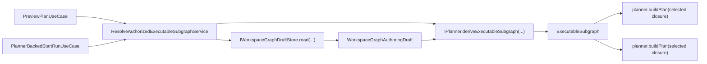
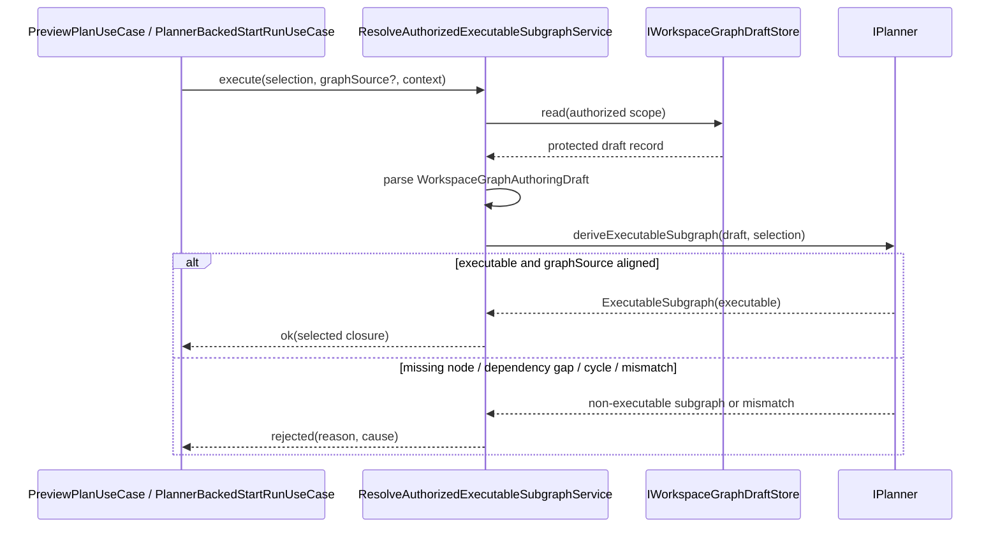
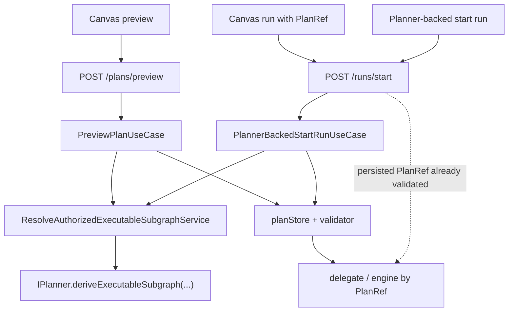

# Executable-subgraph resolution component

This local guide documents the `apps/api` application seam that resolves one
planner-owned `ExecutableSubgraph` from protected workspace-draft truth plus
canonical `ExecutionSelection`.

It exists to keep selected-closure derivation out of route handlers and to stop
preview/start-run from drifting back to whole-draft compile assumptions.

Use this together with:

- `apps/api/docs/start-run-application-component.md`
- `docs/architecture/components/planner/executable-subgraph-derivation-component.md`
- `docs/contracts/planner/execution-selection-and-executable-subgraph-v1.md`
- `apps/api/docs/workspace-graph-draft-application-component.md`

## Owned concern

The component owns exactly one concern:

- resolve planner-owned selected-closure truth from the protected
  workspace-graph draft under an already-authorized command scope

It does **not** own:

- HTTP request parsing or response mapping
- planner derivation rules themselves
- auth/authz policy derivation
- runtime admission after stored-plan validation
- editable draft persistence semantics beyond reading the protected record

## Public API

- `ResolveAuthorizedExecutableSubgraphService`
  Application service:
  `execute({ selection, graphSource? }, context)`
- `PreviewPlanUseCase`
  Uses the resolver before building a preview plan so preview compiles the
  selected closure only.
- `PlannerBackedStartRunUseCase`
  Uses the resolver before planner build so start-run compiles the selected
  closure only.

## Invariants

- `ResolveAuthorizedExecutableSubgraphService.ts` is the only module in this
  component allowed to import `WorkspaceGraphAuthoringDraftSchema` and
  `IWorkspaceGraphDraftStore`.
- `PreviewPlanUseCase.ts` and `PlannerBackedStartRunUseCase.ts` depend on the
  resolver service; they do not parse protected draft payloads directly.
- non-executable selections fail closed with canonical diagnostics; they do not
  widen silently to whole-draft compile.
- when `graphSource` is supplied, its node set must match the planner-derived
  selected closure exactly.
- unsupported protected draft schema versions and corrupt payloads remain
  explicit rejections, not fallback compile paths.
- planRef-backed start-run bypasses this resolver intentionally because preview
  has already persisted the selected closure into a validated stored plan.

## Component map

## Transitions

## End-to-end route role

The resolver is the protected seam for draft-backed selected execution. It is
not a second plan-runtime and it is not on the planRef-backed run path once a
preview has already persisted valid selected-closure proof.

## Consumers

- `apps/api/src/application/services/PreviewPlanUseCase.ts`
- `apps/api/src/application/services/PlannerBackedStartRunUseCase.ts`
- `apps/api/src/modules/startRun/buildProtectedStartRunRuntime.ts`
- `apps/api/src/app.ts`
- `apps/api/test/application/services/resolveAuthorizedExecutableSubgraph.test.ts`
- `apps/api/test/application/services/executableSubgraphResolutionComponent.architecture.test.ts`

## Focused file map

- `apps/api/src/application/services/resolveAuthorizedExecutableSubgraph.ts`
- `apps/api/src/application/services/PreviewPlanUseCase.ts`
- `apps/api/src/application/services/PlannerBackedStartRunUseCase.ts`
- `apps/api/src/modules/startRun/buildProtectedStartRunRuntime.ts`
- `apps/api/src/app.ts`

## Extension rules

- keep protected draft parsing in the resolver service
- keep planner-local closure semantics in `@dvt/planner`, not in `apps/api`
- add new rejection causes only when they stay explicit and fail closed
- do not introduce a second API-local selection DTO family
- do not widen selected execution to whole-draft compile as a convenience path
