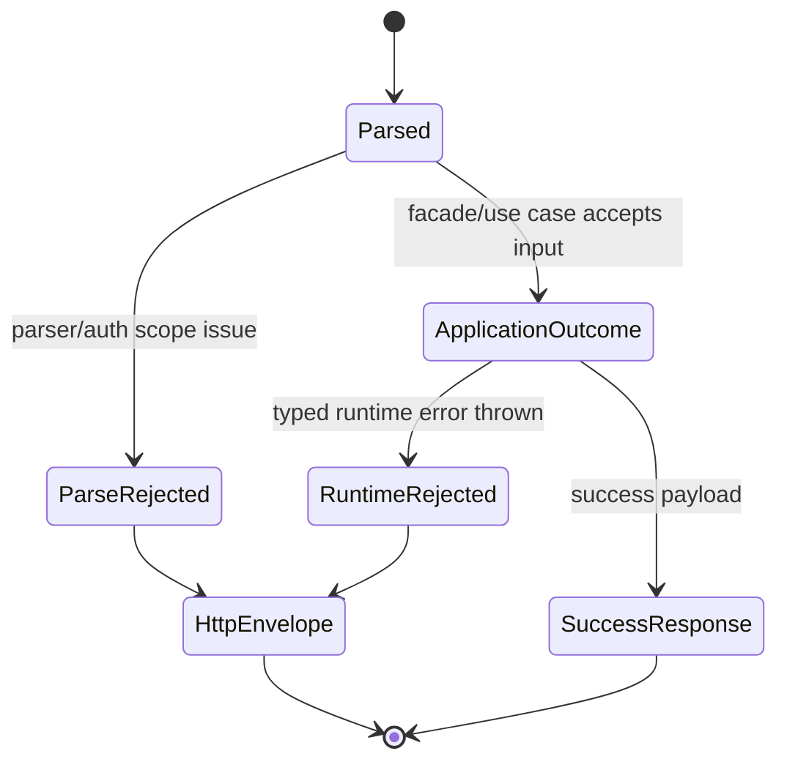
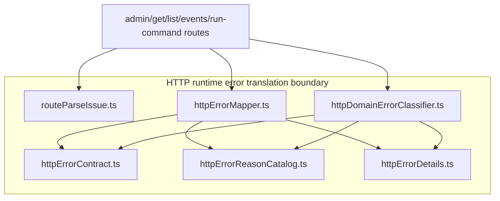
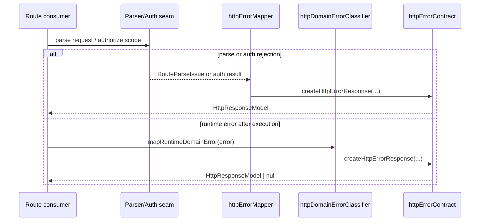

# HTTP runtime error translation component

This local guide documents the `apps/api` boundary that translates parse,
auth, facade, engine, and typed runtime failures into the canonical
`HttpErrorEnvelope.v1`.

This is a **local component guide**, not a second canonical contract. The
canonical caller-visible envelope remains
`docs/contracts/shared/HttpErrorEnvelope.v1.md`.

## Owned concern

The component owns exactly one concern:

- translate entrypoint-local semantic failures into stable `HttpResponseModel`
  values without leaking route-local formatting or runtime message parsing

It does **not** own:

- run lifecycle semantics
- planner semantics
- adapter execution semantics
- Fastify bootstrapping

## Public API

| Module                         | Public API                                                                                                                       | Purpose                                |
| ------------------------------ | -------------------------------------------------------------------------------------------------------------------------------- | -------------------------------------- |
| `httpErrorContract.ts`         | `HTTP_ERROR_TYPE`, `HTTP_HEADER`, `HttpResponseModel`, `createHttpErrorResponse`, `sendHttpResponse`, `normalizeHttpErrorReason` | canonical HTTP error primitives        |
| `httpErrorReasonCatalog.ts`    | `HTTP_ERROR_REASON`                                                                                                              | stable route-level reason catalog      |
| `routeParseIssue.ts`           | `RouteParseIssue`, `RouteParseResult`, `badRequestIssue`, `forbiddenIssue`, `badRequestResult`, `forbiddenResult`                | parser/auth semantic rejection model   |
| `httpErrorMapper.ts`           | `mapRouteParseIssue`, `mapStartRunFacadeResult`, `mapStartRunEngineError`, `mapAuthenticationFailure`, `mapAuthorizationFailure` | parse/auth/facade/engine translation   |
| `httpDomainErrorClassifier.ts` | `mapRuntimeDomainError`                                                                                                          | typed runtime-domain error translation |

## Invariants

- the only caller-visible error envelope is `HttpErrorEnvelope.v1`
- `error.type` decides the HTTP status; routes do not handcraft status codes for
  known semantic failures
- parser failures become `RouteParseIssue` values before serialization
- runtime-domain translation is typed and must not depend on `error.message`
  parsing
- route consumers import `mapRuntimeDomainError` from
  `httpDomainErrorClassifier.ts` directly
- `httpErrorMapper.ts` does not own runtime-domain classification
- optional `details` are omitted when empty

## Transitions

## Component map

## Sequence

## Consumers

- `adminRoutes.ts`
- `getRunRoute.ts`
- `getRunEventsRoute.ts`
- `listRunsRoute.ts`
- `runCommandRouteExecutor.ts`
- `authorizeExecutionScope.ts`
- `authorizeAdminExecutionScope.ts`
- `startRunRoute.ts`

## Focused file map

- `apps/api/src/entrypoints/http/httpErrorContract.ts`
- `apps/api/src/entrypoints/http/httpErrorReasonCatalog.ts`
- `apps/api/src/entrypoints/http/routeParseIssue.ts`
- `apps/api/src/entrypoints/http/httpErrorDetails.ts`
- `apps/api/src/entrypoints/http/httpErrorMapper.ts`
- `apps/api/src/entrypoints/http/httpDomainErrorClassifier.ts`
- `apps/api/test/entrypoints/http/httpErrorTranslation.test.ts`
- `apps/api/test/entrypoints/http/httpRuntimeErrorTranslation.architecture.test.ts`

## Consumers and boundaries

- route parsers and auth seams produce semantic failures
- the mapper serializes parse/auth/facade/engine outcomes
- the classifier serializes typed runtime-domain errors
- unknown runtime errors remain uncategorized and are rethrown to the outer
  error boundary

## Extension rules

- add new route-level static reasons in `HTTP_ERROR_REASON`
- add new parser rejections through `RouteParseIssue`, not ad hoc `{ status,
body }` objects
- add new typed runtime-domain branches only in `httpDomainErrorClassifier.ts`
- if a new helper is shared across mapper and classifier, prefer a dedicated
  helper module inside this component instead of duplicating the logic
