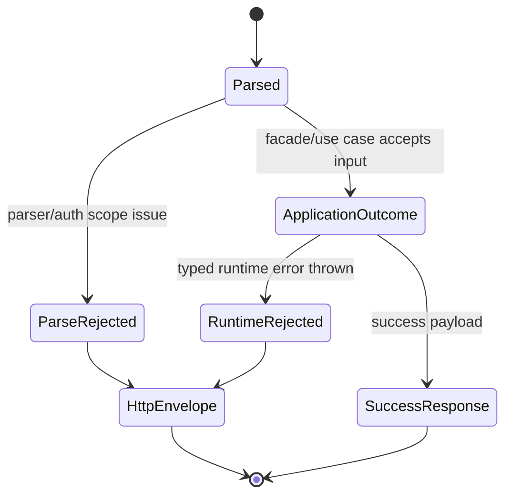
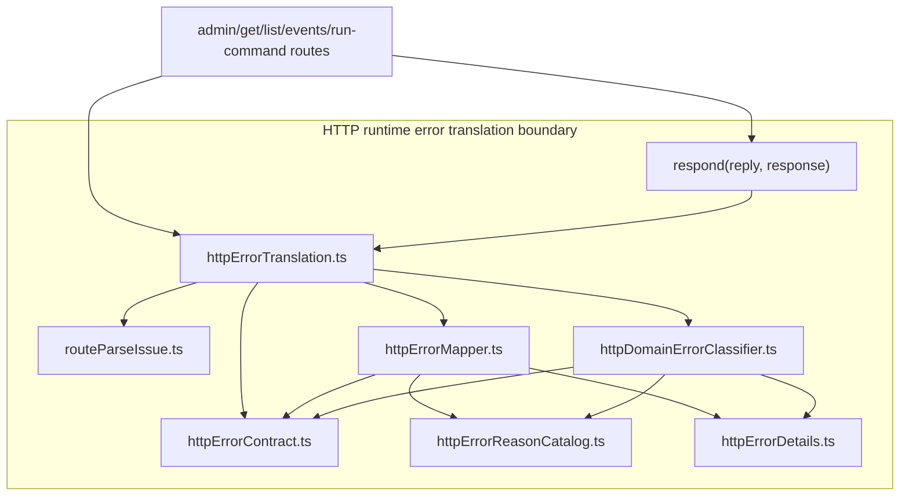
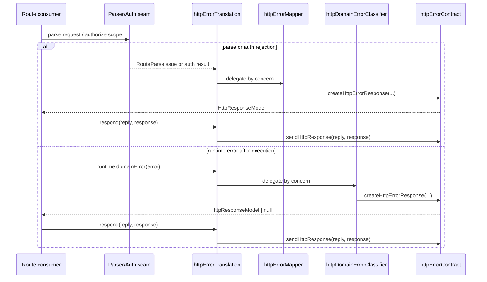

# HTTP runtime error translation component

This local guide documents the `apps/api` boundary that translates parse,
auth, facade, engine, and typed runtime failures into the canonical
`HttpErrorEnvelope.v1`.

This is a **local component guide**, not a second canonical contract. The
canonical caller-visible envelope remains
`docs/contracts/shared/HttpErrorEnvelope.v1.md`.

## Owned concern

The component owns exactly one concern:

- translate entrypoint-local semantic failures into stable `HttpResponseModel`
  values without leaking route-local formatting or runtime message parsing

It does **not** own:

- run lifecycle semantics
- planner semantics
- adapter execution semantics
- Fastify bootstrapping

## Public API

- `httpErrorTranslation.ts`
  Public production seam:
  `httpErrorTranslation.respond`,
  `httpErrorTranslation.admin.*`,
  `httpErrorTranslation.parse.issue`,
  `httpErrorTranslation.auth.*`,
  `httpErrorTranslation.startRun.*`,
  `httpErrorTranslation.workspaceGraphDraft.*`,
  `httpErrorTranslation.runtime.domainError`
- `httpErrorReasonCatalog.ts`
  Stable route-level reason catalog:
  `HTTP_ERROR_REASON`
- `routeParseIssue.ts`
  Parser/auth semantic rejection model:
  `RouteParseIssue`, `RouteParseResult`, `badRequestIssue`,
  `forbiddenIssue`, `badRequestResult`, `forbiddenResult`

## Internal collaborators

- `httpErrorContract.ts`
  Canonical HTTP error primitives and the owned transport serializer used
  behind the facade:
  `HTTP_ERROR_TYPE`, `HTTP_HEADER`, `HttpResponseModel`,
  `createHttpErrorResponse`, `sendHttpResponse`, `normalizeHttpErrorReason`

## Invariants

- the only caller-visible error envelope is `HttpErrorEnvelope.v1`
- `error.type` decides the HTTP status; routes do not handcraft status codes for
  known semantic failures
- parser failures become `RouteParseIssue` values before serialization
- runtime-domain translation is typed and must not depend on `error.message`
  parsing
- production consumers import `httpErrorTranslation.ts` instead of internal
  mapper/classifier modules
- production consumers do not import `createHttpErrorResponse(...)` directly for
  component-owned semantic envelopes
- `httpErrorMapper.ts` does not own runtime-domain classification
- translated `HttpResponseModel` values are emitted through
  `httpErrorTranslation.respond(...)`, which delegates to the owned transport
  serializer in `httpErrorContract.ts`
- optional `details` are omitted when empty

## Transitions

## Component map

## Sequence

## Consumers

- `adminRoutes.ts`
- `getRunRoute.ts`
- `getRunEventsRoute.ts`
- `listRunsRoute.ts`
- `runCommandRouteExecutor.ts`
- `authorizeExecutionScope.ts`
- `authorizeAdminExecutionScope.ts`
- `startRunRoute.ts`
- `workspaceGraphDraftRoutes.ts`

## Focused file map

- `apps/api/src/entrypoints/http/httpErrorContract.ts`
- `apps/api/src/entrypoints/http/httpErrorTranslation.ts`
- `apps/api/src/entrypoints/http/httpErrorReasonCatalog.ts`
- `apps/api/src/entrypoints/http/routeParseIssue.ts`
- `apps/api/src/entrypoints/http/httpErrorDetails.ts`
- `apps/api/src/entrypoints/http/httpErrorMapper.ts`
- `apps/api/src/entrypoints/http/httpDomainErrorClassifier.ts`
- `apps/api/test/entrypoints/http/httpErrorTranslation.test.ts`
- `apps/api/test/entrypoints/http/httpRuntimeErrorTranslation.architecture.test.ts`

## Consumers and boundaries

- route parsers and auth seams produce semantic failures
- `httpErrorTranslation.ts` is the public seam for production consumers,
  including response emission through `respond(...)` and feature-level static
  envelopes for admin and workspace graph draft flows
- the mapper serializes parse/auth/facade/engine outcomes behind that seam
- the classifier serializes typed runtime-domain errors behind that seam
- `sendHttpResponse` is the owned transport writer used by the facade, not the
  preferred production import
- unknown runtime errors remain uncategorized and are rethrown to the outer
  error boundary

## Extension rules

- add new production consumer imports through `httpErrorTranslation.ts`, not
  directly from mapper/classifier internals
- emit translated error responses through `httpErrorTranslation.respond(...)`,
  not through direct `sendHttpResponse` imports from route consumers
- emit component-owned static envelopes through named helpers on
  `httpErrorTranslation.ts`, not through direct `createHttpErrorResponse(...)`
  imports from route consumers
- add new route-level static reasons in `HTTP_ERROR_REASON`
- add new parser rejections through `RouteParseIssue`, not ad hoc `{ status,
body }` objects
- add new typed runtime-domain branches only in `httpDomainErrorClassifier.ts`
- if a new helper is shared across mapper and classifier, prefer a dedicated
  helper module inside this component instead of duplicating the logic
