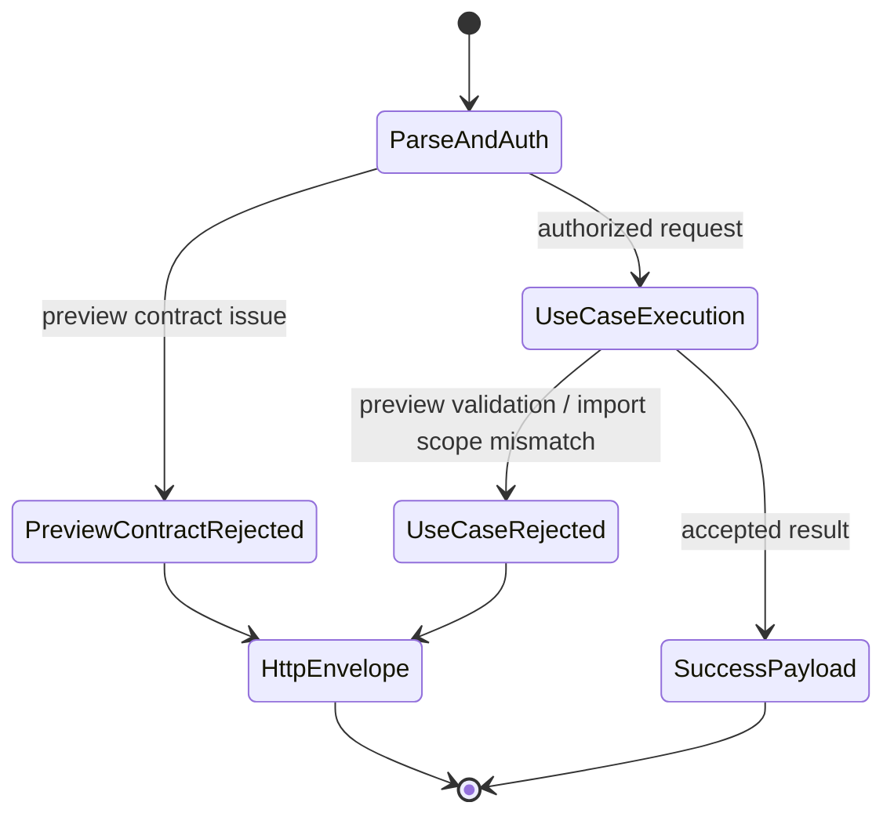
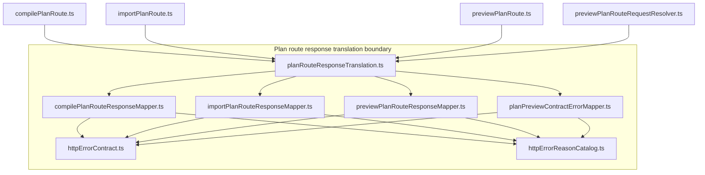
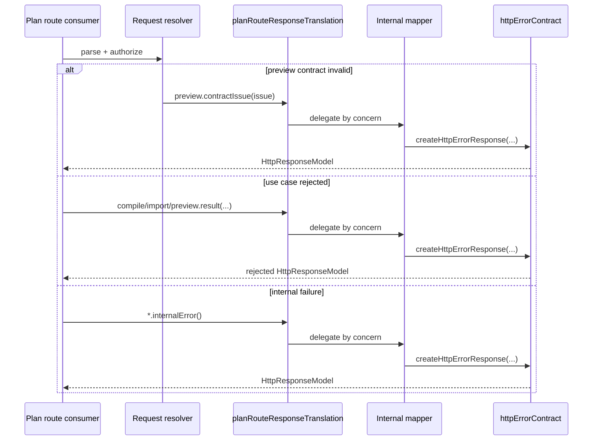

# Plan route response translation component

This local guide documents the `apps/api` boundary that translates
`preview/compile/import` plan-route failures into canonical `HttpResponseModel`
values before the shared plan-route executor writes the response.

This is a **local component guide**, not a second canonical contract. The
caller-visible error envelope remains
`docs/contracts/shared/HttpErrorEnvelope.v1.md`.

## Owned concern

The component owns exactly one concern:

- translate plan-route-specific validation, scope, and internal failures into
  stable `HttpResponseModel` values for preview, compile, and import flows

It does **not** own:

- runtime protected-route error translation
- generic HTTP envelope primitives
- planner semantics
- plan building or plan import execution

## Public API

- `planRouteResponseTranslation.ts`
  Public production seam:
  `planRouteResponseTranslation.compile.result`,
  `planRouteResponseTranslation.compile.internalError`,
  `planRouteResponseTranslation.import.result`,
  `planRouteResponseTranslation.import.internalError`,
  `planRouteResponseTranslation.preview.contractIssue`,
  `planRouteResponseTranslation.preview.result`,
  `planRouteResponseTranslation.preview.internalError`

## Internal collaborators

- `compilePlanRouteResponseMapper.ts`
  Internal compile result and internal-error mapping
- `importPlanRouteResponseMapper.ts`
  Internal import result and internal-error mapping
- `previewPlanRouteResponseMapper.ts`
  Internal preview use-case result and internal-error mapping
- `planPreviewContractErrorMapper.ts`
  Internal preview contract-issue mapping
- `httpErrorContract.ts`
  Primitive envelope builder used only behind the component internals
- `httpErrorReasonCatalog.ts`
  Stable reason catalog reused by the component

## Invariants

- production consumers import `planRouteResponseTranslation.ts` instead of the
  internal plan-route response mapper modules
- only internal mapper modules call `createHttpErrorResponse(...)` for
  component-owned plan-route failures
- the public facade does not import `createHttpErrorResponse(...)` directly
- preview contract validation becomes a semantic issue before serialization
- the component remains sibling to `httpErrorTranslation.ts`; it does not fold
  preview/compile/import flows into the runtime protected-route component

## Transitions

## Component map

## Sequence

## Consumers

- `compilePlanRoute.ts`
- `importPlanRoute.ts`
- `previewPlanRoute.ts`
- `previewPlanRouteRequestResolver.ts`

## Focused file map

- `apps/api/src/entrypoints/http/planRouteResponseTranslation.ts`
- `apps/api/src/entrypoints/http/compilePlanRouteResponseMapper.ts`
- `apps/api/src/entrypoints/http/importPlanRouteResponseMapper.ts`
- `apps/api/src/entrypoints/http/previewPlanRouteResponseMapper.ts`
- `apps/api/src/entrypoints/http/planPreviewContractErrorMapper.ts`
- `apps/api/test/entrypoints/http/planRouteResponseTranslation.test.ts`
- `apps/api/test/entrypoints/http/planRouteResponseTranslation.architecture.test.ts`

## Extension rules

- add new plan-route consumers through `planRouteResponseTranslation.ts`, not
  through direct imports of the internal mapper modules
- keep preview contract issue mapping separate from preview use-case result
  mapping
- if a new plan-route helper is shared by multiple internal mappers, extract a
  dedicated helper module inside this component instead of duplicating logic
- do not move plan-route mapping into `httpErrorTranslation.ts`; the runtime
  protected-route component and the plan-route component are siblings
