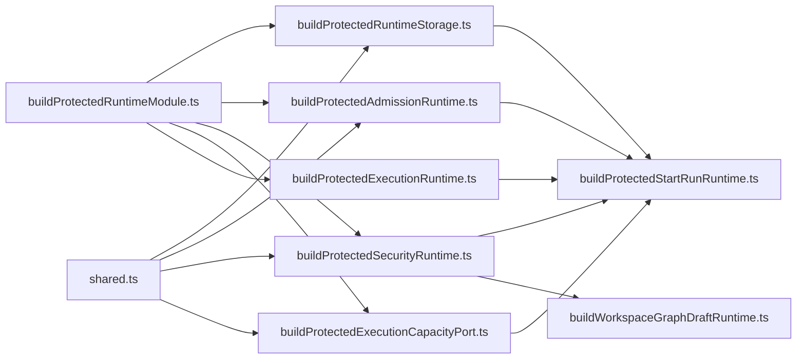
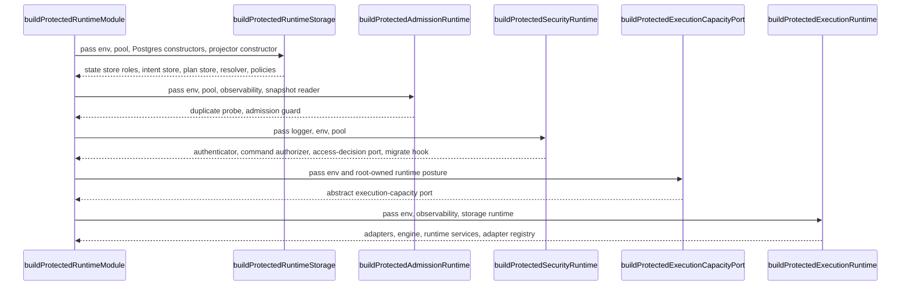

# Protected runtime dependency builders component

This local guide documents the `apps/api` subcomponent that assembles the
protected-runtime dependency clusters consumed by the outer composition root.

It does not own the outer root contract, start-run orchestration, workspace
graph draft composition, or compile-boundary policy. It owns only the builder
cluster that converts already-resolved infrastructure dependencies into named
runtime slices.

Read this together with:

- `docs/architecture/components/api/protected-runtime-and-plan-compile-component.md`
- `apps/api/docs/protected-security-access-decision-component.md`
- `apps/api/docs/start-run-runtime-composition-component.md`
- `apps/api/docs/workspace-graph-draft-runtime-composition-component.md`

## Owned concern

The component owns exactly one concern:

- assemble the protected-runtime dependency clusters for storage, admission,
  security, and execution from already-resolved root dependencies

It does **not** own:

- top-level protected module assembly
- start-run facade/use-case composition
- workspace-graph-draft runtime composition
- plan compile policy
- Fastify lifecycle registration

## Public API

- `buildProtectedRuntimeStorage.ts`
  Builder:
  `buildProtectedRuntimeStorage(...)`,
  `BuildProtectedRuntimeStorageDeps`,
  `ProtectedRuntimeStorage`
- `buildProtectedAdmissionRuntime.ts`
  Builder:
  `buildProtectedAdmissionRuntime(...)`,
  `BuildProtectedAdmissionRuntimeDeps`
- `buildProtectedSecurityRuntime.ts`
  Builder:
  `buildProtectedSecurityRuntime(...)`,
  `BuildProtectedSecurityRuntimeDeps`,
  `ProtectedSecurityRuntime`
- `buildProtectedExecutionCapacityPort.ts`
  Builder:
  `buildProtectedExecutionCapacityPort(...)`,
  `BuildProtectedExecutionCapacityPortDeps`
- `buildProtectedExecutionRuntime.ts`
  Builder:
  `buildProtectedExecutionRuntime(...)`,
  `BuildProtectedExecutionRuntimeDeps`
- `shared.ts`
  Support vocabulary:
  `RuntimePool`

## Invariants

- `buildProtectedRuntimeModule.ts` remains the only top-level protected
  composition root for `apps/api`
- `buildProtectedRuntimeStorage.ts` is the only protected-runtime builder
  allowed to construct the storage cluster:
  state store,
  intent store,
  plan store,
  resolver,
  execution-context resolver,
  and binding policy
- `buildProtectedAdmissionRuntime.ts` is the only protected-runtime builder
  allowed to construct the duplicate-probe and backpressure-admission cluster
- `buildProtectedSecurityRuntime.ts` is the only protected-runtime builder
  allowed to construct the auth/authz cluster around the embedded
  access-decision backend, audit logger, authorizer, and authenticator
- `buildProtectedExecutionCapacityPort.ts` is the only protected-runtime
  builder allowed to bind provider-specific execution-capacity probes behind
  the abstract start-run admission seam
- `buildProtectedExecutionRuntime.ts` is the only protected-runtime builder
  allowed to construct the provider-adapter and workflow-engine cluster
- `shared.ts` remains type vocabulary only; it must not accumulate runtime
  policy or object construction

## Component map

## Transitions

## Consumers

- `apps/api/src/modules/buildProtectedRuntimeModule.ts`
- `apps/api/src/modules/protectedRuntime/buildProtectedExecutionCapacityPort.ts`
- `apps/api/src/modules/startRun/buildProtectedStartRunRuntime.ts`
- `apps/api/src/modules/workspaceGraphDraft/buildWorkspaceGraphDraftRuntime.ts`
- `apps/api/test/modules/protectedRuntimeDependencyBuilders.cases.ts`
- `docs/architecture/components/api/protected-runtime-and-plan-compile-component.md`
