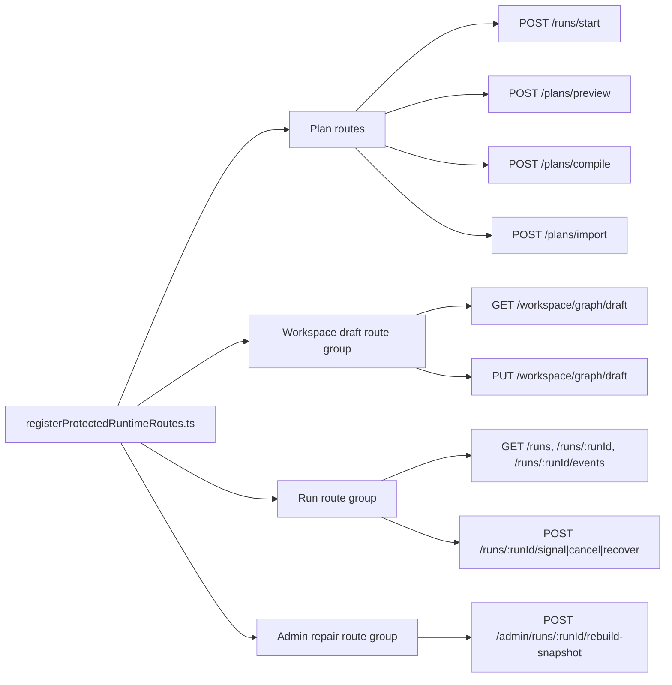
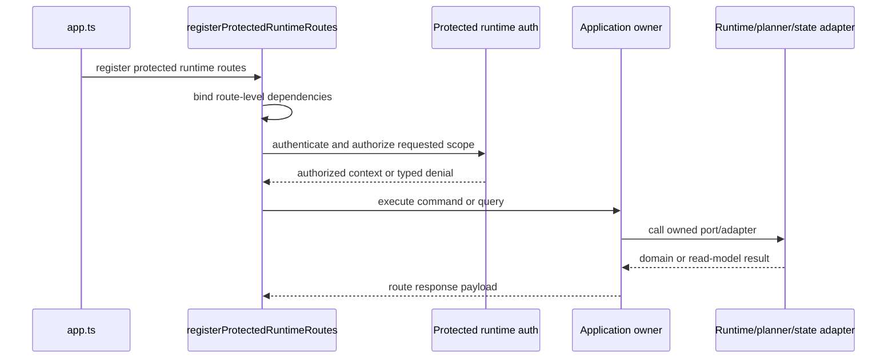

# Protected runtime route group component

This local guide documents the `apps/api` protected runtime HTTP route group
registered by `registerProtectedRuntimeRoutes.ts`.

It implements the first `AR-C10-A` mechanization step from
`docs/planning/proposals/mandatory/runtime-and-contracts/protected-runtime-rail-closure-plan-20260503.md`.
The route group is an application ingress over existing command/query rails; it
is not a domain model, planner, runtime engine, or authorization backend.

Use these related guides with this page:

- `apps/api/docs/start-run-http-entrypoint-component.md`
- `apps/api/docs/start-run-application-component.md`
- `apps/api/docs/protected-security-access-decision-component.md`
- `apps/api/docs/protected-runtime-dependency-builders-component.md`
- `apps/api/docs/workspace-graph-draft-application-component.md`
- `docs/architecture/command-query-rail-governance.md`
- `docs/architecture/fowler-opportunity-planning-governance.md`

## Owned concern

The component owns exactly one concern:

- register the protected runtime HTTP routes and bind each route to one
  DDD-owned command or query rail.

It does **not** own:

- planner semantics,
- engine lifecycle semantics,
- plan-store lifecycle state,
- access-decision backend semantics,
- admin repair policy,
- route-specific parser behavior,
- provider-adapter execution behavior.

## Public API

- `registerProtectedRuntimeRoutes.ts`
  Composition root for protected runtime route registration and route-level
  dependency binding.
- `runtimeRoutes.constants.ts`
  Route path and summary constants that define the protected runtime route
  inventory.
- `PROTECTED_RUNTIME_COMMAND_QUERY_RAILS`
  Application-owned command/query rail catalog. It is the source that names
  product-intent rails, DDD ownership, application ports, adapter surfaces,
  authorization posture, required negative tests, and executable test evidence
  for this route group.
- `registerWorkspaceGraphDraftRoutes(...)`
  Delegated route group for the workspace graph draft read/write boundary.
- `registerAdminRoutes(...)`
  Explicitly enabled admin repair route group.

## Invariants

- Every route in `runtimeRoutes.constants.ts` has exactly one row in
  `PROTECTED_RUNTIME_COMMAND_QUERY_RAILS` and in the command/query rail matrix
  below.
- Every required negative test case in `PROTECTED_RUNTIME_COMMAND_QUERY_RAILS`
  has at least one `apps/api/test/**/*.ts` evidence reference.
- Each matrix row names the owning application service or delegated route group.
- Routes remain HTTP adapters; they do not own planner, engine, state-store, or
  access-decision backend semantics.
- `POST /runs/:runId/signal` with `CANCEL` is compatibility behavior.
- `POST /runs/:runId/cancel` is the canonical cancel command route.
- No protected runtime rail accepts legacy behavior as canonical behavior.
- Admin repair routes are registered only when `DVT_ADMIN_ROUTES_ENABLED` is
  true.
- New protected runtime routes require an update to this component guide, the
  route constants, and architecture coverage in the same slice.

## Component map

## Command/query rail matrix

| Rail name                 | Route                                      | Rail    | Bounded context              | DDD object                  | Application owner                    | Authorization posture                                         | Required negative coverage                                                                 |
| ------------------------- | ------------------------------------------ | ------- | ---------------------------- | --------------------------- | ------------------------------------ | ------------------------------------------------------------- | ------------------------------------------------------------------------------------------ |
| `StartRun`                | `POST /runs/start`                         | Command | Runtime safety and admission | Run command admission       | StartRunAuthorizedFacade             | `run:start`, tenant scope                                     | missing token, missing action, tenant mismatch, client `runId`, invalid plan source        |
| `PreviewExecutablePlan`   | `POST /plans/preview`                      | Command | Planner/runtime admission    | Executable plan draft       | PreviewPlanUseCase                   | `run:start` compatibility authorization, tenant scope         | missing token, missing action, tenant mismatch, invalid graph source, invalid selection    |
| `CompileExecutablePlan`   | `POST /plans/compile`                      | Query   | Planner boundary             | Compiled plan read model    | CompilePlanUseCase                   | `run:start` compatibility authorization, tenant scope         | missing token, missing action, tenant mismatch, unsupported adapter                        |
| `ImportExecutablePlan`    | `POST /plans/import`                       | Command | Runtime plan ingestion       | Imported executable plan    | ImportPlanUseCase                    | `run:start` compatibility authorization, tenant scope         | missing token, missing action, tenant mismatch, invalid plan ref                           |
| `GetWorkspaceGraphDraft`  | `GET /workspace/graph/draft`               | Query   | Workspace graph drafting     | Workspace draft read model  | getWorkspaceGraphDraftUseCase        | `workspace:graph-draft:view`, tenant/project/environment      | missing token, missing action, tenant/workspace mismatch                                   |
| `SaveWorkspaceGraphDraft` | `PUT /workspace/graph/draft`               | Command | Workspace graph drafting     | Workspace draft aggregate   | saveWorkspaceGraphDraftUseCase       | `workspace:graph-draft:save`, tenant/project/environment      | missing token, missing action, tenant/workspace mismatch, stale authority                  |
| `ListRuns`                | `GET /runs`                                | Query   | Runtime read model           | Run list read model         | ListRunsUseCase                      | `run:list`, tenant scope                                      | missing token, missing action, tenant mismatch                                             |
| `GetRunStatus`            | `GET /runs/:runId`                         | Query   | Runtime read model           | Run status read model       | GetRunStatusUseCase                  | `run:view`, tenant scope                                      | missing token, missing action, tenant mismatch, unknown run                                |
| `GetRunEvents`            | `GET /runs/:runId/events`                  | Query   | Runtime read model           | Run event stream read model | GetRunEventsUseCase                  | `run:logs:view`, tenant scope                                 | missing token, missing action, tenant mismatch, unknown run                                |
| `SignalRun`               | `POST /runs/:runId/signal`                 | Command | Runtime control              | Run signal command          | SignalRunUseCase                     | `run:signal`, or `run:cancel` only for compatibility `CANCEL` | missing token, missing action, tenant mismatch, unsupported signal, compatibility disabled |
| `CancelRun`               | `POST /runs/:runId/cancel`                 | Command | Runtime control              | Run cancel command          | CancelRunUseCase                     | `run:cancel`, tenant scope                                    | missing token, missing action, tenant mismatch, non-empty reason                           |
| `RecoverRun`              | `POST /runs/:runId/recover`                | Command | Runtime recovery             | Run recovery command        | RecoverRunUseCase                    | `run:retry`, tenant scope                                     | missing token, missing action, tenant mismatch, invalid recovery source                    |
| `RebuildRunSnapshot`      | `POST /admin/runs/:runId/rebuild-snapshot` | Command | Runtime repair operations    | Snapshot rebuild command    | registerAdminRoutes maintenance port | `admin:rebuild-snapshot`, tenant/admin scope                  | disabled route, missing token, missing action, tenant mismatch                             |

## Compatibility posture

`POST /runs/:runId/signal` with `CANCEL` is compatibility behavior. It may
authorize through the cancel action while the route remains available, but it is
not the canonical cancel command rail.

`POST /runs/:runId/cancel` is the canonical cancel command route. Removing the
signal compatibility path requires a separate governed deprecation plan.

No protected runtime rail accepts legacy behavior as canonical behavior. The
only active compatibility posture in this component is `CANCEL` through
`POST /runs/:runId/signal`, gated by `DVT_SIGNAL_ROUTE_ALLOW_CANCEL` and mapped
back to the `CancelRun` rail.

## Transitions

## Consumers

- `apps/api/src/app.ts`
- `apps/api/src/entrypoints/http/registerProtectedRuntimeRoutes.ts`
- `apps/api/src/entrypoints/http/runtimeRoutes.constants.ts`
- `apps/api/src/application/ports/protectedRuntimeCommandQueryRails.ts`
- `apps/api/test/entrypoints/http/registerProtectedRuntimeRoutes.test.ts`
- `apps/api/test/entrypoints/http/protectedRuntimeRouteGroup.architecture.test.ts`
- `apps/api/test/integration/protectedRuntime.integration.test.ts`

## Extension rules

- Add a route only by updating `runtimeRoutes.constants.ts`, this component
  guide, and architecture coverage together.
- Add route behavior only through the owning command/query rail.
- Keep route-group registration focused on composition; route-specific parsing
  and response mapping belong in the route handler component.
- Keep compatibility paths explicit and named as compatibility, not canonical
  product rails.
