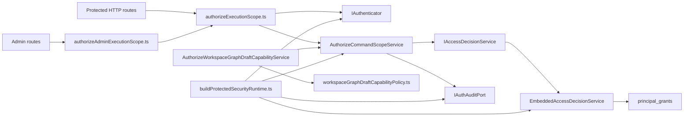
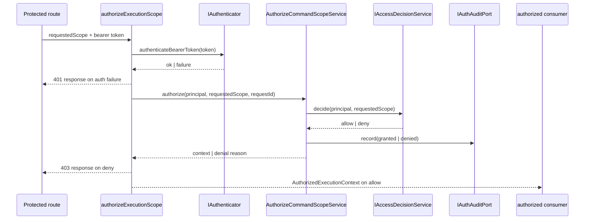

# Protected security access decision component

This local guide documents the `apps/api` subcomponent that owns the protected
authorization language and the API-boundary decision flow built around it.

It exists to keep one DVT-owned access vocabulary, one route-facing
authorization helper seam, and one embedded-first decision backend without
smearing those concerns across routes, use cases, and infrastructure modules.

Read this together with:

- `docs/adr/ADR-0051-access-decision-service-and-openfga-adapter.md`
- `docs/architecture/components/api/api-current-to-target-architecture.md`
- `docs/architecture/components/api/protected-runtime-and-plan-compile-component.md`
- `apps/api/docs/protected-runtime-dependency-builders-component.md`
- `apps/api/docs/workspace-graph-draft-application-component.md`

## Owned concern

The component owns exactly one concern:

- define and enforce the protected API access-decision language and the
  authenticated allow/deny flow that consumes it

It does **not** own:

- OIDC/JWKS identity verification semantics beyond the authenticator seam
- engine runtime integrity checks
- provider or vendor-specific PDP APIs
- route-body parsing for business commands
- persistence or read-model execution after authorization succeeds

## Public API

- `apps/api/src/application/ports/accessDecision.ts`
  Canonical contract:
  `AUTHORIZATION_ACTION_NAME`,
  `AUTHORIZATION_ACTION`,
  `ACCESS_SCOPE_RESOURCE`,
  `RequestedScope`,
  `ExecutionScope`,
  `AccessDecision`,
  `IAccessDecisionService`,
  plus the tenant/project/environment/workspace-draft scope builders
- `apps/api/src/application/ports/authContract.ts`
  Authorized execution context contract for granted protected requests
- `apps/api/src/application/ports/auth.ts`
  Route/application-facing authentication and auth-audit ports
- `apps/api/src/application/services/authorizeCommandScopeService.ts`
  Application service:
  `AuthorizeCommandScopeService`
- `apps/api/src/application/services/workspaceGraphDraftCapabilityPolicy.ts`
  Internal policy module:
  `WORKSPACE_GRAPH_DRAFT_CAPABILITY_POLICY`,
  `buildWorkspaceGraphDraftDeniedCapability(...)`,
  `buildWorkspaceGraphDraftCapabilityFromPolicy(...)`
- `apps/api/src/entrypoints/http/authorizeExecutionScope.ts`
  Route helper:
  `authorizeExecutionScope(...)`
- `apps/api/src/entrypoints/http/authorizeAdminExecutionScope.ts`
  Route helper:
  `authorizeAdminExecutionScope(...)`
- `apps/api/src/infrastructure/auth/embeddedAccessDecisionService.ts`
  Embedded-first backend:
  `EmbeddedAccessDecisionService`
- `apps/api/src/modules/protectedRuntime/buildProtectedSecurityRuntime.ts`
  Runtime builder:
  `buildProtectedSecurityRuntime(...)`,
  `BuildProtectedSecurityRuntimeDeps`,
  `ProtectedSecurityRuntime`

## Invariants

- `accessDecision.ts` is the single source of truth for protected action names,
  resource discriminants, scope builders, and allow/deny shapes.
- `domain/auth/types.ts` stays identity-only; it must not re-own access action,
  scope, or denial semantics.
- Route and application consumers reuse canonical actions from
  `accessDecision.ts` instead of re-declaring raw action literals locally.
- `AuthorizeCommandScopeService` depends on ports only. It must not construct
  authenticators, audit implementations, or embedded decision backends.
- `authorizeExecutionScope.ts` and `authorizeAdminExecutionScope.ts` remain
  route-facing adapters only. They must not own policy storage or grant lookup.
- `EmbeddedAccessDecisionService` consumes `requestedScope.resource` explicitly
  and fails closed; it must not reconstruct scope ownership from ad hoc route
  shapes.
- `buildProtectedSecurityRuntime.ts` is the only protected-runtime builder
  allowed to assemble the authenticator, audit logger, authorizer, and embedded
  access-decision backend cluster.
- Workspace graph draft capability flow remains a consumer of this component;
  it may translate capability modes, but it does not own a second
  authorization language.
- `workspaceGraphDraftCapabilityPolicy.ts` owns the capability policy table and
  the typed denial-to-capability translation for the workspace graph draft
  consumer.

## Component map

## Transitions

## Consumers

- `apps/api/src/entrypoints/http/startRunRoute.ts`
- `apps/api/src/entrypoints/http/getRunRoute.ts`
- `apps/api/src/entrypoints/http/getRunEventsRoute.ts`
- `apps/api/src/entrypoints/http/listRunsRoute.ts`
- `apps/api/src/entrypoints/http/signalRunRoute.ts`
- `apps/api/src/entrypoints/http/cancelRunRoute.ts`
- `apps/api/src/entrypoints/http/recoverRunRoute.ts`
- `apps/api/src/entrypoints/http/adminRoutes.ts`
- `apps/api/src/application/services/startRunAuthorizedFacade.ts`
- `apps/api/src/application/services/authorizeWorkspaceGraphDraftCapabilityService.ts`
- `apps/api/src/modules/protectedRuntime/buildProtectedSecurityRuntime.ts`
- `apps/api/test/application/services/protectedSecurityAccessDecision.architecture.test.ts`
