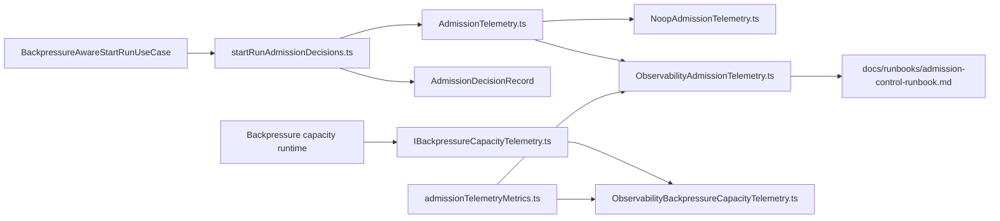
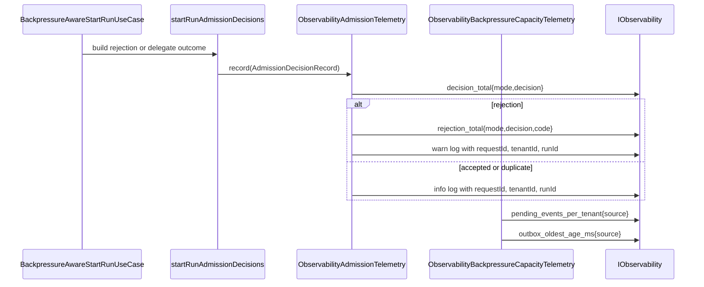

# Start-run admission observability component

This local guide documents the `apps/api` subcomponent that translates
canonical start-run admission outcomes and backlog snapshots into bounded
observability signals.

It is a local component guide, not a second public contract. The caller-visible
result surface remains the canonical shared start-run contract, while this
component owns only operator-facing telemetry and its local translation rules.

Read this together with:

- `apps/api/docs/start-run-execution-capacity-admission-component.md`
- `apps/api/docs/start-run-runtime-composition-component.md`
- `docs/runbooks/admission-control-runbook.md`

## Owned concern

The component owns exactly one concern:

- translate canonical start-run admission decisions and backlog snapshots into
  bounded metrics and structured logs

It does **not** own:

- duplicate detection
- tenant or system backpressure policy
- execution-capacity policy
- HTTP response mapping
- runbook diagnosis policy beyond linking to the operator truth

## Public API

- `AdmissionTelemetry.ts`
  Canonical decision-record vocabulary:
  `AdmissionDecisionRecord`,
  `AdmissionTelemetry`,
  `ADMISSION_TELEMETRY_DECISION`
- `IBackpressureCapacityTelemetry.ts`
  Backlog-snapshot telemetry port:
  `BackpressureCapacitySnapshot`,
  `IBackpressureCapacityTelemetry`
- `NoopAdmissionTelemetry.ts`
  Inert sink:
  `NoopAdmissionTelemetry`
- `startRunAdmissionDecisions.ts`
  Decision translation helpers:
  `toGuardAdmissionRejectResult(...)`,
  `toExecutionCapacityRejectResult(...)`,
  `buildAdmissionRejectionRecord(...)`,
  `recordAdmissionTelemetry(...)`,
  `recordDelegateDecisionIfNeeded(...)`
- `ObservabilityAdmissionTelemetry.ts`
  Structured decision sink:
  `ObservabilityAdmissionTelemetry`
- `ObservabilityBackpressureCapacityTelemetry.ts`
  Gauge-backed backlog sink:
  `ObservabilityBackpressureCapacityTelemetry`
- `admissionTelemetryMetrics.ts`
  Shared metric and log names:
  `ADMISSION_TELEMETRY_METRICS`,
  `ADMISSION_TELEMETRY_LOG`

## Invariants

- admission telemetry never changes the caller-visible start-run result kind
- execution-capacity denial stays inside canonical
  `reject_system` or `would_reject_system`, not a second decision family
- decision counters use bounded labels only:
  `mode`, `decision`, and optional `code`
- backlog gauges use bounded `source` labels only
- `tenantId`, `runId`, and `requestId` may appear in structured logs but never
  in metric labels
- telemetry failures must not break command admission or backlog evaluation
- one shared namespace owns both decision counters and backlog gauges:
  `dvt.admission.*`
- operator diagnosis for rejection codes lives in
  `docs/runbooks/admission-control-runbook.md`

## Fowler assessment

Compared with mature control planes, this is the healthy split:

- the application service owns decision semantics
- the observability adapters own translation into metrics and logs
- the metric catalog owns stable names
- the runbook owns diagnosis truth

That mirrors the shape used by mature systems where admission decisions stay in
published language, while operator telemetry stays bounded and internal.

The anti-patterns this component explicitly prevents are:

- high-cardinality metric labels built from tenant or run identity
- a second decision family just for execution-capacity denial
- direct provider vocabulary inside the application telemetry contract
- scattering metric names across use cases and adapters

## Component map

## Transitions

## Consumers

- `apps/api/src/application/services/BackpressureAwareStartRunUseCase.ts`
- `apps/api/src/modules/startRun/buildProtectedStartRunRuntime.ts`
- `apps/api/src/infrastructure/backpressure/LiveBackpressureSnapshotReader.ts`
- `apps/api/test/application/services/startRunAdmissionDecisions.test.ts`
- `apps/api/test/infrastructure/admissionTelemetry/ObservabilityAdmissionTelemetry.test.ts`
- `apps/api/test/infrastructure/admissionTelemetry/ObservabilityBackpressureCapacityTelemetry.test.ts`
- `apps/api/test/application/services/startRunAdmissionTelemetry.architecture.test.ts`

## Semantic fitness functions

- `startRunAdmissionTelemetry.architecture.test.ts`
  freezes owned-concern docblocks, guide presence, canonical denial language,
  bounded label policy, and shared metric namespace ownership
- `startRunAdmissionDecisions.test.ts`
  proves translation from guard and execution-capacity inputs into canonical
  caller results and telemetry records
- `ObservabilityAdmissionTelemetry.test.ts`
  proves decision counters, rejection counters, execution-capacity codes, and
  no tenant or run identifiers in metric labels
- `ObservabilityBackpressureCapacityTelemetry.test.ts`
  proves backlog gauges remain bounded to `source`

## Focused file map

- `apps/api/src/application/ports/AdmissionTelemetry.ts`
- `apps/api/src/application/ports/IBackpressureCapacityTelemetry.ts`
- `apps/api/src/application/services/NoopAdmissionTelemetry.ts`
- `apps/api/src/application/services/startRunAdmissionDecisions.ts`
- `apps/api/src/infrastructure/admissionTelemetry/ObservabilityAdmissionTelemetry.ts`
- `apps/api/src/infrastructure/admissionTelemetry/ObservabilityBackpressureCapacityTelemetry.ts`
- `apps/api/src/infrastructure/admissionTelemetry/admissionTelemetryMetrics.ts`
- `apps/api/test/application/services/startRunAdmissionTelemetry.architecture.test.ts`
- `apps/api/test/infrastructure/admissionTelemetry/ObservabilityAdmissionTelemetry.test.ts`
- `apps/api/test/infrastructure/admissionTelemetry/ObservabilityBackpressureCapacityTelemetry.test.ts`
