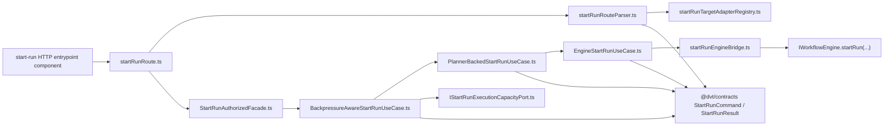
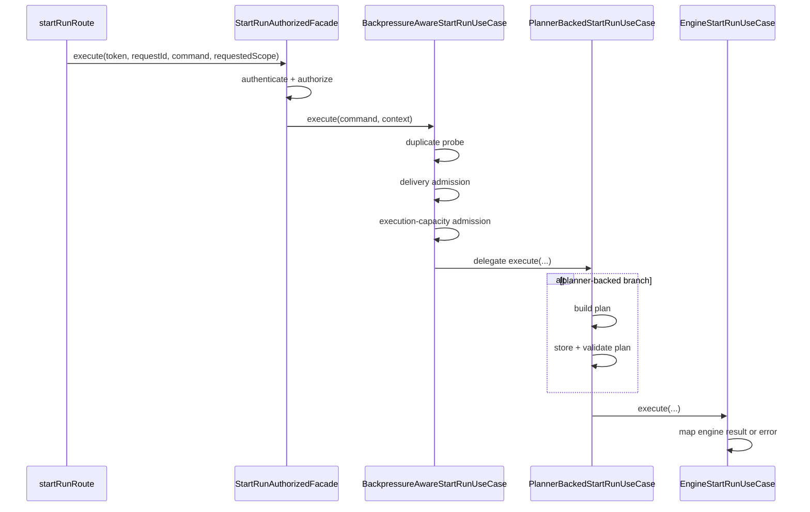

# Start-run application component

This local guide documents the `apps/api` component that owns authenticated
start-run orchestration.

It sits between HTTP request parsing and the engine-facing execution call. It
does not redefine the shared caller-visible command/result vocabulary. That
boundary is imported directly from `@dvt/contracts`.

Use these related guides with this page:

- `apps/api/docs/start-run-http-entrypoint-component.md`
- `apps/api/docs/start-run-execution-capacity-admission-component.md`
- `docs/architecture/components/engine/contracts/engine/start-run-boundary-component.md`

## Owned concern

The component owns exactly one concern:

- authenticate, authorize, admit, compile when needed, and dispatch canonical
  `start-run` commands inside `apps/api`

It does **not** own:

- the canonical command/result vocabulary itself
- provider-specific capacity metrics
- HTTP envelope translation
- engine lifecycle semantics after dispatch

## Ownership split

The component exists between two different ownership layers:

- `@dvt/contracts`
  owns the shared caller-visible `StartRunCommand` / `StartRunResult`
  vocabulary as published language
- `apps/api/src/entrypoints/http`
  owns HTTP request parsing and response emission for the route seam
- this component
  owns authenticated orchestration, admission ordering, optional planner
  compilation, and engine dispatch inside `apps/api`

This means `@dvt/contracts` is a shared kernel, not the owner of local
application behavior ports. Local behavior remains in `startRunUseCasePort.ts`,
`startRunFacadePort.ts`, and `startRunEngineError.ts`.

## Public API

- `startRunUseCasePort.ts`
  Local use-case port for application execution:
  `IStartRunUseCase`, `StartRunUseCaseResult`
- `startRunFacadePort.ts`
  Local authenticated facade port result surface:
  `START_RUN_FACADE_RESULT_KIND`,
  `StartRunFacadeResult`,
  `StartRunFacadeExecutionResult`
- `startRunEngineError.ts`
  Local engine-error taxonomy returned by the application port before HTTP
  translation
- `StartRunAuthorizedFacade.ts`
  Auth/authz + latency facade for the start-run path
- `BackpressureAwareStartRunUseCase.ts`
  Admission orchestrator:
  duplicate probe -> delivery admission -> execution-capacity admission ->
  delegate
- `PlannerBackedStartRunUseCase.ts`
  Planner-backed compilation and stored-plan validation before execution
- `EngineStartRunUseCase.ts`
  Bridge from canonical `StartRunCommand` to `IWorkflowEngine.startRun(...)`
- `startRunTargetAdapterRegistry.ts`
  Runtime-supported adapter registry used by the route boundary

## Invariants

- `apps/api` imports canonical `StartRunCommand`, `StartRunResult`, adapter
  truth, and result taxonomy directly from `@dvt/contracts`
- the HTTP edge is documented and constrained separately in
  `start-run-http-entrypoint-component.md`
- there are no app-local re-export shims for command/result boundary types
- only `startRunFacadePort.ts` adds API-auth result kinds
- admission order remains:
  duplicate probe -> delivery admission -> execution-capacity admission ->
  delegate
- planner-backed execution must validate the stored plan before engine dispatch
- `EngineStartRunUseCase` is the only module in this component that calls
  `IWorkflowEngine.startRun(...)`
- engine error/result translation lives in the dedicated
  `startRunEngineBridge.ts` helper instead of sharing the same module as the
  engine call orchestration
- `BackpressureAwareStartRunUseCase` test coverage is split by concern into
  duplicate flow, admission modes, and execution-capacity suites backed by a
  shared test-support module

## Component map

## Transitions

## Consumers

- `apps/api/src/entrypoints/http/startRunRoute.ts`
- `apps/api/src/entrypoints/http/httpErrorTranslation.ts`
- `apps/api/src/modules/buildProtectedRuntimeModule.ts`
- `apps/api/test/application/services/startRun*.test.ts`
- `apps/api/test/application/services/BackpressureAwareStartRunUseCase*.test.ts`
- `apps/api/test/application/services/engineStartRunUseCase*.test.ts`
- `apps/api/test/entrypoints/http/startRunRoute*.test.ts`

## Focused file map

- `apps/api/src/application/ports/IStartRunTargetAdapterRegistry.ts`
- `apps/api/src/application/ports/startRunUseCasePort.ts`
- `apps/api/src/application/ports/startRunFacadePort.ts`
- `apps/api/src/application/ports/startRunEngineError.ts`
- `apps/api/src/application/services/startRunTargetAdapterRegistry.ts`
- `apps/api/src/application/services/startRunAuthorizedFacade.ts`
- `apps/api/src/application/services/BackpressureAwareStartRunUseCase.ts`
- `apps/api/src/application/services/PlannerBackedStartRunUseCase.ts`
- `apps/api/src/application/services/startRunEngineBridge.ts`
- `apps/api/src/application/services/engineStartRunUseCase.ts`
- `apps/api/test/application/services/BackpressureAwareStartRunUseCase.test.support.ts`
- `apps/api/test/application/services/BackpressureAwareStartRunUseCase.duplicateFlow.test.ts`
- `apps/api/test/application/services/BackpressureAwareStartRunUseCase.admissionModes.test.ts`
- `apps/api/test/application/services/BackpressureAwareStartRunUseCase.executionCapacity.test.ts`
- `apps/api/src/entrypoints/http/startRunRouteCommandBuilder.ts`
- `apps/api/src/entrypoints/http/startRunRouteParser.ts`
- `apps/api/src/entrypoints/http/startRunRouteTargetAdapterParser.ts`
- `apps/api/test/application/services/startRunApplicationComponent.architecture.test.ts`

## Extension rules

- add new caller-visible command/result fields only in `@dvt/contracts`
- do not reintroduce app-local command/result re-export shims
- keep auth outcomes local to `startRunFacadePort.ts`
- keep provider-specific admission details behind dedicated ports
- treat AST architecture tests as part of the component contract, not optional
  style checks
