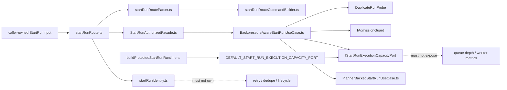
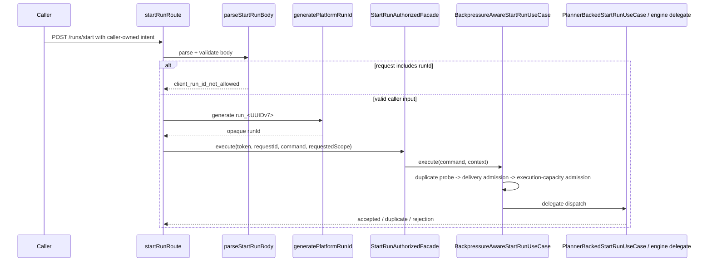
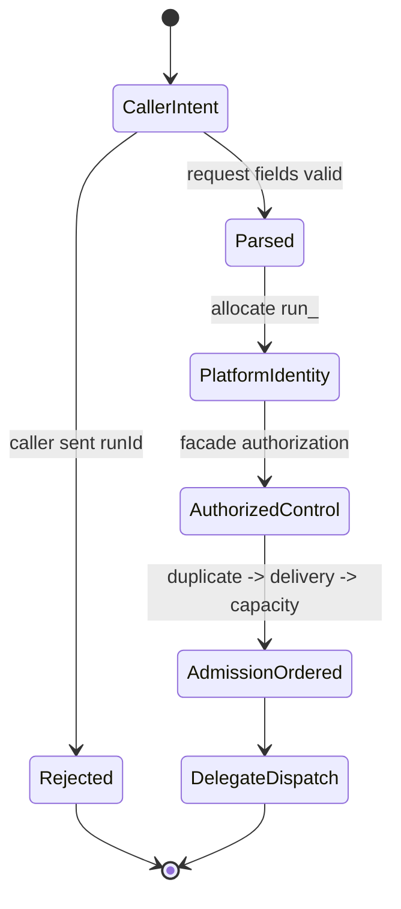

# Start-run control boundary component

This local guide documents the grouped `apps/api` control boundary for
`POST /runs/start`.

It exists because the current branch contains two adjacent hardening slices
that need to be read together:

- `AR-C7`
  platform-owned `run_<UUIDv7>` identity at the protected API boundary
- `AR-C3-A`
  abstract execution-capacity admission inside authenticated start-run
  orchestration

Use this guide with:

- `apps/api/docs/start-run-http-entrypoint-component.md`
- `apps/api/docs/start-run-platform-identity-component.md`
- `apps/api/docs/start-run-application-component.md`
- `apps/api/docs/start-run-execution-capacity-admission-component.md`
- `docs/architecture/components/web/runs/start-run-client-identity-boundary.md`

## Owned concern

The component owns exactly one concern:

- keep `POST /runs/start` as a protected control-plane boundary from
  caller-owned start intent to runtime-owned command dispatch without leaking
  runtime identity or provider admission semantics across layers

It does **not** own:

- frontend caller DTO definition
- engine lifecycle semantics after dispatch
- provider workflow identity
- adapter-native capacity metrics
- storage uniqueness or tenancy indexing policy

## Public API

- `startRunRoute.ts`
  Transport seam that composes parser, platform identity allocation, facade
  execution, and HTTP response emission
- `startRunRouteParser.ts`
  Request parser that turns caller-owned HTTP input into canonical command plus
  requested authorization scope
- `startRunIdentity.ts`
  Platform-owned `run_<UUIDv7>` allocator used only inside the protected route
  boundary
- `StartRunAuthorizedFacade.ts`
  Auth/authz facade that enters authenticated application orchestration
- `BackpressureAwareStartRunUseCase.ts`
  Admission orchestrator that keeps duplicate, delivery, and execution-
  capacity checks in governed order
- `buildProtectedStartRunRuntime.ts`
  Composition builder that binds the fail-closed default execution-capacity
  seam and assembles the authenticated start-run chain

## Invariants

- caller-authored request input is `planRef` or planner input plus workspace
  scope, target adapter, and selection; it is not canonical runtime identity
- reject caller-authored `runId` before allocation
- platform-owned `run_<UUIDv7>` is generated at the protected API boundary
  before the command enters authenticated application orchestration
- generated `runId` remains opaque to callers and downstream consumers
- duplicate probe -> delivery admission -> execution-capacity admission ->
  delegate dispatch remains the semantic ordering
- execution-capacity denial stays in canonical `system_backpressure`; it does
  not create a second top-level result family
- fail-closed default execution-capacity binding stays in
  `buildProtectedStartRunRuntime.ts`, not in the route or allocator
- the allocator must not grow retry, duplicate-run, lifecycle, recovery, or
  provider workflow semantics
- the application layer must not learn provider queue depth or adapter-native
  worker metrics

## Component map

## Transitions

## State boundary

## Consumers

- `apps/api/src/app.ts`
- `apps/api/src/entrypoints/http/startRunRoute.ts`
- `apps/api/src/entrypoints/http/startRunRouteParser.ts`
- `apps/api/src/entrypoints/http/startRunRouteCommandBuilder.ts`
- `apps/api/src/entrypoints/http/startRunIdentity.ts`
- `apps/api/src/application/services/BackpressureAwareStartRunUseCase.ts`
- `apps/api/src/modules/startRun/buildProtectedStartRunRuntime.ts`
- `apps/api/test/entrypoints/http/startRunIdentity.architecture.test.ts`
- `apps/api/test/entrypoints/http/startRunControlBoundary.architecture.test.ts`
- `apps/api/test/application/services/startRunExecutionCapacityAdmission.architecture.test.ts`

## Semantic fitness

The grouped boundary is guarded by:

- `apps/api/test/entrypoints/http/startRunIdentity.architecture.test.ts`
- `apps/api/test/entrypoints/http/startRunControlBoundary.architecture.test.ts`
- `apps/api/test/application/services/startRunExecutionCapacityAdmission.architecture.test.ts`

Those tests validate semantics, not barrel thinness:

- caller-owned request intent remains separate from platform-owned runtime
  identity
- `runId` rejection happens before allocation
- identity allocation stays isolated from runtime lifecycle and persistence
  semantics
- fail-closed execution-capacity default binding stays in composition
- duplicate, delivery, execution-capacity, and delegate ordering remains
  explicit

## Extension rules

- Add new caller-owned request fields only if the protected route contract owns
  and validates them.
- Do not add retry/idempotency behavior to the identity allocator.
- Do not leak provider-native capacity metrics into `apps/api` application
  ports.
- Revisit `ADR-0050` before changing run-id shape or allocation owner.
- Revisit `AR-C3-B/C` before claiming this boundary is operationally complete.
