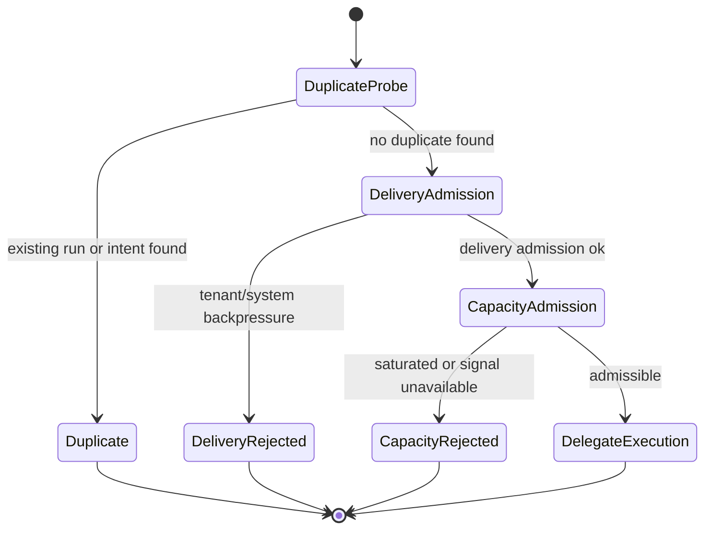
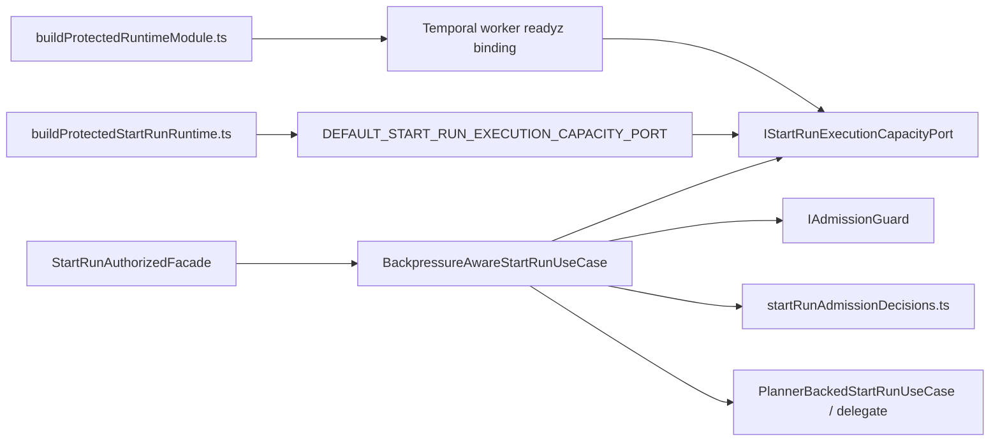
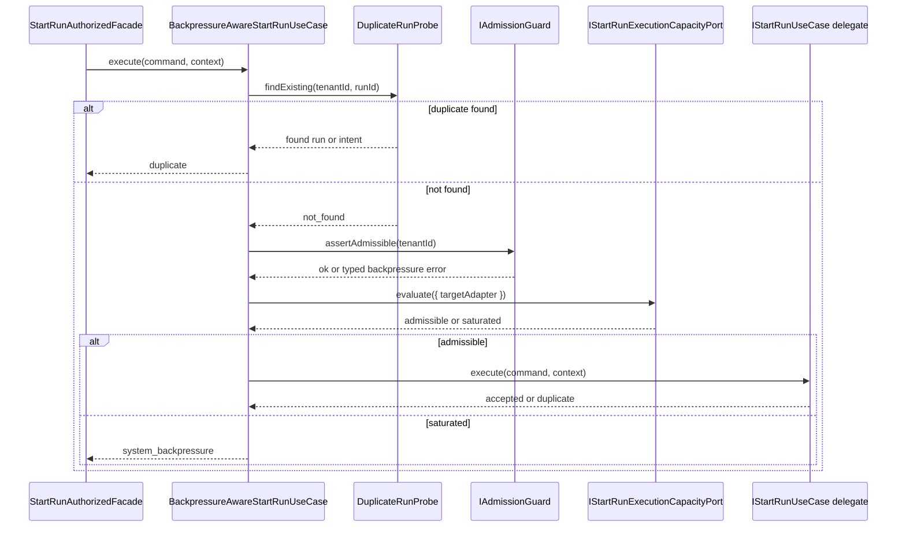

# Start-run execution capacity admission component

This local guide documents the `apps/api` component that adds an
execution-capacity admission seam to the start-run command path without
coupling the API layer to Temporal or any other concrete adapter.

This is a **local component guide**, not a second shared contract. The caller-
visible start-run result surface remains the canonical shared contract:
`docs/architecture/components/engine/contracts/engine/StartRunBoundary.v1.md`.

Read this together with:

- `apps/api/docs/start-run-control-boundary-component.md`
- `apps/api/docs/start-run-application-component.md`
- `docs/architecture/components/engine/contracts/engine/start-run-boundary-component.md`

## Owned concern

The component owns exactly one concern:

- evaluate whether the selected `targetAdapter` can admit a new start-run
  request and translate that decision into canonical start-run admission
  results

It does **not** own:

- duplicate-run detection
- tenant backpressure policy
- HTTP response mapping
- adapter-native queue metrics
- root-level provider-specific execution-capacity binding ownership

## Public API

- `IStartRunExecutionCapacityPort.ts`
  Abstract application seam:
  `IStartRunExecutionCapacityPort`,
  `StartRunExecutionCapacityRequest`,
  `StartRunExecutionCapacityResult`,
  `START_RUN_EXECUTION_CAPACITY_RESULT_KIND`,
  `START_RUN_EXECUTION_CAPACITY_REASON`
- `defaultStartRunExecutionCapacityPort.ts`
  Composition-time default binding:
  `DEFAULT_START_RUN_EXECUTION_CAPACITY_PORT`
- `TemporalWorkerReadyzExecutionCapacityPort.ts`
  First worker-backed concrete binding:
  `TemporalWorkerReadyzExecutionCapacityPort`
- `BackpressureAwareStartRunUseCase.ts`
  Orchestrator that consumes the seam as part of start-run admission ordering

## Invariants

- the API application layer remains adapter-agnostic
- the seam accepts only `targetAdapter` in the first slice
- the seam returns admission semantics, not raw queue depth or worker metrics
- inability to obtain a concrete capacity signal fails closed through the
  default binding
- protected-runtime composition owns provider-specific capacity bindings
- the caller-visible start-run result kind remains `system_backpressure`
- more specific execution-capacity denials are expressed through canonical
  `code` values, not a second top-level result kind
- only composition binds the default implementation

## Fowler assessment

Compared with mature control planes, `AR-C3-A` improves the boundary in the
right place:

- it adds a gateway-style application port instead of leaking scheduler
  vocabulary into controllers or routes
- it keeps the fail-closed default at the composition edge, not inside the
  use case or transport layer
- it preserves one published caller-visible language:
  canonical `system_backpressure`

The current route is now closed for the first production slice:

- `AR-C3-A` introduced the abstract execution-capacity seam
- `AR-C3-B` bound that seam to the Temporal worker `GET /readyz` signal in
  protected-runtime composition
- `AR-C3-C` closed telemetry labels, runbook truth, and operator-facing
  rejection diagnosis

The maturity gaps that remain are now future extensions, not missing closure:

- tenant-scoped execution-capacity policy
- non-Temporal concrete bindings behind the same abstract seam

## First concrete binding route

The first real adapter-backed signal for this seam is the standalone Temporal
worker readiness probe:

- `apps/api` may query the worker `GET /readyz` endpoint through a
  composition-owned infrastructure adapter
- `ready=true` maps to `admissible`
- reachable but `ready=false` maps to canonical
  `START_RUN_EXECUTION_CAPACITY_REASON.executorUnavailable`
- transport, timeout, or protocol failure maps to canonical
  `START_RUN_EXECUTION_CAPACITY_REASON.capacitySignalUnavailable`

This keeps the application seam adapter-agnostic while still binding it to a
real runtime-owned signal.

## Operator observability

Execution-capacity denial stays inside canonical `system_backpressure`, but the
operator-facing telemetry is now explicit:

- `dvt.admission.decision_total{mode,decision}` distinguishes accepted,
  duplicate, and reject or would-reject outcomes
- `dvt.admission.rejection_total{mode,decision,code}` distinguishes
  `EXECUTION_CAPACITY_EXHAUSTED`, `EXECUTOR_UNAVAILABLE`, and
  `CAPACITY_SIGNAL_UNAVAILABLE` from older system-pressure codes
- `docs/runbooks/admission-control-runbook.md` owns the diagnostic path for
  those codes and for the Temporal worker `GET /readyz` probe

## Anti-patterns explicitly prevented

- provider queue-depth or worker-metric vocabulary in `apps/api`
- fail-open behavior when no concrete capacity signal is available
- route-owned or facade-owned execution-capacity checks
- a second top-level start-run result kind just for capacity denial
- default-binding imports inside `BackpressureAwareStartRunUseCase.ts`

## Transitions

## Component map

## Sequence

## Consumers

- `BackpressureAwareStartRunUseCase.ts`
- `buildProtectedStartRunRuntime.ts`
- `buildProtectedExecutionCapacityPort.ts`
- `startRunExecutionCapacityAdmission.architecture.test.ts`
- `defaultStartRunExecutionCapacityPort.test.ts`

## Semantic fitness functions

- `startRunExecutionCapacityAdmission.architecture.test.ts`
  locks owned-concern docblocks, abstract-port usage, admission ordering,
  fail-closed default semantics, and composition-only binding.
- `BackpressureAwareStartRunUseCase.executionCapacity.test.ts`
  proves the runtime ordering and caller-visible rejection behavior.
- `defaultStartRunExecutionCapacityPort.test.ts`
  proves the default binding saturates with
  `capacity_signal_unavailable`.

## Focused file map

- `apps/api/src/application/ports/IStartRunExecutionCapacityPort.ts`
- `apps/api/src/application/services/defaultStartRunExecutionCapacityPort.ts`
- `apps/api/src/infrastructure/executionCapacity/TemporalWorkerReadyzExecutionCapacityPort.ts`
- `apps/api/src/modules/protectedRuntime/buildProtectedExecutionCapacityPort.ts`
- `apps/api/src/application/services/startRunAdmissionDecisions.ts`
- `apps/api/src/application/services/BackpressureAwareStartRunUseCase.ts`
- `apps/api/src/modules/startRun/buildProtectedStartRunRuntime.ts`
- `apps/api/test/application/services/BackpressureAwareStartRunUseCase.executionCapacity.test.ts`
- `apps/api/test/application/services/BackpressureAwareStartRunUseCase.executionCapacityReadyzBinding.test.ts`
- `apps/api/test/application/services/defaultStartRunExecutionCapacityPort.test.ts`
- `apps/api/test/application/services/startRunExecutionCapacityAdmission.architecture.test.ts`

## Extension rules

- bind concrete adapter signals only in composition
- keep provider-native metrics and queue semantics behind the port
- add new denial reasons only if they are canonical across adapters
- extend the shared `StartRunBoundary` contract before exposing new caller-
  visible denial codes
- preserve the ordering:
  duplicate probe -> delivery admission -> execution capacity -> delegate
