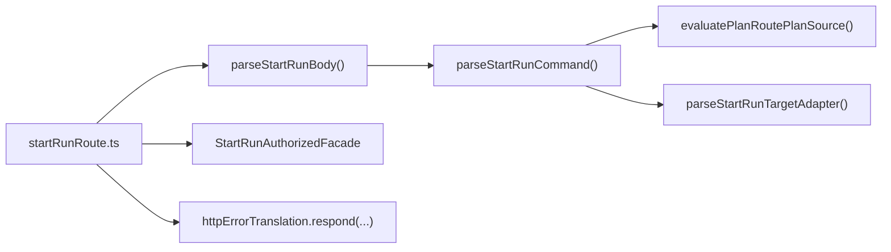
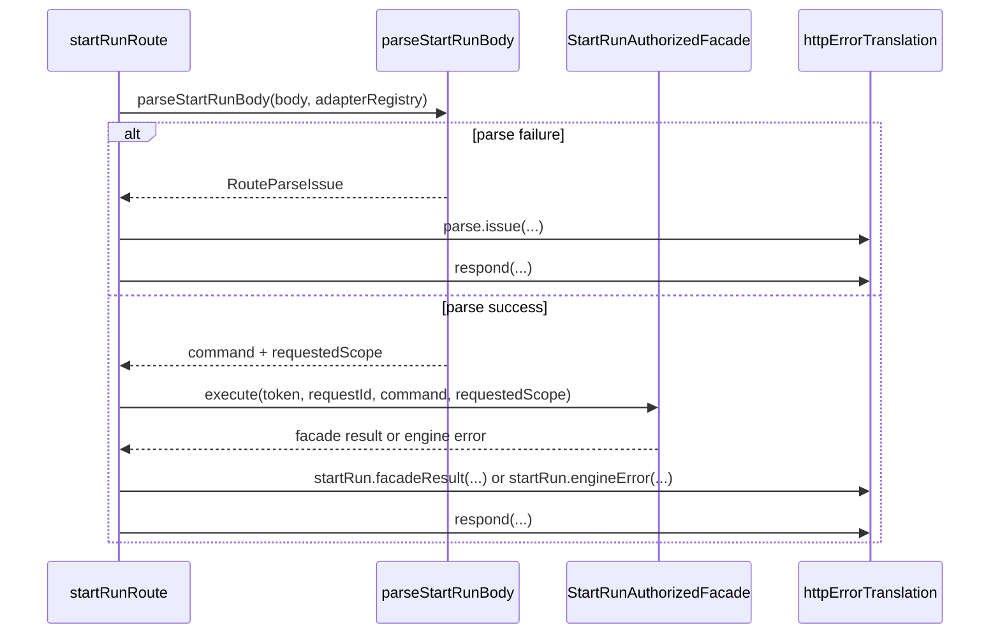

# Start-run HTTP entrypoint component

This local guide documents the `apps/api` HTTP subcomponent that owns request
parsing and response emission for the `start-run` route.

It sits at the transport edge, before the wider
[`start-run application component`](./start-run-application-component.md).
It does not own auth semantics, planner compilation, or engine dispatch.

Use these related guides with this page:

- `apps/api/docs/start-run-application-component.md`
- `apps/api/docs/http-runtime-error-translation-component.md`

## Owned concern

The component owns exactly one concern:

- translate the `POST /runs/start` HTTP request into a canonical
  `StartRunCommand` plus requested authorization scope, then emit the mapped
  HTTP response through the public error-translation facade

It does **not** own:

- authenticated execution orchestration
- canonical result taxonomy
- direct `FastifyReply` serialization details
- planner execution or plan storage
- engine error mapping

## Public API

- `startRunRoute.ts`
  Route seam that composes parser, bearer-token extraction, authenticated
  facade execution, and HTTP response translation
- `startRunRouteParser.ts`
  Request parser that returns canonical command + requested scope
- `startRunRouteCommandBuilder.ts`
  Command builder that selects the allowed plan-source branch and assembles the
  canonical `StartRunCommand`
- `startRunRouteTargetAdapterParser.ts`
  Adapter-specific binding of the generic target-adapter parser to the
  start-run registry

## Invariants

- the only default adapter-registry binding in this subcomponent lives at the
  outer route seam
- `startRunRoute.ts` never calls `sendHttpResponse(...)` directly; it always
  emits via `httpErrorTranslation.respond(...)`
- `startRunRoute.ts` depends on `parseStartRunBody(...)`, not on lower-level
  plan-route parser internals
- `startRunRouteCommandBuilder.ts` owns plan-source branch assembly after
  `evaluatePlanRoutePlanSource(...)` decides the allowed branch
- parser and builder modules stay transport-semantic; they do not import
  application services such as the authenticated facade

## Component map

## Transitions

## Consumers

- `apps/api/src/entrypoints/http/startRunRoute.ts`
- `apps/api/src/app.ts`
- `apps/api/test/entrypoints/http/startRunRoute*.test.ts`
- `apps/api/test/entrypoints/http/planRouteParserHelpers.test.ts`
- `apps/api/test/entrypoints/http/startRunRouteTargetAdapterParser.test.ts`

## Focused file map

- `apps/api/src/entrypoints/http/startRunRoute.ts`
- `apps/api/src/entrypoints/http/startRunRouteParser.ts`
- `apps/api/src/entrypoints/http/startRunRouteCommandBuilder.ts`
- `apps/api/src/entrypoints/http/startRunRouteTargetAdapterParser.ts`
- `apps/api/test/entrypoints/http/startRunHttpEntrypointComponent.architecture.test.ts`
- `apps/api/test/entrypoints/http/startRunRoute.validation.test.ts`
- `apps/api/test/entrypoints/http/startRunRoute.planSourcePolicy.test.ts`
- `apps/api/test/entrypoints/http/startRunRoute.authAndSuccess.test.ts`
- `apps/api/test/entrypoints/http/startRunRoute.facadeResultTranslation.test.ts`
- `apps/api/test/entrypoints/http/startRunRoute.engineErrorTranslation.test.ts`

## Extension rules

- keep default registry composition at the outermost route seam only
- add new transport-level request fields in the parser/builder layer before
  touching application orchestration
- route-level consumers must keep using `httpErrorTranslation.respond(...)`
- do not let the route import lower-level plan-route field helpers directly
  once a dedicated `start-run` parser seam exists
