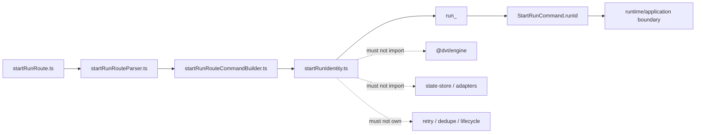
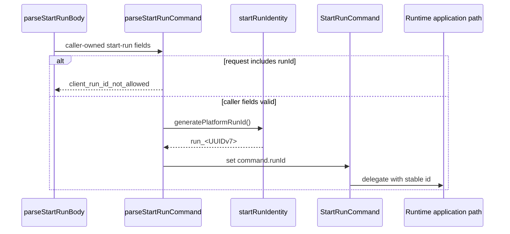
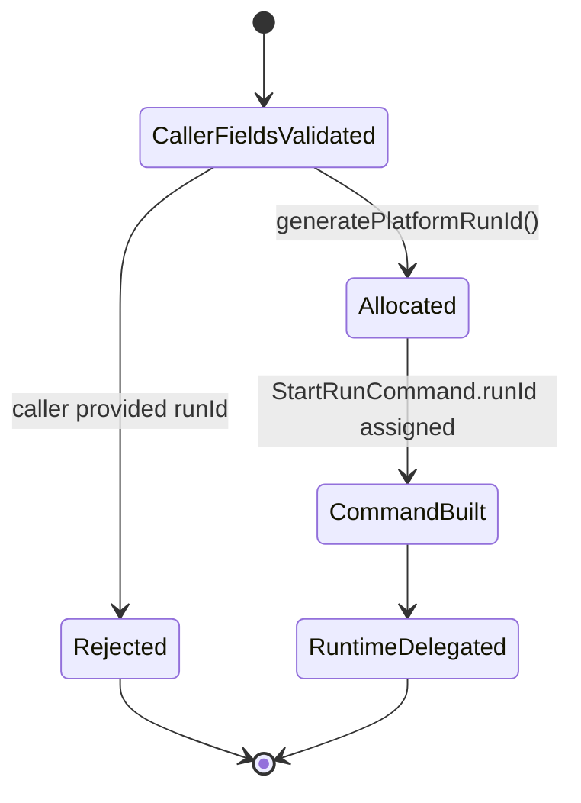

# Start-run platform identity component

This local guide documents the narrow `apps/api` allocator that creates
platform-owned start-run execution ids.

Use this guide with:

- `apps/api/docs/start-run-http-entrypoint-component.md`
- `docs/adr/adr-0050-platform-owned-start-run-identity.md`
- `docs/architecture/components/web/runs/start-run-client-identity-boundary.md`
- `buzon/20260423-codex-fowler-run-id-uuidv7-migration-analysis-and-remediation.md`

## Owned concern

The component owns exactly one concern:

- allocate an opaque, platform-owned `run_<UUIDv7>` execution identity at the
  protected start-run API boundary.

It is not a second engine.

It does **not** own:

- HTTP request parsing;
- authorization;
- start-run admission policy;
- duplicate-run policy;
- retry or idempotency semantics;
- runtime lifecycle transitions;
- recovery;
- provider workflow identity;
- state-store persistence.

Those concerns stay in the route/parser, authenticated application services,
runtime engine, provider adapters, and persistence components that already own
them.

## Public API

- `generatePlatformRunId(): string`
  Returns a new opaque `run_<UUIDv7>` value for one accepted start-run command.
- `StartRunRunIdGenerator`
  Function type used by the HTTP entrypoint to inject deterministic ids in
  tests without changing production allocation.

No other production module should call private UUID formatting helpers.

## Invariants

- generated ids use the `run_<UUIDv7>` shape;
- `startRunRouteCommandBuilder.ts` validates the generated value before
  building `StartRunCommand`;
- consumers treat returned ids as opaque strings;
- UUID timestamp bits are platform-local diagnostic data, not ordering,
  authorization, retry, or lifecycle input;
- allocation uses cryptographic random bytes for multi-instance collision
  resistance;
- persistence uniqueness remains the final collision guard;
- the module imports `node:crypto` only;
- the module must not import `@dvt/engine`, state-store adapters, provider
  adapters, or `StartRunAuthorizedFacade`;
- the module must not contain retry, idempotency, recovery, cancel, or workflow
  vocabulary.

## Component map

## Transitions

## State boundary

## Consumers

- `apps/api/src/entrypoints/http/startRunRoute.ts`
- `apps/api/src/entrypoints/http/startRunRouteParser.ts`
- `apps/api/src/entrypoints/http/startRunRouteCommandBuilder.ts`
- `apps/api/test/entrypoints/http/startRunIdentity.architecture.test.ts`
- `apps/api/test/entrypoints/http/startRunRoute*.test.ts`

## Semantic fitness

The component is guarded by
`apps/api/test/entrypoints/http/startRunIdentity.architecture.test.ts`.

That test validates semantics, not barrel thinness:

- caller-authored `runId` is rejected before allocation;
- platform identity is injected only after caller-owned fields are valid;
- malformed generated identity is rejected before application/runtime
  orchestration;
- `run_<UUIDv7>` shape and timestamp locality are enforced;
- forbidden engine, persistence, adapter, facade, retry, idempotency, recovery,
  cancel, and workflow vocabulary stays out of the allocator;
- this local component guide publishes public API, invariants, transitions, and
  consumers.

## Extension rules

- Do not add consumer-parsed structure to `runId`.
- Do not add host, process, tenant, provider, or browser identity to the id.
- Do not add retry/idempotency handling in this module; add a governed caller
  idempotency contract if retry-safe start semantics are needed.
- Do not move lifecycle or provider workflow decisions into this module.
- Revisit `ADR-0050` before changing the id shape or allocation owner.
