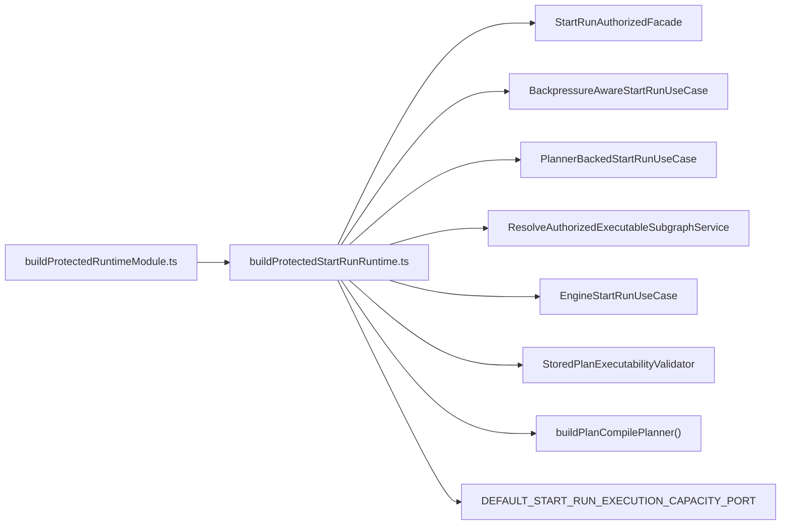
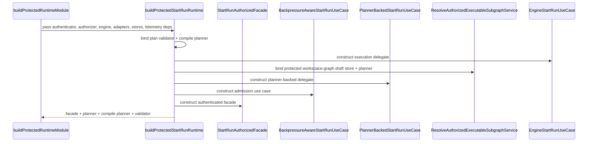

# Start-run runtime composition component

This local guide documents the `apps/api` subcomponent that assembles the
authenticated start-run chain inside the protected runtime module.

It does not own transport parsing, shared contracts, or provider adapter
construction. It owns only the composition seam that binds already-resolved
runtime dependencies into the start-run facade and use-case chain.

Read this together with:

- `apps/api/docs/start-run-application-component.md`
- `apps/api/docs/start-run-execution-capacity-admission-component.md`
- `apps/api/docs/executable-subgraph-resolution-component.md`
- `docs/architecture/components/api/protected-runtime-and-plan-compile-component.md`

## Owned concern

The component owns exactly one concern:

- assemble the authenticated start-run runtime chain from abstract runtime
  dependencies already resolved by the protected composition root

It does **not** own:

- HTTP request parsing
- canonical shared command/result vocabulary
- provider adapter construction
- state-store and plan-store construction
- workspace-graph draft composition

## Public API

- `buildProtectedStartRunRuntime.ts`
  Builder:
  `buildProtectedStartRunRuntime(...)`,
  `BuildProtectedStartRunRuntimeDeps`,
  `ProtectedStartRunRuntime`

## Invariants

- `buildProtectedRuntimeModule.ts` remains the top-level protected composition
  root for `apps/api`
- `buildProtectedStartRunRuntime.ts` is the only module in the protected
  runtime component allowed to construct:
  `StartRunAuthorizedFacade`,
  `BackpressureAwareStartRunUseCase`,
  `PlannerBackedStartRunUseCase`,
  `ResolveAuthorizedExecutableSubgraphService`,
  `EngineStartRunUseCase`,
  and `StoredPlanExecutabilityValidator`
- the outer composition root passes abstract runtime dependencies into this
  builder; it does not reconstruct the start-run chain itself
- compile-planner construction for the authenticated start-run path lives in
  this subcomponent, not back in the outer root
- the fail-closed default execution-capacity binding stays inside start-run
  composition, not inside `BackpressureAwareStartRunUseCase.ts`

## Component map

## Transitions

## Consumers

- `apps/api/src/modules/buildProtectedRuntimeModule.ts`
- `apps/api/docs/start-run-application-component.md`
- `apps/api/docs/start-run-execution-capacity-admission-component.md`
- `apps/api/test/modules/startRunRuntimeComposition.cases.ts`
- `apps/api/test/application/services/startRunExecutionCapacityAdmission.architecture.test.ts`
