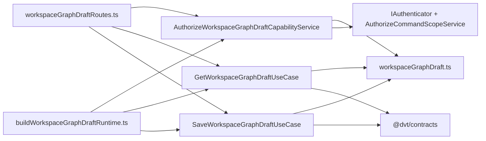
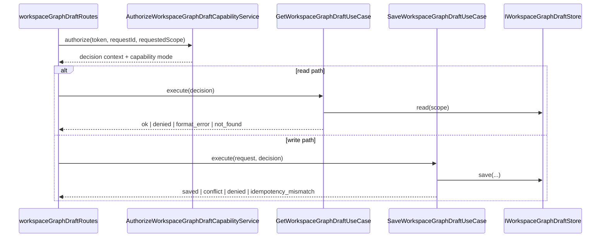

# Workspace graph draft application component

This local guide documents the `apps/api` application component that owns
protected workspace-graph-draft authorization plus typed read/write use cases.

It sits between HTTP route parsing and the runtime-composition builder. It does
not own outer dependency assembly, HTTP envelopes, or the editable aggregate
schema itself.

Read this together with:

- `apps/api/docs/workspace-graph-draft-runtime-composition-component.md`
- `docs/architecture/components/planner/workspace-authoring-draft-aggregate.md`
- `docs/architecture/components/api/protected-runtime-and-plan-compile-component.md`

## Owned concern

The component owns exactly one concern:

- derive protected graph-draft capability posture and execute canonical
  read/write application flows over the authoring-draft contract boundary

It does **not** own:

- HTTP request parsing or response translation
- runtime dependency assembly
- Postgres pool construction
- compile projection or execution admission
- the authoring aggregate contract itself

## Public API

- `workspaceGraphDraft.ts`
  Local application port family:
  `WORKSPACE_GRAPH_DRAFT_ACTION`,
  `WORKSPACE_GRAPH_DRAFT_ACTIVE_SCHEMA_VERSION`,
  `WORKSPACE_GRAPH_DRAFT_INITIAL_REVISION`,
  `IWorkspaceGraphDraftStore`,
  `IWorkspaceGraphDraftAuditPort`,
  `IWorkspaceGraphDraftTelemetry`
- `AuthorizeWorkspaceGraphDraftCapabilityService.ts`
  Capability decision service:
  `AuthorizeWorkspaceGraphDraftCapabilityService`
- `GetWorkspaceGraphDraftUseCase.ts`
  Read application service:
  `GetWorkspaceGraphDraftUseCase`,
  `GetWorkspaceGraphDraftUseCaseResult`
- `SaveWorkspaceGraphDraftUseCase.ts`
  Write application service:
  `SaveWorkspaceGraphDraftUseCase`,
  `SaveWorkspaceGraphDraftUseCaseResult`

## Invariants

- `AuthorizeWorkspaceGraphDraftCapabilityService.ts` is the only module in this
  component allowed to import `IAuthenticator` and
  `AuthorizeCommandScopeService`.
- `GetWorkspaceGraphDraftUseCase.ts` and `SaveWorkspaceGraphDraftUseCase.ts`
  depend on canonical `@dvt/contracts` types plus local application ports; they
  do not import HTTP routes or runtime builders.
- `workspaceGraphDraft.ts` is the only module in this component that owns
  action names, persistence interfaces, audit port, and telemetry port
  vocabulary.
- save success means editable authoring truth persisted; it does not imply
  compile validity or runtime admission.
- unsupported schema version and idempotency mismatch remain explicit outcomes;
  they are not coerced into fake success paths.

## Component map

## Transitions

## Consumers

- `apps/api/src/entrypoints/http/workspaceGraphDraftRoutes.ts`
- `apps/api/src/modules/workspaceGraphDraft/buildWorkspaceGraphDraftRuntime.ts`
- `apps/api/test/application/services/authorizeWorkspaceGraphDraftCapabilityService.test.ts`
- `apps/api/test/application/services/workspaceGraphDraftApplicationComponent.architecture.test.ts`
- `apps/api/test/entrypoints/http/workspaceGraphDraftRoutes.test.ts`

## Focused file map

- `apps/api/src/application/ports/workspaceGraphDraft.ts`
- `apps/api/src/application/services/authorizeWorkspaceGraphDraftCapabilityService.ts`
- `apps/api/src/application/services/getWorkspaceGraphDraftUseCase.ts`
- `apps/api/src/application/services/saveWorkspaceGraphDraftUseCase.ts`
- `apps/api/src/modules/workspaceGraphDraft/buildWorkspaceGraphDraftRuntime.ts`
- `apps/api/src/entrypoints/http/workspaceGraphDraftRoutes.ts`
- `apps/api/test/application/services/authorizeWorkspaceGraphDraftCapabilityService.test.ts`
- `apps/api/test/application/services/workspaceGraphDraftApplicationComponent.architecture.test.ts`

## Fowler reading

This is an application-service component, not a transaction-script route.
Mature protected-write systems keep authentication and authorization policy in a
dedicated decision service, then let read/write use cases operate over typed
ports and canonical contracts. That prevents route handlers from becoming
shadow orchestrators and prevents persistence use cases from pulling auth or
transport details inward.

## Extension rules

- add aggregate/persistence vocabulary in `workspaceGraphDraft.ts` before using
  it in read/write services
- keep auth/authz policy in
  `AuthorizeWorkspaceGraphDraftCapabilityService.ts`
- keep HTTP translation in `workspaceGraphDraftRoutes.ts`
- keep runtime construction in `buildWorkspaceGraphDraftRuntime.ts`
- treat the architecture test as a contract for ownership, not a style check
