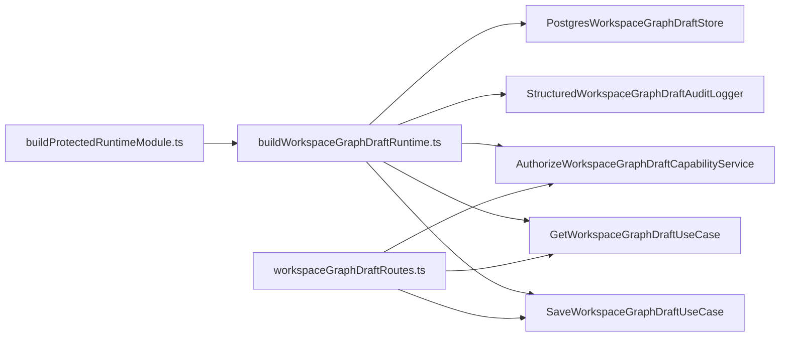
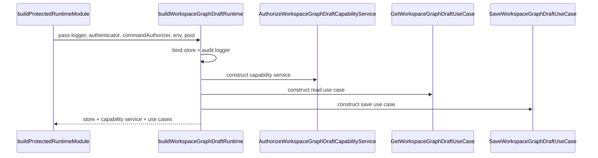

# Workspace graph draft runtime composition component

This local guide documents the `apps/api` subcomponent that assembles the
workspace-graph-draft runtime chain inside the protected runtime module.

It does not own HTTP parsing, canonical request/response contracts, or the
outer protected composition root. It owns only the runtime seam that binds the
graph-draft store, audit, capability service, and read/write use cases from
already-resolved protected-runtime dependencies.

Read this together with:

- `apps/api/docs/workspace-graph-draft-application-component.md`
- `apps/api/docs/protected-runtime-dependency-builders-component.md`
- `apps/api/docs/start-run-runtime-composition-component.md`
- `docs/architecture/components/api/protected-runtime-and-plan-compile-component.md`
- `apps/api/src/entrypoints/http/workspaceGraphDraftRoutes.ts`

## Owned concern

The component owns exactly one concern:

- assemble the protected workspace-graph-draft runtime chain from abstract
  runtime dependencies already resolved by the outer composition root

It does **not** own:

- HTTP request parsing
- canonical request/response contracts
- outer protected runtime assembly
- auth/authz dependency construction
- Postgres pool construction

## Public API

- `buildWorkspaceGraphDraftRuntime.ts`
  Builder:
  `buildWorkspaceGraphDraftRuntime(...)`,
  `BuildWorkspaceGraphDraftRuntimeDeps`

## Invariants

- `buildProtectedRuntimeModule.ts` remains the only top-level protected runtime
  composition root for `apps/api`
- `buildWorkspaceGraphDraftRuntime.ts` is the only module in the protected
  runtime component allowed to construct:
  `PostgresWorkspaceGraphDraftStore`,
  `StructuredWorkspaceGraphDraftAuditLogger`,
  `AuthorizeWorkspaceGraphDraftCapabilityService`,
  `GetWorkspaceGraphDraftUseCase`,
  and `SaveWorkspaceGraphDraftUseCase`
- the outer root passes resolved auth, environment, logger, and pool
  dependencies into this builder; it does not rebuild the graph-draft chain
  inline
- graph-draft read/write policy stays in the application services and routes,
  not in the composition root

## Component map

## Transitions

## Consumers

- `apps/api/src/modules/buildProtectedRuntimeModule.ts`
- `apps/api/src/entrypoints/http/workspaceGraphDraftRoutes.ts`
- `apps/api/test/modules/workspaceGraphDraftRuntimeComposition.cases.ts`
- `apps/api/test/entrypoints/http/workspaceGraphDraftRoutes.test.ts`
