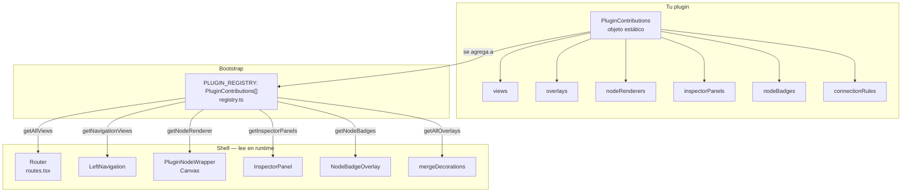
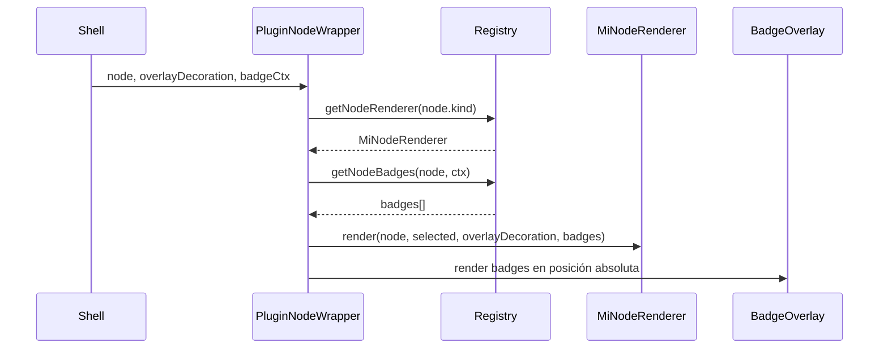
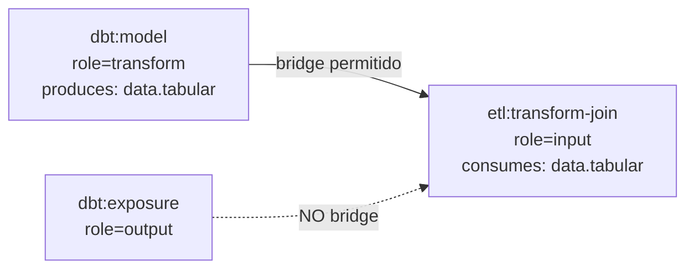

# DVT+ Plugin Developer Guide

> v1 — 2026-03-28
> Para crear un plugin interno en el mismo bundle. El contrato público es `PluginContributions`.

---

## Cómo funciona el sistema



---

## Paso 1 — Crear el archivo de contribuciones

```
apps/web/src/app/plugins/
  mi-plugin/
    miPluginContributions.ts   ← contrato público
    MiNodeRenderer.tsx          ← si registra nodos
    inspectorPanels.tsx         ← si registra paneles
```

```typescript
// plugins/mi-plugin/miPluginContributions.ts
import type { PluginContributions } from '../registry';

export const miPluginContributions: PluginContributions = {
  id: 'mi-plugin',
  displayName: 'Mi Plugin',
  version: '1.0.0',
  capabilities: ['canvas.overlay'], // declarativo, no validado en runtime v1
};
```

---

## Paso 2 — Registrarlo en PLUGIN_REGISTRY

```typescript
// plugins/registry.ts
import { dbtContributions } from './dbt/dbtContributions';
import { monitoringContributions } from './monitoring/monitoringContributions';
import { miPluginContributions } from './mi-plugin/miPluginContributions'; // ← agregar

export const PLUGIN_REGISTRY: PluginContributions[] = [
  dbtContributions,
  monitoringContributions,
  miPluginContributions, // ← agregar aquí
];
```

Eso es todo. El router, la nav y el canvas lo detectan automáticamente.

---

## Slots disponibles

### `views` — agrega rutas y nav

```typescript
views: [
  {
    pluginId: 'mi-plugin',
    id: 'mi-plugin.dashboard',
    path: '/mi-dashboard',
    component: React.lazy(() => import('./MiDashboard')),
    nav: {
      label: 'Dashboard',
      icon: BarChart2,
      order: 30,          // orden en la nav lateral
      level: 'core',      // 'core' | 'extended' | 'admin'
    },
  },
],
```

### `overlays` — decora nodos en el canvas

```typescript
overlays: [
  {
    id: 'mi-plugin.highlight',
    label: 'Highlight',
    icon: Sparkles,
    mode: 'additive',   // 'exclusive' | 'additive'
    priority: 20,
    // Función PURA — sin fetch, sin stores
    nodeDecorator: (node, ctx) => {
      if (!ctx.activeRun) return null;
      return ctx.runStatusByNodeId.get(node.id) === 'failed'
        ? { borderColor: '#ef4444' }
        : null;
    },
  },
],
```

`OverlayContext` disponible en `nodeDecorator`:

| Campo                  | Tipo                                | Descripción             |
| ---------------------- | ----------------------------------- | ----------------------- |
| `activeRun`            | `RunStatusSnapshot \| null`         | Run activo              |
| `runStatusByNodeId`    | `ReadonlyMap<string, string>`       | Estado por nodo         |
| `costByNodeId`         | `ReadonlyMap<string, NodeCostData>` | Costo por nodo          |
| `selectedNodeIds`      | `ReadonlySet<string>`               | Nodos seleccionados     |
| `upstreamOfSelected`   | `ReadonlySet<string>`               | Upstream de selección   |
| `downstreamOfSelected` | `ReadonlySet<string>`               | Downstream de selección |

### `inspectorPanels` — tabs en el panel derecho

```typescript
inspectorPanels: [
  {
    id: 'mi-plugin.detalle',
    pluginId: 'mi-plugin',
    label: 'Detalle',
    icon: Info,
    order: 10,
    shouldShow: (node, ctx) => node.pluginId === 'mi-plugin',
    component: MiDetallePanel,   // React.ComponentType<InspectorPanelProps>
  },
],
```

`InspectorPanelProps`:

```typescript
type InspectorPanelProps = {
  node: CanonicalNode;
  activeRunId: string | null;
  onClose: () => void;
};
```

### `nodeBadges` — badges superpuestos en nodos

```typescript
nodeBadges: [
  {
    id: 'mi-plugin.estado',
    pluginId: 'mi-plugin',
    forKinds: 'all',   // o ['dbt:model', 'dbt:test']
    priority: 50,
    getBadge: (node, ctx) => {
      if (!ctx.activeRunId) return null;
      return {
        text: '!',
        color: 'red',
        position: 'top-right',
        tooltip: 'Nodo con alerta',
      };
    },
  },
],
```

### `nodeRenderers` — renderer base para un kind propio

#### Qué controla el shell vs. qué controla el renderer

```
┌─────────────────────────────────────────────────────────┐
│ ReactFlow (shell)                                       │
│  • posición x/y en el canvas        • zoom y pan       │
│  • handles de conexión (puntos)     • aristas           │
│  • selección nativa                 • minimap           │
│                                                         │
│  ┌───────────────────────────────────────────────┐     │
│  │ PluginNodeWrapper (shell)                     │     │
│  │  • resuelve qué renderer usar                 │     │
│  │  • pinta badges en posición absoluta          │     │
│  │  • aplica overlayDecoration (dimmed, border)  │     │
│  │                                               │     │
│  │  ┌─────────────────────────────────────────┐ │     │
│  │  │ Tu NodeRenderer (plugin)                │ │     │
│  │  │  • diseño visual del nodo               │ │     │
│  │  │  • contenido interno                    │ │     │
│  │  │  • lee node.name, node.tags, metadata   │ │     │
│  │  │  • NO gestiona badges                   │ │     │
│  │  │  • NO posiciona handles                 │ │     │
│  │  └─────────────────────────────────────────┘ │     │
│  └───────────────────────────────────────────────┘     │
└─────────────────────────────────────────────────────────┘
```

#### Tamaño y layout del nodo

El renderer tiene control total sobre su tamaño. ReactFlow lo respeta.

| Regla                    | Detalle                                                                          |
| ------------------------ | -------------------------------------------------------------------------------- |
| Ancho mínimo recomendado | `min-w-[140px]` — menos queda ilegible en el minimap                             |
| Ancho máximo recomendado | Sin límite fijo, pero > 300px deforma el DAG                                     |
| Alto                     | Determinado por el contenido — no usar `h-fixed`                                 |
| Scroll dentro del nodo   | **No** — los nodos no son scrollables; si hay mucho contenido, usar el inspector |
| Overflow                 | `overflow-hidden` + `truncate` para textos largos                                |
| Hover/selected           | Leer `selected` y `hovered` de `NodeRendererProps` — no manejar eventos de click |

#### Qué puede ir dentro del renderer

| Permitido                                   | No permitido                                              |
| ------------------------------------------- | --------------------------------------------------------- |
| Texto, iconos, badges de estado interno     | Botones que abren modales (usar inspector)                |
| Tags, tooltips nativos de HTML              | `<input>`, formularios editables                          |
| Indicadores de costo/duración               | Fetch de datos (el shell pre-calcula en `OverlayContext`) |
| Secciones colapsables simples               | `useEffect`, stores externos                              |
| `overlayDecoration.borderColor` vía CSS var | Inline styles (usar CSS modules)                          |

#### Ejemplo mínimo

```typescript
// plugins/mi-plugin/MiEntidadRenderer.tsx
export function MiEntidadRenderer({ node, selected, overlayDecoration }: NodeRendererProps) {
  return (
    <div
      className={cn(
        styles.root,
        'rounded-md border-2 bg-neutral-900 px-3 py-2 text-xs',
        'border-violet-500',
        selected && 'ring-2 ring-white/40',
        overlayDecoration?.dimmed && 'opacity-30',
        overlayDecoration?.borderColor && styles.overlayBorder,
      )}
    >
      <div className="font-semibold truncate">{node.name}</div>
      {node.description && (
        <div className="text-[10px] opacity-60 truncate">{node.description}</div>
      )}
    </div>
  );
}
```

CSS module para el border dinámico:

```css
/* MiEntidadRenderer.module.css */
.root {
  min-width: 140px;
}
.overlayBorder {
  border-color: var(--overlay-border-color);
}
```

```typescript
nodeRenderers: new Map([
  ['mi-plugin:entidad', {
    kind: 'mi-plugin:entidad',
    priority: 100,
    component: MiEntidadRenderer,   // React.ComponentType<NodeRendererProps>
  }],
]),

nodeKinds: [
  {
    kind: 'mi-plugin:entidad',
    pluginId: 'mi-plugin',
    label: 'Entidad',
    role: 'transform',
    previewStepKind: 'MY_PLUGIN_ENTITY',
    icon: Box,
    borderClass: 'border-violet-500',
    minimapColor: '#8b5cf6',
    allowsIncoming: true,
    allowsOutgoing: true,
    supportsColumns: false,
  },
],
```

`previewStepKind` es opcional. Si tu plugin necesita que el preview genérico
proyecte un `stepKind` específico, decláralo aquí. Si no lo declaras, la shell
cae al mapping base por `role`.

`NodeRendererProps`:

```typescript
type NodeRendererProps = {
  node: CanonicalNode;
  selected: boolean;
  hovered: boolean;
  overlayDecoration: MergedNodeDecoration | null;
  badges: NodeBadge[];
  data: Record<string, unknown>;
};
```

---

## Flujo de rendering en el canvas



El renderer **no gestiona badges** — `PluginNodeWrapper` los pinta encima.

---

## Cross-plugin bridge (conexiones entre plugins)

Si tu plugin produce o consume datos de otro plugin, declara los puertos:

```typescript
produces: [{ portType: 'data.tabular', forRoles: ['transform'] }],
consumes: [{ portType: 'data.tabular', forRoles: ['input'] }],
```



Reglas:

- `portType` debe coincidir en ambos lados
- `role` del nodo origen debe estar en `produces.forRoles`
- `role` del nodo destino debe estar en `consumes.forRoles`
- `dbt:exposure` y `dbt:metric` **no** participan en bridge `data.tabular`

---

## `runAdapter` — normalizar datos de run por plugin

`runAdapter` es el extension point para que un plugin exponga sus runs en el formato canónico que el shell entiende. Lo usa el inspector panel History y cualquier overlay que necesite estado de run.

### Contrato

```typescript
runAdapter?: {
  mapToCanonical: (run: unknown) => CanonicalRun | null;
};
```

`mapToCanonical` recibe el objeto nativo del plugin (`Run`, `AirflowRun`, etc.) y devuelve `CanonicalRun | null`. El shell llama a todos los plugins en orden hasta obtener un resultado no-nulo.

### `CanonicalRun` y `CanonicalTask`

```typescript
// types/canonical.ts

interface CanonicalRun {
  runId: string;
  planId: string;
  pluginId: string;
  status: 'pending' | 'running' | 'completed' | 'failed' | 'cancelled';
  startedAt: string; // ISO 8601
  finishedAt?: string;
  durationMs?: number;
  environment: string;
  gitSha?: string;
  tasks: CanonicalTask[];
  metadata?: Record<string, unknown>; // dbt: { artifacts }
}

interface CanonicalTask {
  taskId: string; // único dentro del run: "{runId}:{stepId}:{nodeId}"
  runId: string;
  nodeId: string; // referencia CanonicalNode.id
  pluginId: string;
  status: CanonicalTaskStatus;
  startedAt?: string;
  finishedAt?: string;
  durationMs?: number;
  logs?: string[];
  errorMessage?: string;
  metadata?: Record<string, unknown>; // extensión por plugin
}
```

### Campos de `metadata` por plugin

| Plugin             | Campos típicos en `CanonicalTask.metadata`                           |
| ------------------ | -------------------------------------------------------------------- |
| `dbt`              | `stepType`, `stepId`, `stepName`, `warehouse`, `policies`, `message` |
| `airflow` (futuro) | `dagId`, `taskId`, `tryNumber`, `xcomValue`                          |
| `custom`           | cualquier campo — el inspector del plugin lo lee directamente        |

### Ejemplo mínimo

```typescript
// plugins/mi-plugin/miPluginContributions.ts
import type { CanonicalRun } from '../../types/canonical';

export const miPluginContributions: PluginContributions = {
  id: 'mi-plugin',
  // ...
  runAdapter: {
    mapToCanonical: (value): CanonicalRun | null => {
      const run = value as Partial<MiRun>;
      if (!run.id || !run.startedAt) return null;

      return {
        runId: run.id,
        planId: run.planId ?? 'unknown',
        pluginId: 'mi-plugin',
        status: mapMiStatus(run.status),
        startedAt: run.startedAt,
        environment: run.env ?? 'default',
        tasks: (run.taskExecutions ?? []).map((t) => ({
          taskId: `${run.id}:${t.id}`,
          runId: run.id,
          nodeId: t.nodeId,
          pluginId: 'mi-plugin',
          status: mapMiTaskStatus(t.state),
          durationMs: t.elapsedMs,
          metadata: {
            // campos propios del plugin — el inspector panel los leerá de aquí
            retries: t.retryCount,
            exitCode: t.exitCode,
          },
        })),
      };
    },
  },
};
```

### Cómo el inspector History panel usa el adapter

El panel History recibe `activeRunId` de `InspectorPanelProps`. Llama a `runsService.getRun(activeRunId)`, pasa el resultado a `registry.mapRunToCanonical(run)` (que itera los plugins), y filtra las tareas por `task.nodeId === node.id`. El panel no necesita conocer el tipo nativo — solo lee `CanonicalTask`.

---

## Publicar/suscribir eventos entre plugins

```typescript
// Publicar desde un componente
import { sharedEventBus } from '../../plugins/PluginRegistryContext';

sharedEventBus.publish('mi-plugin:alerta.detectada', { nodeId, severity: 'high' });

// Suscribir desde otro plugin
const unsubscribe = eventBus.subscribe('mi-plugin:alerta.detectada', (payload) => {
  console.log(payload.nodeId);
});
// Llamar unsubscribe() al desmontar
```

Convención de topics: `<pluginId>:<evento>`. Topics del shell: `shell:session.changed`, `shell:node.selected`, `shell:run.started`.

---

## Test mínimo de un overlay

```typescript
// plugins/mi-plugin/miPluginContributions.test.ts
import { miPluginContributions } from './miPluginContributions';

const overlay = miPluginContributions.overlays![0];

const mockCtx = {
  activeRun: { runId: 'r1' } as any,
  runStatusByNodeId: new Map([['node-1', 'failed']]),
  costByNodeId: new Map(),
  selectedNodeIds: new Set<string>(),
  upstreamOfSelected: new Set<string>(),
  downstreamOfSelected: new Set<string>(),
};

const mockNode = {
  id: 'node-1',
  name: 'my_model',
  pluginId: 'dbt',
  kind: 'dbt:model',
  role: 'transform',
  status: 'failed',
  tags: [],
} as any;

it('decora nodos fallidos con borde rojo', () => {
  expect(overlay.nodeDecorator(mockNode, mockCtx)).toEqual({ borderColor: '#ef4444' });
});

it('no decora nodos sin estado de run', () => {
  const ctx = { ...mockCtx, runStatusByNodeId: new Map() };
  expect(overlay.nodeDecorator(mockNode, ctx)).toBeNull();
});
```

---

### `connectionRules` — reglas de conexión intra-plugin

`connectionRules` controla qué conexiones están permitidas **entre nodos del mismo plugin**. Las reglas entre plugins distintos se manejan a través de `produces`/`consumes` (ver sección Cross-plugin bridge).

#### Orden de evaluación

```
1. Shell-001: sin ciclos (BFS completo)
2. Shell-002: sin auto-conexiones
3. Shell-003: sin aristas duplicadas
4. connectionRules del plugin (si source.pluginId === target.pluginId)
5. Cross-plugin bridge (si source.pluginId ≠ target.pluginId)
```

Las tres primeras reglas las evalúa el shell **siempre**, antes de consultar al plugin. El plugin no puede ignorarlas.

#### Declaración

```typescript
connectionRules: [
  // Permitir explícitamente
  { sourceKind: 'mi-plugin:entidad', targetKind: 'mi-plugin:entidad', allowed: true },

  // Denegar con razón legible
  {
    sourceKind: 'mi-plugin:salida',
    targetKind: 'mi-plugin:entidad',
    allowed: false,
    reason: 'Los nodos de salida no pueden tener nodos destino',
  },

  // Wildcard: aplica a cualquier kind del plugin
  { sourceKind: '*', targetKind: 'mi-plugin:singleton', allowed: false, reason: 'Singleton no acepta entradas' },
],
```

#### Semántica del wildcard `*`

| `sourceKind`    | `targetKind`    | Significado                                              |
| --------------- | --------------- | -------------------------------------------------------- |
| `'mi-plugin:a'` | `'mi-plugin:b'` | Regla exacta — solo ese par                              |
| `'*'`           | `'mi-plugin:b'` | Cualquier nodo del plugin como fuente → `b` como destino |
| `'mi-plugin:a'` | `'*'`           | `a` como fuente → cualquier nodo del plugin como destino |
| `'*'`           | `'*'`           | Regla catch-all para toda combinación intra-plugin       |

El evaluador recorre las reglas **en orden de declaración** y usa la primera coincidencia. Si no hay regla coincidente, la conexión se **permite por defecto**.

#### Distinción con `produces`/`consumes`

| Mecanismo             | Cuándo aplica                         | Quién evalúa                                |
| --------------------- | ------------------------------------- | ------------------------------------------- |
| `connectionRules`     | `source.pluginId === target.pluginId` | Shell llama a `evaluatePluginRules()`       |
| `produces`/`consumes` | `source.pluginId ≠ target.pluginId`   | Shell llama a `evaluateCrossPluginBridge()` |

Nunca ambos al mismo tiempo — el shell elige uno según el `pluginId` de los nodos.

---

### `ToolbarContribution` — botones en la toolbar del canvas

> **Nota:** `ToolbarContribution` está definido en el contrato (`PluginManifest.ts`) pero **no está en `PluginContributions` v1**. En v1, los plugins no registran toolbar buttons directamente — el shell expone toggles propios. Esta sección documenta el contrato para v2.

#### Interfaz

```typescript
interface ToolbarContribution {
  id: string;
  pluginId: string;
  icon: LucideIcon;
  label: LocalizableString;
  order: number;
  slot: 'left' | 'center' | 'right';
  isActive?: (ctx: ToolbarContext) => boolean;
  onClick: (ctx: ToolbarContext) => void;
}

type ToolbarContext = {
  selectedNodeIds: string[];
  activeOverlayId: string | null;
};
```

#### Activar un overlay exclusivo desde un toolbar button

El patrón estándar para un toggle de overlay:

```typescript
// En tu futuro toolbarContributions.ts (v2)
import { Activity } from 'lucide-react';

export const runtimeToolbarButton: ToolbarContribution = {
  id: 'monitoring.toolbar.runtime',
  pluginId: 'monitoring',
  icon: Activity,
  label: 'Runtime',
  order: 10,
  slot: 'left',

  // El botón se ve activo cuando el overlay exclusivo está activado
  isActive: (ctx) => ctx.activeOverlayId === 'monitoring.runtime',

  // onClick llama al shell store para alternar el overlay activo
  onClick: (ctx) => {
    const next = ctx.activeOverlayId === 'monitoring.runtime' ? null : 'monitoring.runtime';
    // El shell expone un setter; en v1 se usa useAppStore directamente
    useAppStore.getState().setActiveOverlayId(next);
  },
};
```

#### Cómo funciona el toggle en v1 (workaround sin toolbar contributions)

En v1 el overlay exclusivo activo se almacena en `appStore.impactOverlayEnabled` (booleano). En v2, cuando haya múltiples overlays exclusivos de distintos plugins, el store cambiará a `activeOverlayId: string | null`. El plugin **no necesita cambiar `connectionRules` ni `nodeDecorator`** — el shell ya pasa `activeExclusiveOverlayId` a `buildNodeDecorations()`.

```
Shell toolbar button clicked
        ↓
appStore.setActiveOverlayId('monitoring.runtime')
        ↓
useCanvasController re-computa overlayDecorations
  └── buildNodeDecorations(canonicalNodes, getAllOverlays(), 'monitoring.runtime', ctx)
           ↓
     overlay con mode='exclusive' e id='monitoring.runtime' gana
     los demás overlays exclusivos se ignoran
```

---

### Test de inspector panels

Tres patrones de test para paneles de inspector:

#### 1. Test de `shouldShow()`

```typescript
// plugins/mi-plugin/inspectorPanels.test.ts
import { miInspectorPanels } from './inspectorPanels';

const overviewPanel = miInspectorPanels.find((p) => p.id === 'mi-plugin.overview')!;

const baseCtx = {
  activeRunId: null,
  registeredPlugins: new Set(['mi-plugin']),
};

const miNode = {
  id: 'node-1',
  name: 'my_entity',
  pluginId: 'mi-plugin',
  kind: 'mi-plugin:entidad',
  role: 'transform',
  status: 'idle',
  tags: [],
} as any;

const foreignNode = { ...miNode, pluginId: 'other-plugin' } as any;

it('muestra el panel para nodos propios', () => {
  expect(overviewPanel.shouldShow(miNode, baseCtx)).toBe(true);
});

it('oculta el panel para nodos de otro plugin', () => {
  expect(overviewPanel.shouldShow(foreignNode, baseCtx)).toBe(false);
});

it('oculta el panel SQL si el nodo no tiene sql en metadata', () => {
  const sqlPanel = miInspectorPanels.find((p) => p.id === 'mi-plugin.sql')!;
  const nodeWithoutSql = { ...miNode, metadata: {} } as any;
  expect(sqlPanel.shouldShow(nodeWithoutSql, baseCtx)).toBe(false);
});
```

#### 2. Test del componente de panel (renderizado)

```typescript
// plugins/mi-plugin/MiOverviewPanel.test.tsx
import { render, screen } from '@testing-library/react';
import { MiOverviewPanel } from './MiOverviewPanel';

const node = {
  id: 'node-1',
  name: 'my_entity',
  pluginId: 'mi-plugin',
  kind: 'mi-plugin:entidad',
  role: 'transform',
  status: 'success',
  tags: ['finance'],
  metadata: { description: 'Entidad principal' },
} as any;

it('muestra el nombre del nodo', () => {
  render(<MiOverviewPanel node={node} activeRunId={null} onClose={() => {}} />);
  expect(screen.getByText('my_entity')).toBeInTheDocument();
});

it('muestra tags', () => {
  render(<MiOverviewPanel node={node} activeRunId={null} onClose={() => {}} />);
  expect(screen.getByText('finance')).toBeInTheDocument();
});

it('muestra activeRunId cuando hay run activo', () => {
  render(<MiOverviewPanel node={node} activeRunId="run-abc" onClose={() => {}} />);
  expect(screen.getByText(/run-abc/)).toBeInTheDocument();
});
```

#### 3. Props que recibe el componente

```typescript
type InspectorPanelProps = {
  node: CanonicalNode; // Nodo seleccionado en el canvas
  activeRunId: string | null; // Run activo en el momento de abrir el panel
  onClose: () => void; // Cierra el inspector (llama a shell)
};
```

El panel **no** debe cerrar el inspector por su cuenta excepto mediante `onClose`. No debe hacer fetch — leer de `node.metadata` (pre-cargado por el shell) o suscribirse al `sharedEventBus`.

---

## Checklist de un plugin nuevo

- [ ] Crear `plugins/<nombre>/<nombre>Contributions.ts`
- [ ] Agregar a `PLUGIN_REGISTRY` en `registry.ts`
- [ ] Declarar `capabilities` (informativo en v1)
- [ ] Si tiene vista: `views[]` con `nav` si debe aparecer en la nav
- [ ] Si tiene overlay: `nodeDecorator` puro (sin fetch, sin stores)
- [ ] Si tiene nodos propios: `nodeKinds[]` + `nodeRenderers` Map + `connectionRules`
- [ ] Si conecta con otro plugin: `produces` / `consumes`
- [ ] Test del `nodeDecorator` como función pura
- [ ] Test de `shouldShow()` para cada `inspectorPanel`
- [ ] Test de renderizado del componente de cada panel

---

_Guía v1 — 2026-03-28. Para lifecycle completo, registro dinámico y carga externa ver §4 del ADR de arquitectura de plugins (v2)._
