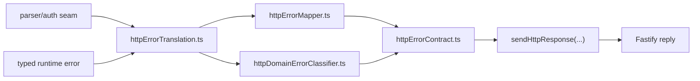

# Fowler branch analysis - API HTTP error translation stack

## Scope

This review covers the full branch delta against `origin/main` for the recent
API HTTP error translation work:

- `refactor(api): Hard cut runtime domain error classifier`
- `refactor(api): Harden HTTP runtime error translation boundary`
- `refactor(api): Expose HTTP error translation component API`

The slice stays inside `apps/api/src/entrypoints/http/*` and the supporting
local/canonical documentation around that boundary.

## System context

Inside the wider DVT system, this boundary is not a domain component. It is an
entrypoint-side translation layer between:

- parser/auth/application/runtime outcomes
- the canonical `HttpErrorEnvelope.v1`
- Fastify response serialization

That makes it comparable to the exception-translation layer in mature systems,
not to the engine or planner core.

## Fowler reading

From a Fowler viewpoint, the branch now reads as a clearer combination of:

- **Gateway / boundary translator**
  The component translates domain and application outcomes into a stable HTTP
  contract.
- **Presentation-model discipline**
  `HttpResponseModel` makes transport shape explicit instead of leaking ad hoc
  `{ status, body }` objects across routes.
- **Component façade**
  `httpErrorTranslation.ts` now acts as the public seam while internal modules
  keep narrower concerns.
- **Special case handling**
  typed runtime failures moved out of route bodies into a dedicated classifier.

This is materially closer to a mature boundary than the original mixed mapper.

## Comparison with mature systems

### Where the branch improved

- **Spring / ASP.NET style exception translation**
  The branch now has a dedicated translation layer instead of controller-local
  branching.
- **Stripe-style stable error envelope**
  A small stable error contract is preserved while internal semantics evolve.
- **Hexagonal edge discipline**
  `apps/api` owns transport mapping; the engine still owns runtime semantics.

### Where the branch still falls short

- response writing is still slightly inconsistent: some route consumers use
  `sendHttpResponse`, while others manually serialize `HttpResponseModel`
- internal success-path response writing is still mixed with translated-response
  writing in route consumers, making the seam less visually obvious than in
  mature middleware stacks
- there is no single route helper that makes “translated response vs raw
  success payload” visually explicit everywhere

## Patterns improved

- **SRP**
  Runtime-domain classification was split out of the generic mapper.
- **Encapsulation**
  Production consumers now depend on `httpErrorTranslation.ts` instead of
  internal mapper/classifier modules.
- **Semantic API**
  The component now presents a concern-grouped public API:
  `parse`, `auth`, `startRun`, `runtime`.
- **Local component documentation**
  The code now has a nearby guide with API, invariants, transitions, and
  consumers.
- **Architecture safety**
  The architecture test validates ownership and consumer import rules, not just
  file existence.

## Antipatterns detected

- **Manual boundary bypass**
  Some routes still write `HttpResponseModel` manually instead of using the
  owned transport serializer.
- **Half-finished encapsulation**
  Without uniform response writing, the translation component is semantically
  stronger than its final transport handoff.
- **Mixed transport style**
  Success responses and translated responses are visually similar in route code,
  which makes the transport boundary harder to scan.

## Component grouping

The branch establishes a real local component:

- `httpErrorTranslation.ts` - public component API
- `httpErrorContract.ts` - transport primitives and serializer
- `httpErrorReasonCatalog.ts` - stable reason catalog
- `routeParseIssue.ts` - parser/auth semantic rejection model
- `httpErrorMapper.ts` - parse/auth/facade/engine translation
- `httpDomainErrorClassifier.ts` - typed runtime-domain classification
- `httpErrorDetails.ts` - shared details helper

Consumers:

- query/admin/runtime routes
- route authorization seams
- plan route request resolver
- workspace graph draft routes

## Repetitions

- repeated manual `reply.code(...).send(...)` for values that are already
  `HttpResponseModel`
- repeated route-level distinction between “mapped transport response” and
  “success payload” expressed differently across files

## Opportunities

- unify writing of translated `HttpResponseModel` through `sendHttpResponse`
- strengthen the architecture test so production consumers cannot manually
  serialize mapped responses
- if the API keeps growing, add a tiny local route helper that makes “emit
  translated response” explicit in one name

## Drift

### Code drift

- semantic encapsulation improved faster than transport serialization
- a few route files still reveal the old manual-response style

### Documentation drift

- local and canonical docs already describe the public API seam correctly
- they should now also document the invariant that translated responses are
  emitted through the owned serializer, not handwritten route code

## Teachings

- when a component façade is introduced, finish the last hop and route output
  through the owned serializer too
- architecture tests should lock usage patterns, not only import topology
- “public API exists” is not enough; consumer ergonomics and handoff
  consistency matter just as much

## Action for the next pass

- unify route consumers on `sendHttpResponse` for translated `HttpResponseModel`
- extend the semantic architecture test to forbid manual serialization of
  mapped responses in production consumers

## Diagram

