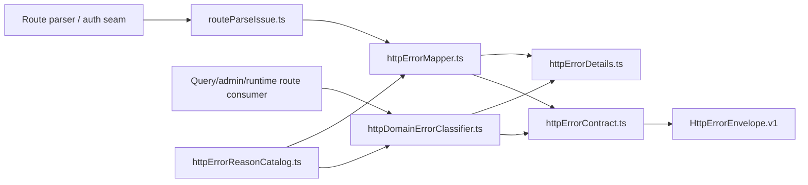

# Fowler architecture analysis - API HTTP runtime error translation boundary

## Scope and context

This analysis focuses on the recent work around the `apps/api` HTTP error
translation boundary, especially the seam now split across:

- `httpErrorContract.ts`
- `httpErrorReasonCatalog.ts`
- `routeParseIssue.ts`
- `httpErrorMapper.ts`
- `httpDomainErrorClassifier.ts`
- the route consumers that translate typed runtime failures into the canonical
  `HttpErrorEnvelope.v1`

The analysis is scoped to the boundary inside the wider DVT system. It does not
re-describe engine semantics, planner semantics, or adapter ownership.

## Fowler reading

From a Fowler perspective, the strongest interpretation of this slice is:

- **Gateway / boundary translator**
  `apps/api/src/entrypoints/http/*` translates domain/application outcomes into
  a caller-visible HTTP contract.
- **Separated presentation from domain**
  the HTTP boundary now knows transport shape and semantic reasons, but it does
  not own run lifecycle rules.
- **Special case handling moved out of the route body**
  runtime-domain error classification is no longer inlined ad hoc inside route
  handlers.
- **DTO / response model discipline**
  `HttpResponseModel` and `HttpErrorEnvelope` keep serialization explicit.

The main architectural gain is not “more files”. It is **better semantic
ownership**.

## Comparison with mature systems

Compared by pattern, not by lineage:

### What now looks more mature

- **Stripe-style stable error envelope**
  the system now behaves closer to mature public APIs that freeze a small,
  explicit caller-visible error shape and stop leaking route-local formatting.
- **ASP.NET / Spring exception-translation layers**
  a dedicated translation seam exists between typed domain failures and HTTP
  serialization, instead of letting controllers perform ad hoc branching.
- **Kubernetes-style boundary ownership**
  the API edge owns transport semantics while core domain packages remain the
  semantic authority for runtime failures.

### What still falls short of mature systems

- there is still no explicit local component home near the code explaining the
  owned concern, invariants, and consumers
- module-level owned concern is still mostly implicit
- architecture safety relied on unit tests and review, not on a semantic
  architecture test that locks the seam
- helper repetition (`compactDetails` / `withDetails`) still shows utility
  sprawl risk

## Patterns improved

- **SRP improved**
  `httpErrorMapper.ts` no longer mixes route/facade/auth mapping with runtime
  engine-error classification.
- **Encapsulation improved**
  runtime-domain translation now has a dedicated home instead of being a hidden
  branch chain inside a broader mapper module.
- **Stable semantic contract improved**
  the boundary continues to align with `HttpErrorEnvelope.v1` instead of
  regressing toward message parsing.
- **Consumer explicitness improved**
  runtime query/admin routes now import the classifier directly instead of
  depending on a mixed surface.

## Antipatterns detected

- **Utility sprawl**
  optional details helpers are duplicated across modules.
- **Implicit component**
  the boundary behaves like a component but is not documented as one.
- **Narrative drift**
  the previous closeout described a compatibility posture that the code should
  not keep long term.
- **Hidden semantics**
  without module docblocks, a reader has to reverse-engineer which file owns
  which part of the boundary.

## Components and code that should be grouped as a local component

The following should be treated as one local component:

- **HTTP runtime error translation boundary**
  - transport primitives: `httpErrorContract.ts`
  - stable reasons: `httpErrorReasonCatalog.ts`
  - parse-semantic result model: `routeParseIssue.ts`
  - facade/auth/engine mapper: `httpErrorMapper.ts`
  - runtime-domain classifier: `httpDomainErrorClassifier.ts`
  - route consumers: `adminRoutes.ts`, `getRunRoute.ts`,
    `getRunEventsRoute.ts`, `listRunsRoute.ts`,
    `runCommandRouteExecutor.ts`

This is a component because it has:

- one cohesive responsibility
- one explicit public contract
- a clear transition flow
- a small, stable consumer set

## Repetitions

- `compactDetails` duplicated
- `withDetails` duplicated
- repeated route-consumer import pattern for `mapRuntimeDomainError`
- repeated lack of module-owned-concern docblocks across the boundary

## Opportunities

- extract optional-detail helpers into a small dedicated module
- freeze the component with an architecture test that asserts semantic
  ownership, not just file existence
- add a local guide under `apps/api/docs` so engineers do not need to bounce
  between closeouts to understand the boundary
- add short owned-concern docblocks at the module top
- link the local guide from the canonical API component home

## Drift

### Code drift

- `httpErrorMapper.ts` still looked broader than its real concern because its
  module comments and local docs did not explain the split
- the repeated optional-detail helpers invited future divergence

### Documentation drift

- the previous closeout over-described compatibility and under-described hard
  ownership
- there was no current local component guide near the code
- `apps/api/README.md` still contains encoding damage and does not route readers
  to a local component guide

## Teachings for future slices

- when a seam becomes real, give it a local component home immediately
- avoid “compatibility” re-exports inside one package unless there is a real
  external consumer
- if a module owns semantics, lock that ownership with an architecture test
- closeouts are not a substitute for component documentation
- once two modules duplicate a tiny helper in the same boundary, treat it as a
  smell and decide explicitly whether to extract or keep it duplicated

## Actions applied in this pass

- create a local component guide with API, invariants, transitions, consumers,
  and diagrams
- add owned-concern docblocks to the boundary modules
- extract shared optional-detail helpers
- add a semantic architecture test for the boundary
- align canonical docs and local docs to the current code

## Diagram

