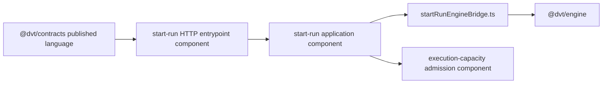
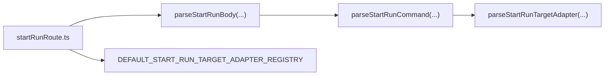

# Fowler architecture analysis - start-run application and HTTP entrypoint seam

## Scope

This analysis covers the active branch state of:

- `apps/api/src/application/services/BackpressureAwareStartRunUseCase.ts`
- `apps/api/src/application/services/PlannerBackedStartRunUseCase.ts`
- `apps/api/src/application/services/engineStartRunUseCase.ts`
- `apps/api/src/application/services/startRunEngineBridge.ts`
- `apps/api/src/application/services/startRunAuthorizedFacade.ts`
- `apps/api/src/entrypoints/http/startRunRoute*.ts`
- `apps/api/src/application/ports/startRun*.ts`
- local component docs and architecture tests for the start-run slice

## Problem summary

The branch had already improved the start-run slice materially, but it still
carried two architectural ambiguities:

1. the HTTP route boundary existed in code without being named as a local
   component with explicit invariants
2. the engine bridge mixed orchestration and translation responsibilities in a
   single module, while default adapter-registry composition leaked through
   several parser layers

That shape is workable, but it is not yet the clean “published language +
entrypoint adapter + application orchestration + engine bridge” decomposition
seen in mature systems.

## Root cause

- the initial hard-cut focused on removing app-local contract shims and adding
  admission/capacity seams, which was the correct priority
- once those blockers were removed, the remaining drift became subtler:
  ownership and composition defaults were still implicit inside the route side
  of the slice
- the previous architecture tests mainly protected path choices and file
  existence, but they did not yet fully protect semantic encapsulation at the
  HTTP subcomponent and app-to-engine bridge seams

## Constraints and invariants

- `@dvt/contracts` is shared kernel for serializable cross-package vocabulary,
  not owner of app-local behavior ports (`ADR-0018`)
- `apps/api` owns entry/application orchestration, composition, and transport
  semantics (`api-current-to-target-architecture.md`)
- provider-specific execution capacity must remain behind an abstract port
  (`ar-c3-start-run-execution-capacity-admission-plan-20260422.md`)
- response emission must use the public HTTP translation facade instead of
  route-local serialization (`http-runtime-error-translation-component.md`)
- the slice must close with package validation and `pnpm verify:prepush`
  (`AGENTS.md`, `ai-work-protocol.md`)

## Comparison with mature systems

Compared with mature control-plane and workflow APIs, the branch now aligns on
the right backbone:

- **published language**
  one canonical command/result vocabulary in a shared kernel
- **anti-corruption / translation seam**
  local conversion between API application semantics and engine/provider
  semantics
- **thin transport adapter**
  route layer composes parser + authenticated facade + response mapping instead
  of embedding logic inline
- **single composition decision**
  defaults and infrastructure bindings belong at the outer edge, not scattered
  across helper layers

This is the same direction used by mature systems such as workflow front doors,
admission controllers, and internal platform APIs: explicit contract,
transport-specific parsing, application orchestration, and provider-specific
details hidden behind ports.

## Patterns improved

- **Published language / shared kernel**
  canonical `StartRunCommand` / `StartRunResult` imports now come directly from
  `@dvt/contracts`
- **Hexagonal directionality**
  application ports stay local to `apps/api`; serializable boundary types stay
  in the shared kernel
- **Componentization**
  the HTTP entrypoint seam is promoted from implied files to an explicit local
  component
- **Anti-corruption layer**
  `startRunEngineBridge.ts` isolates engine-facing translation concerns from
  `EngineStartRunUseCase`
- **Single composition point**
  default adapter-registry wiring is now owned at the outer route seam only

## Antipatterns detected

### Fixed in this pass

- implicit HTTP subcomponent with no named contract
- repeated default registry binding in route, parser, and target-adapter parser
- mixed orchestration + translation in `engineStartRunUseCase.ts`
- missing `owned concern` docblocks on the start-run route boundary modules

### Still open

- `buildProtectedRuntimeModule.ts` remains the large composition root and the
  next bigger Fowler-sized decomposition candidate

## Components / code that group cleanly now

### 1. Start-run HTTP entrypoint component

- `startRunRoute.ts`
- `startRunRouteParser.ts`
- `startRunRouteCommandBuilder.ts`
- `startRunRouteTargetAdapterParser.ts`

### 2. Start-run application orchestration component

- `StartRunAuthorizedFacade.ts`
- `BackpressureAwareStartRunUseCase.ts`
- `PlannerBackedStartRunUseCase.ts`
- `EngineStartRunUseCase.ts`
- local ports under `apps/api/src/application/ports/startRun*.ts`

### 3. Start-run engine bridge subcomponent

- `startRunEngineBridge.ts`
- engine-result / engine-input translation at the app-to-engine seam

### 4. Start-run execution-capacity admission subcomponent

- `IStartRunExecutionCapacityPort.ts`
- `defaultStartRunExecutionCapacityPort.ts`
- `startRunAdmissionDecisions.ts`

## Repetitions

- repeated default registry composition across three route-layer files
- repeated implicit ownership of route parsing responsibilities
- repeated engine seam translation responsibilities inside one file

## Opportunities

1. decompose `buildProtectedRuntimeModule.ts` into named sub-runtimes
2. extract shared AST semantic helpers if the API component architecture tests
   continue to grow
3. add a protected-runtime local component guide once the composition root is
   decomposed further

## Drift found

### Code drift

- start-run route defaults were not aligned with “single composition point”
- engine translation responsibilities were more mixed than the local guide
  implied

### Documentation drift

- the local start-run application guide described the wider slice but did not
  document the HTTP entrypoint subcomponent explicitly
- README-level local component guide listings did not expose the HTTP
  subcomponent

## Selected remediation

1. add a local component guide for the start-run HTTP entrypoint seam
2. add semantic architecture tests for that seam
3. extract `startRunEngineBridge.ts`
4. move default adapter-registry composition to the route seam only
5. update the main start-run application guide to clarify shared-kernel vs
   local-port ownership

## Rejected alternatives

- **leave the route boundary implicit**
  rejected because semantic ownership would remain split across unnamed files
- **keep the engine bridge monolithic but only add comments**
  rejected because it would not reduce the actual responsibility mix
- **move local behavior ports into `@dvt/contracts`**
  rejected because ADR-0018 makes the shared kernel owner of serializable
  vocabulary, not behavior ports

## Diagrams

### Current target shape

### Default binding ownership

## Status after remediation

The slice is materially closer to a mature Fowler-style decomposition:

- clearer semantic ownership
- fewer hidden composition paths
- stronger AST-semantic guardrails
- explicit local docs for both the route seam and the application seam
- split admission test suites backed by a shared support module instead of one
  concentrated backpressure test file
