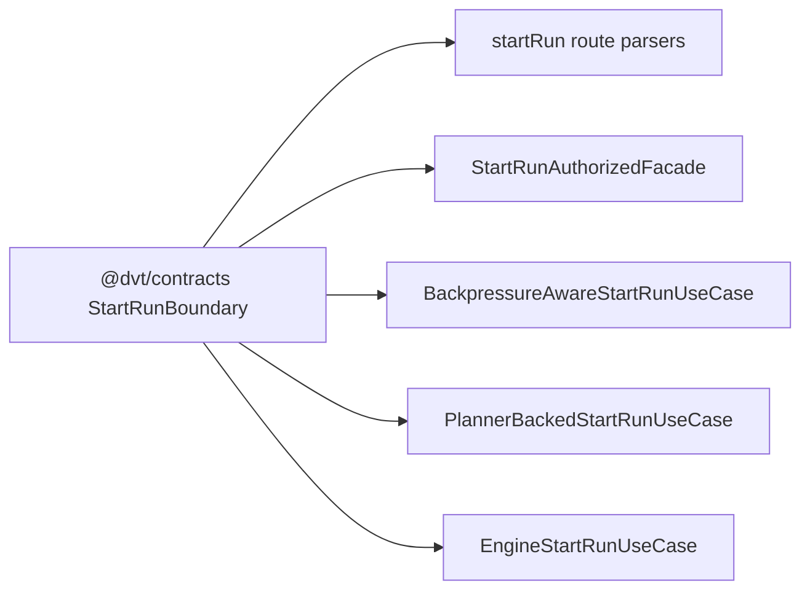
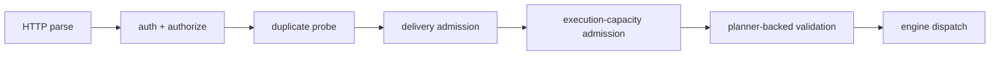

# Fowler architecture analysis - start-run boundary and admission seam

## Scope

This analysis covers the current state of:

- `packages/@dvt/contracts/src/contracts/engine/StartRunBoundary.v1.ts`
- `packages/@dvt/contracts/src/schema-packs/start-run.ts`
- `packages/@dvt/contracts/test/**`
- `apps/api/src/application/services/BackpressureAwareStartRunUseCase.ts`
- `apps/api/src/application/services/PlannerBackedStartRunUseCase.ts`
- `apps/api/src/application/services/engineStartRunUseCase.ts`
- `apps/api/src/application/services/startRunAuthorizedFacade.ts`
- `apps/api/src/application/ports/IStartRunExecutionCapacityPort.ts`
- local API start-run component guides and semantic architecture tests

## System context

The system is now closer to a mature Fowler-style shape than the earlier
app-local contract posture:

- `@dvt/contracts` owns the canonical caller-visible boundary
- `apps/api` owns orchestration, composition, auth, and admission
- execution-capacity semantics sit behind an abstract application port
- provider truth remains hidden behind ports and composition

This is the same direction used by mature control planes and queue-backed
admission front doors:

- one canonical external contract
- one orchestration layer
- provider-specific saturation behind ports
- fail-closed behavior when capacity truth is missing

## Patterns improved

- **Published language / shared kernel**
  `StartRunCommand` and `StartRunResult` are consumed from `@dvt/contracts`
  directly instead of through app-local shadow import paths.
- **Hexagonal port discipline**
  `IStartRunExecutionCapacityPort` keeps provider-native capacity semantics out
  of the API application layer.
- **Composition root discipline**
  the default capacity binding remains owned by
  `buildProtectedRuntimeModule.ts`, not by routes or use cases.
- **Separated orchestration**
  `startRunAdmissionDecisions.ts` keeps rejection/telemetry mapping out of the
  main use-case orchestration path.
- **Semantic packaging**
  the start-run application path is now documented as a local component with
  explicit API, invariants, transitions, and consumers.

## Antipatterns detected

### Resolved in this pass

- **Shadow contract import paths**
  removed:
  `startRunCommandContract.ts`,
  `startRunResultContract.ts`,
  `startRunContract.ts`
- **Normative drift**
  `StartRunBoundary.v1.md` no longer tolerates thin local re-export files
- **Documentation drift**
  the previous `buzon` analysis had mojibake and stale findings

### Still present

- **Large composition root**
  `apps/api/src/modules/buildProtectedRuntimeModule.ts` remains the heaviest
  seam in the slice and still concentrates too many assembly concerns
- **Large test files**
  `BackpressureAwareStartRunUseCase.test.ts` and
  `httpErrorTranslation.test.ts` remain useful but still large enough to
  warrant additional partitioning
- **AST helper duplication risk**
  the API and contracts test suites now both have AST-semantic tests; the next
  maturity move is a shared semantic-test helper package or clearer reuse

## Components that now group cleanly

### Shared start-run boundary component

- canonical command/result vocabulary
- grouped system-backpressure code sets
- schema pack derivation
- fixtures and contract tests

### Start-run application component in `apps/api`

- `startRunUseCasePort.ts`
- `startRunFacadePort.ts`
- `StartRunAuthorizedFacade.ts`
- `BackpressureAwareStartRunUseCase.ts`
- `PlannerBackedStartRunUseCase.ts`
- `EngineStartRunUseCase.ts`
- `startRunTargetAdapterRegistry.ts`

### Execution-capacity admission subcomponent

- `IStartRunExecutionCapacityPort.ts`
- `defaultStartRunExecutionCapacityPort.ts`
- `startRunAdmissionDecisions.ts`

## Diagrams

### Shared contract to API application flow

### Application transition chain

## Repetitions fixed

- removed local command/result re-export shims from `apps/api`
- switched application and route modules to direct `@dvt/contracts` imports
- added AST rules that prohibit the reintroduction of shim modules as an
  alternate path

## Drift fixed

- normative contract doc now matches the no-shim implementation
- engine contract component guide no longer lists deleted shim files
- API architecture index now documents the new local start-run application
  component guide
- `buzon` analysis is now UTF-8 clean and aligned with the codebase

## Future lessons

- when a contract becomes canonical, cut the old path completely; do not leave
  convenience import shims behind
- local component guides are useful only if they explain ownership and
  invariants, not if they restate file lists
- AST-semantic tests are worth the cost when the alternative is path-based
  drift returning silently
- composition roots should be documented as components before they are
  physically decomposed

## Opportunities

1. Split `buildProtectedRuntimeModule.ts` into smaller assembly components:
   storage runtime, admission runtime, security runtime, execution runtime,
   start-run runtime.
2. Continue splitting large behavior tests into taxonomy-specific suites.
3. Extract common AST inspection helpers if more semantic component tests land
   across API and contracts.
4. Add a local component guide for the protected runtime assembly once that
   composition root is decomposed further.

## Residuals

- no compatibility or shim path remains for the canonical start-run command and
  result boundary
- the next meaningful architectural slice is not more contract work; it is
  decomposition of the protected runtime composition root
