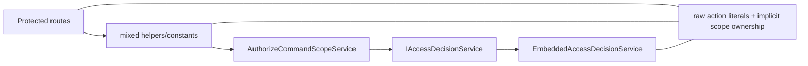
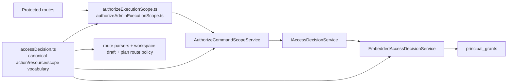
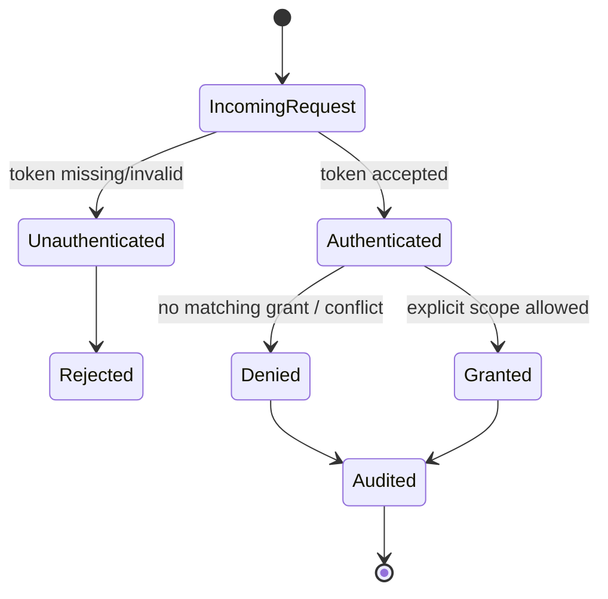

# Fowler architecture analysis - protected access-decision component

## Scope

This mailbox entry reviews the branch work around the protected authorization
boundary in `apps/api`:

- the DVT-owned `IAccessDecisionService` contract
- the embedded-first decision backend
- route and application consumers that now build explicit access scopes
- the protected security runtime builder, local component docs, and semantic
  architecture tests

It does not attempt to externalize the PDP yet. OpenFGA or another mature PDP
remains a later backend swap behind the same contract.

## System Context

Before this slice, the authorization story had improved structurally but was
still half-encapsulated:

- the route/application code already depended on `IAccessDecisionService`
- but action names were still scattered across route constants and local
  ports
- some code still inferred resource ownership from optional ids instead of an
  explicit resource discriminant
- global API docs still described an older repo-plus-policy runtime shape

After this slice, the system shape is tighter:

- `accessDecision.ts` owns the canonical action/resource/scope language
- route, application, and workspace-draft consumers reuse that published
  language
- the embedded backend consumes `requestedScope.resource` explicitly
- the protected security cluster now has its own local component guide and a
  semantic architecture test
- follow-up cleanup extracted the workspace-graph-draft capability policy into
  its own companion module and removed the remaining stringly-typed denial
  translator from that service
- follow-up cleanup also reduced branching noise in `listRunsRouteParser.ts`
  and replaced duplicated contract-test capability builders with a shared
  fixture factory
- global API docs no longer narrate the retired pre-embedded authz shape

## Fowler Reading

The important Fowler move here is not "more abstraction". It is a cleaner
published language and a clearer component boundary.

| Fowler concept             | Current owner                                                | Why it matters here                                                                     |
| -------------------------- | ------------------------------------------------------------ | --------------------------------------------------------------------------------------- |
| Published Language         | `accessDecision.ts`                                          | canonical action/resource/scope vocabulary now has one owner                            |
| Separated Interface        | `IAccessDecisionService`, `IAuthenticator`, `IAuthAuditPort` | route/application code depends on ports, not backend specifics                          |
| Application Service        | `AuthorizeCommandScopeService`                               | decision orchestration and audit stay out of routes                                     |
| Gateway / Adapter          | `EmbeddedAccessDecisionService`                              | local grant storage is hidden behind the decision port                                  |
| Policy Enforcement Point   | `authorizeExecutionScope.ts` and protected routes            | allow/deny happens at the API boundary                                                  |
| Special Case / Fail Closed | deny branches and unauthenticated branches                   | missing or mismatched grants reject explicitly                                          |
| Componentization           | local component guide + semantic architecture test           | the boundary is documented and fitness-checked as a component, not as a pile of helpers |

## Mature-System Comparison

The remediated shape is closer to mature control planes and policy systems:

- **Zanzibar/OpenFGA-style systems** keep a canonical object/action language
  and isolate route/service code from tuple-storage details. DVT now does the
  same locally through `accessDecision.ts`, even though the first backend is
  embedded instead of remote.
- **OPA/Cedar-style deployments** treat authorization as a decision boundary
  with application-specific input, not as ad hoc checks inside every route.
  DVT now follows that pattern at the API boundary.
- **Spring Security / mature gateway stacks** typically separate
  authentication, decision, audit, and business execution. The current
  protected-security component now expresses those responsibilities directly.

DVT still differs from those mature systems in one deliberate way: the first
backend remains embedded to avoid an extra network dependency. That is
acceptable as long as the application contract stays stable and vendor-neutral.

## Patterns Improved

- **Semantic encapsulation**
  Canonical actions now live in `AUTHORIZATION_ACTION` and
  `AUTHORIZATION_ACTION_NAME` instead of being re-authored route by route.
- **Explicit resource modeling**
  Tenant/project/environment/workspace-draft scope ownership is explicit in the
  contract and consumed explicitly by the embedded backend.
- **Component boundary clarity**
  The protected security cluster now has its own local component guide with
  API, invariants, transitions, consumers, and diagrams.
- **Companion policy extraction**
  `AuthorizeWorkspaceGraphDraftCapabilityService` now orchestrates while
  `workspaceGraphDraftCapabilityPolicy.ts` owns capability-shaping rules and
  typed denial translation.
- **Semantic fitness**
  Architecture coverage now checks ownership rules and language placement, not
  only whether a root stays thin.
- **Doc/code convergence**
  Global API docs now describe the embedded-first protected-security runtime
  instead of a retired repo-plus-policy split.

## Antipatterns Detected

### Resolved in this pass

- **Published language drift**
  Access actions were valid but scattered. That invited semantic drift across
  routes and docs.
- **Implicit scope ownership**
  The backend could still infer ownership from optional ids instead of reading
  the explicit resource discriminant.
- **Narrative drift in docs**
  The active API component doc still talked about a `principal access repo`
  runtime that no longer existed as the public shape.
- **Component invisibility**
  The protected security cluster was real in code but not documented as a
  first-class local component with semantic tests.
- **Behavioral clutter in adapters and fixtures**
  `listRunsRouteParser.ts` and the workspace-graph-draft contract validation
  fixtures each had local repetition that hid the real concern under branching
  and near-identical builders.

### Still present or deliberately deferred

- **Embedded grant-model leakage risk**
  The embedded backend still knows the local `principal_grants` JSON shape.
  That is acceptable for now because it stays behind the adapter boundary.
- **No external PDP yet**
  This is deliberate. The contract is ready, but the backend is intentionally
  local-first.
- **Raw action literals in some tests and grant fixtures**
  A portion of test vectors still use explicit strings. That is acceptable when
  the test is exercising contract compatibility or fixture readability rather
  than re-owning production semantics.

## Components That Group Cleanly

### Protected security access-decision component

- `apps/api/src/application/ports/accessDecision.ts`
- `apps/api/src/application/ports/auth.ts`
- `apps/api/src/application/ports/authContract.ts`
- `apps/api/src/application/services/authorizeCommandScopeService.ts`
- `apps/api/src/application/services/workspaceGraphDraftCapabilityPolicy.ts`
- `apps/api/src/infrastructure/auth/embeddedAccessDecisionService.ts`
- `apps/api/src/entrypoints/http/authorizeExecutionScope.ts`
- `apps/api/src/entrypoints/http/authorizeAdminExecutionScope.ts`
- `apps/api/src/modules/protectedRuntime/buildProtectedSecurityRuntime.ts`
- `apps/api/docs/protected-security-access-decision-component.md`
- `apps/api/test/application/services/protectedSecurityAccessDecision.architecture.test.ts`

### Explicit-scope route consumers

- `startRunRouteParser.ts`
- `getRunRouteParser.ts`
- `getRunEventsRouteParser.ts`
- `listRunsRouteParser.ts`
- `adminRoutes.ts`
- `runCommandRoute.constants.ts`
- `signalRunRouteAuthorization.constants.ts`
- `planRoutePolicyCatalog.ts`
- `workspaceGraphDraft.ts`

## Repetitions

### Fixed

- repeated action literals such as `run:start`, `run:list`, `run:view`,
  `run:logs:view`, and `admin:rebuild-snapshot` across production modules
- repeated capability decision assembly in
  `AuthorizeWorkspaceGraphDraftCapabilityService`
- repeated near-identical capability fixtures in
  `packages/@dvt/contracts/test/validation/workspace-graph-draft.ts`
- repeated branching concern inside `listRunsRouteParser.ts`
- repeated route-level ambiguity about who owns action constants

### Intentionally retained

- string literals in test fixtures and grant arrays where explicit vectors make
  the behavior easier to read and audit

## Opportunities

1. Add a second backend adapter later without changing route/application code.
2. Introduce a shared grant-fixture helper for integration tests if fixture
   duplication starts to obscure intent.
3. Promote the semantic-fitness pattern used here to other `apps/api`
   components that still rely mostly on thinness tests.
4. If an external PDP is added later, keep the same DVT action/resource
   vocabulary and only map it inside the adapter.

## Drift Fixed

- `accessDecision.ts` now owns canonical action objects as well as types.
- Embedded decision evaluation now switches on explicit `resource`
  discriminants.
- `AuthorizeWorkspaceGraphDraftCapabilityService` now imports policy shaping
  from `workspaceGraphDraftCapabilityPolicy.ts` instead of owning a local
  capability-policy table plus an open-ended denial-reason alias.
- `planRoutePolicyCatalog.ts`, `workspaceGraphDraft.ts`,
  `startRunRouteParser.ts`, route parser constants, and `adminRoutes.ts`
  consume the canonical action language.
- `listRunsRouteParser.ts` now expresses tenant/project/environment validation
  through focused helper functions rather than one larger branchy parser body.
- `protected-runtime-and-plan-compile-component.md`,
  `api-current-to-target-architecture.md`, and `apps/api` local docs now point
  at the protected-security component as it actually exists.
- A mailbox review, local component guide, and semantic architecture test now
  anchor the component in repo governance.

## Diagrams

### Before remediation

### After remediation

### Authorization transition

## Future Lesson

The contract is not truly isolated until the **language** is isolated.
Extracting a port without also extracting the canonical action/resource
vocabulary leaves a half-finished boundary. Mature systems win here by making
the published language explicit and then forcing all adapters and consumers to
speak it. DVT should keep doing that for every boundary it extracts.
