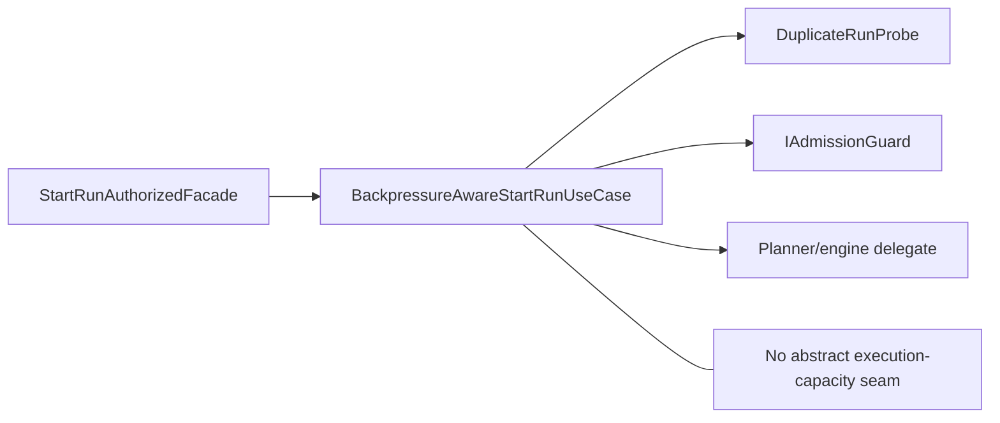
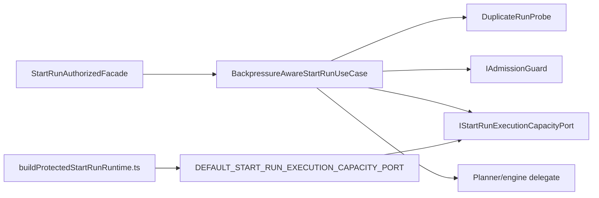
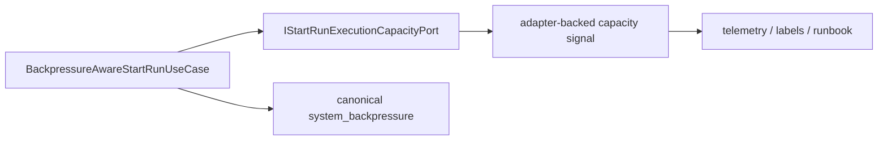

# Fowler architecture analysis - AR-C3 execution-capacity admission

## Scope

This mailbox entry reviews the current branch posture for `AR-C3`, with focus
on the abstract seam already implemented as `AR-C3-A`:

- `BackpressureAwareStartRunUseCase`
- `IStartRunExecutionCapacityPort`
- `defaultStartRunExecutionCapacityPort`
- `startRunAdmissionDecisions`
- `buildProtectedStartRunRuntime`
- local API component guides, planning state, and semantic architecture tests

It does not claim `AR-C3-B` or `AR-C3-C` as complete. Concrete adapter
binding, telemetry, runbook, and sustained operational evidence remain open.

## System context

Before this seam, start-run admission already owned duplicate detection and
delivery-pressure checks, but it had no abstract way to answer the adjacent
question:

> Can the selected execution adapter absorb another run now?

That created an unhealthy architectural fork:

- either accept work the executor could not currently absorb
- or leak Temporal-specific saturation vocabulary into `apps/api`

The branch moved the system toward the mature shape:

- the API admission boundary owns an application-facing capacity seam
- the use case keeps orchestration ownership
- composition owns the default binding
- caller-visible rejection still uses one canonical language:
  `system_backpressure`

## Fowler reading

The value of `AR-C3-A` is not "more abstraction". It is better placement of
responsibility.

| Fowler concept             | Current owner                               | Improvement                                                          |
| -------------------------- | ------------------------------------------- | -------------------------------------------------------------------- |
| Separated interface        | `IStartRunExecutionCapacityPort`            | API admission depends on a semantic port, not provider data          |
| Application controller     | `BackpressureAwareStartRunUseCase`          | orchestration order stays in one place                               |
| Composition root           | `buildProtectedStartRunRuntime.ts`          | default binding is owned at assembly time                            |
| Published language         | `StartRunBoundary.v1`                       | denial remains `system_backpressure`, not a parallel result family   |
| Special case / fail closed | `DEFAULT_START_RUN_EXECUTION_CAPACITY_PORT` | missing capacity truth rejects explicitly                            |
| Anti-corruption boundary   | `startRunAdmissionDecisions.ts`             | provider-shaped reasons are translated into canonical contract codes |

## Comparison with mature systems

Mature systems normally keep caller-facing admission policy independent from a
particular scheduler:

- the controller or route does not read queue depth directly
- the application layer consumes semantic admission signals
- the concrete scheduler signal is bound behind composition
- inability to obtain trustworthy capacity data fails closed or degrades in a
  governed way

The current DVT+ posture now matches that pattern at the abstract boundary
level. It is still less mature in two ways:

1. the seam is not yet driven by a real adapter signal
2. the operator story for distinguishing capacity rejection from existing
   delivery pressure is not yet fully closed

That is acceptable. Mature systems reach this in phases. The problem before was
not "lack of concrete metrics"; it was lack of the correct boundary.

## Patterns improved

- **Hexagonal discipline**
  `apps/api` now owns a real application port instead of importing provider
  truth directly.
- **Composition-root ownership**
  The fail-closed default binding lives in `buildProtectedStartRunRuntime.ts`,
  not in the use case, route, or facade.
- **Fail-closed posture**
  Missing signal maps to `capacity_signal_unavailable` rather than silent
  permissive behavior.
- **Semantic translation isolation**
  `startRunAdmissionDecisions.ts` keeps contract mapping and telemetry shaping
  out of the orchestrator.
- **Local componentization**
  The seam now has its own component guide with public API, invariants,
  transitions, consumers, and diagrams.
- **Fitness-function direction**
  Architecture tests now freeze semantic invariants, not only "correct import
  path" shape.

## Antipatterns detected

### Resolved in this pass

- **Provider vocabulary leak risk**
  Temporal-shaped saturation no longer needs to cross into the API contract.
- **Fail-open omission**
  No capacity signal no longer implies accidental admission.
- **Composition ambiguity**
  The real default-binding owner is now documented as
  `buildProtectedStartRunRuntime.ts`.
- **Planning drift**
  Lane state no longer describes the abstract seam as queued work only.

### Still present or deferred

- **No concrete signal yet**
  `AR-C3-B` is still open, so the port is abstract-first rather than
  operationally complete.
- **No operator closure yet**
  `AR-C3-C` remains open for dashboards, runbooks, and evidence.
- **Broad protected runtime root**
  `buildProtectedRuntimeModule.ts` is still the heavy outer composition root,
  even though start-run composition has been extracted one level down.

## Components that group cleanly

### Execution-capacity admission component

- `IStartRunExecutionCapacityPort.ts`
- `defaultStartRunExecutionCapacityPort.ts`
- `startRunAdmissionDecisions.ts`
- `BackpressureAwareStartRunUseCase.ts`
- `buildProtectedStartRunRuntime.ts`
- `start-run-execution-capacity-admission-component.md`
- `startRunExecutionCapacityAdmission.architecture.test.ts`

### Neighboring components that should stay separate

- start-run HTTP entrypoint component
- authenticated start-run application component
- protected runtime dependency builders

This separation is healthy. Collapsing them back together would hide the
semantic boundary that `AR-C3-A` just created.

## Repetitions

### Fixed

- repeated "planned seam" language across planning/doc surfaces when the seam
  already existed in code
- repeated wrong ownership reference to `buildProtectedRuntimeModule.ts` for
  the default binding

### Still acceptable

- `BackpressureAwareStartRunUseCase` and
  `BackpressureAwareStartRunUseCase.executionCapacity.test.ts` both encode
  ordering truth; one is production code, one is runtime behavior proof
- the component guide and the architecture test both restate invariants; this
  is intentional because one is prose and the other is executable fitness

## Drift map

### Fixed in this pass

- `agent-lane-c.yaml` now reflects that `AR-C3-A` is implemented and under
  review
- `api-current-to-target-architecture.md` now points the capacity default
  binding at `buildProtectedStartRunRuntime.ts`
- `20260422-api-start-run-execution-capacity-admission-closeout.md` now cites
  the real composition owner
- the local component guide now records Fowler lessons, explicit anti-patterns,
  and semantic fitness rules

### Still open by design

- parent `AR-C3` remains in progress because `AR-C3-B/C` are still open
- no claim is made that telemetry/runbook closure exists yet

## Diagrams

### Before AR-C3-A

### After AR-C3-A

### Mature target for AR-C3-B/C

## Opportunities

1. Land `AR-C3-B` without leaking provider-native metrics or queue-depth
   semantics into the port.
2. Add one integration test at the protected-runtime composition level when the
   concrete binding exists.
3. Consider extracting a shared semantic-architecture helper once more local
   components follow this pattern.
4. Keep shrinking `buildProtectedRuntimeModule.ts` so outer-root complexity does
   not erase the boundary gains made by `buildProtectedStartRunRuntime.ts`.

## Future lessons

- Introduce the abstract seam before the concrete signal if the deeper risk is
  architectural leakage, not missing metrics.
- When a subcomponent is extracted from a larger composition root, immediately
  truth-sync the plan, diagrams, and closeout paths; otherwise the repo records
  a false architecture.
- Architecture tests should lock ordering and invariants that would change the
  system meaning, not just import topology.
- One canonical caller-visible rejection language is healthier than a new
  top-level result kind for each new internal pressure source.

## Remediation evidence

- Component guide:
  `apps/api/docs/start-run-execution-capacity-admission-component.md`
- Semantic architecture test:
  `apps/api/test/application/services/startRunExecutionCapacityAdmission.architecture.test.ts`
- Planning truth:
  `docs/planning/state/agent-lane-c.yaml`
- System architecture truth-sync:
  `docs/architecture/components/api/api-current-to-target-architecture.md`
