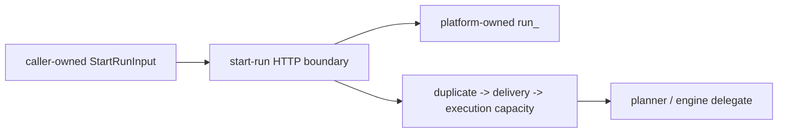
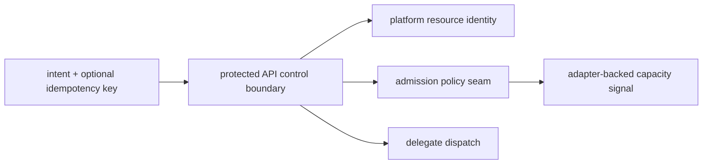

# Fowler architecture analysis - branch start-run control boundary

## Scope

This mailbox entry reviews the real work currently present in the branch
context:

- committed `AR-C7` platform-owned start-run identity work
- local `AR-C3-A` execution-capacity admission truth-sync and semantic
  hardening
- the surrounding API, web, docs, and tests that now define the `start-run`
  control boundary

It does not claim closure for:

- `AR-C3-B` concrete adapter-backed capacity binding
- `AR-C3-C` telemetry/runbook/evidence closure
- plan-record tenant indexing

## System context

The branch has effectively hardened one control-plane path:

`caller intent -> protected API parsing -> platform-owned run identity ->
authenticated admission -> delegate dispatch`

Before these changes, the path was weaker in two adjacent places:

- the browser authored canonical runtime identity
- the API had no abstract execution-capacity seam

Those are not unrelated bugs. Together they are boundary failures. One leaked
identity ownership outward; the other left admission ownership underspecified.

## Comparison with mature systems

Mature workflow and control-plane systems usually keep three things separate:

1. caller-owned intent
2. platform-owned resource identity
3. runtime-admission policy

They do not let browsers mint canonical execution ids, and they do not let the
API application layer depend directly on scheduler queue vocabulary.

The branch now moves DVT+ toward that shape:

- web owns `StartRunInput` caller intent
- API HTTP boundary owns opaque `run_<UUIDv7>` allocation
- authenticated application orchestration owns duplicate, delivery, and
  execution-capacity ordering
- composition owns the fail-closed default execution-capacity binding

The remaining maturity gap is operational, not conceptual:

- no concrete adapter-backed capacity signal yet
- no separate caller idempotency contract yet
- no storage indexing closure for plan-record tenancy yet

## Patterns improved

- **Separated interface**
  `StartRunInput` and `StartRunCommand.runId` are no longer collapsed into one
  caller-authored payload shape.
- **Published language discipline**
  caller-visible execution-capacity denial still uses canonical
  `system_backpressure`.
- **Composition root discipline**
  `buildProtectedStartRunRuntime.ts` owns the fail-closed default execution-
  capacity binding.
- **Special case / fail-closed**
  caller `runId` is rejected explicitly, and missing execution-capacity signal
  rejects explicitly.
- **Local semantic components**
  the branch now has specific local guides for HTTP entrypoint, platform
  identity, execution-capacity admission, web client identity, and the grouped
  start-run control boundary.
- **Fitness functions**
  architecture tests now validate owned concern, ordering, fail-closed
  semantics, and separation of concerns rather than only thin-barrel shape.

## Antipatterns detected

### Resolved in this branch context

- **Client-authored runtime identity**
  fixed by `ADR-0050` / `AR-C7`.
- **Admission hole next to existing backpressure checks**
  fixed at the abstract-boundary level by `AR-C3-A`.
- **Documentation fragmentation**
  start-run identity and admission are no longer documented only as scattered
  sub-bullets.
- **Planning drift**
  `agent-lane-c.yaml` now reflects that `AR-C3-A` is implemented and under
  review.

### Still present or intentionally deferred

- **No start-run idempotency key**
  resource identity and retry identity are still separate future work.
- **No concrete capacity binding**
  `AR-C3-B` remains open.
- **No operator closure for capacity denials**
  `AR-C3-C` remains open.
- **Plan-record storage posture**
  tenancy indexing remains separate from runtime identity ownership.

## Components that now group cleanly

### Web client identity boundary

- `apps/web/src/app/ports/runs.ts`
- `apps/web/src/app/services/runs/runsService.api.ts`
- `apps/web/src/app/services/runs/runsService.mock.ts`
- `apps/web/src/app/services/runs/runsService.ts`
- `apps/web/src/app/views/canvas/canvasRunSelection.ts`
- `apps/web/src/app/views/canvas/canvasRunStartAction.ts`
- `docs/architecture/components/web/runs/start-run-client-identity-boundary.md`

### API start-run HTTP identity boundary

- `apps/api/src/entrypoints/http/startRunRoute.ts`
- `apps/api/src/entrypoints/http/startRunRouteParser.ts`
- `apps/api/src/entrypoints/http/startRunRouteCommandBuilder.ts`
- `apps/api/src/entrypoints/http/startRunIdentity.ts`
- `apps/api/docs/start-run-http-entrypoint-component.md`
- `apps/api/docs/start-run-platform-identity-component.md`

### API start-run admission boundary

- `apps/api/src/application/services/BackpressureAwareStartRunUseCase.ts`
- `apps/api/src/application/ports/IStartRunExecutionCapacityPort.ts`
- `apps/api/src/application/services/defaultStartRunExecutionCapacityPort.ts`
- `apps/api/src/application/services/startRunAdmissionDecisions.ts`
- `apps/api/src/modules/startRun/buildProtectedStartRunRuntime.ts`
- `apps/api/docs/start-run-execution-capacity-admission-component.md`

### Grouped API start-run control boundary

- `apps/api/src/app.ts`
- `apps/api/src/entrypoints/http/startRunRoute.ts`
- `apps/api/src/application/services/BackpressureAwareStartRunUseCase.ts`
- `apps/api/src/modules/startRun/buildProtectedStartRunRuntime.ts`
- `apps/api/docs/start-run-control-boundary-component.md`

## Repetitions

### Fixed

- repeated negative explanations of retired web behavior were replaced by the
  positive `StartRunInput` contract
- repeated stale planning language describing `AR-C3-A` as queued-only has been
  removed from the lane truth
- repeated wrong ownership attribution to `buildProtectedRuntimeModule.ts` for
  the default execution-capacity binding has been corrected

### Still acceptable

- identity and admission invariants appear in both prose and tests; that is
  deliberate because one is reader-facing and the other is executable

## Drift map

### Fixed in this pass

- branch-level analysis now exists as one document instead of forcing readers to
  stitch `AR-C7` and `AR-C3-A` together mentally
- the system architecture review now names the grouped start-run control
  boundary
- API current-to-target architecture now includes an integrated start-run
  control-boundary diagram
- `apps/api` local guide inventory now lists the grouped control-boundary guide
- `app.ts` now declares its owned concern explicitly

### Still open

- `AR-C3-B/C` remain open and should stay open until real binding and
  operational evidence exist

## Diagrams

### Before branch hardening

### After branch hardening

### Mature target

## Opportunities

1. Land `AR-C3-B` with a real adapter-backed signal behind the abstract port.
2. Add a governed start-run idempotency key separate from `runId`.
3. Close the P1 plan-record tenancy indexing follow-up.
4. Reuse the grouped-boundary pattern for other protected control-plane routes.

## Future lessons

- Boundary hardening often comes in adjacent pairs. Identity and admission were
  two sides of the same control-plane problem.
- Local guides are more useful when they describe ownership and invariants at
  the right aggregation level, not just one file at a time.
- Semantic fitness tests should freeze meaningful ordering and ownership, not
  just import topology.
- Do not wait for operational completion before documenting the conceptual
  boundary correctly.

## Remediation evidence

- grouped API guide:
  `apps/api/docs/start-run-control-boundary-component.md`
- integrated API fitness:
  `apps/api/test/entrypoints/http/startRunControlBoundary.architecture.test.ts`
- identity fitness:
  `apps/api/test/entrypoints/http/startRunIdentity.architecture.test.ts`
- admission fitness:
  `apps/api/test/application/services/startRunExecutionCapacityAdmission.architecture.test.ts`
- web caller-boundary fitness:
  `apps/web/src/app/views/canvas/canvasRunStartIdentity.architecture.test.ts`
