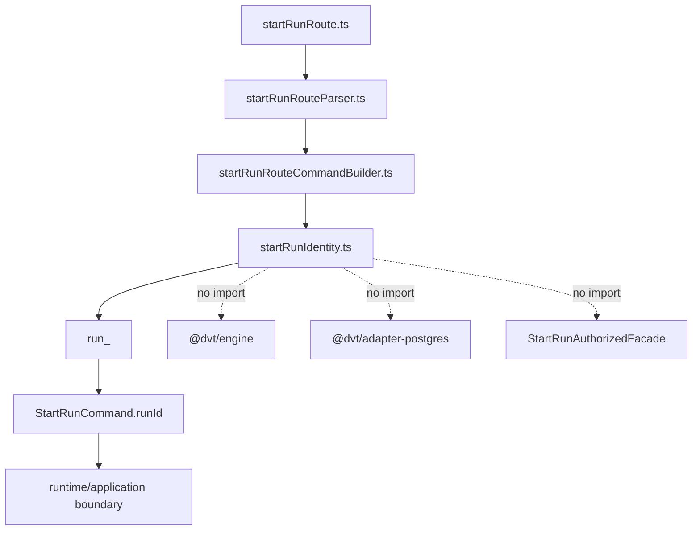
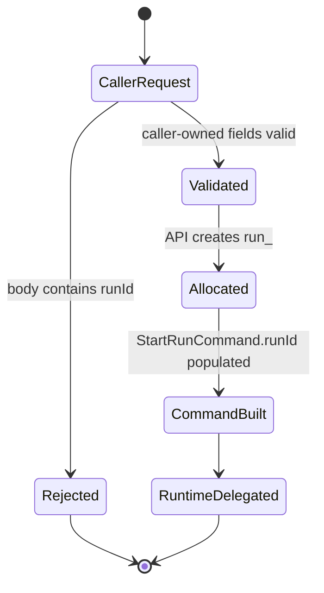

# Fowler architecture analysis - run-id UUIDv7 migration

## Scope

This mailbox entry reviews the follow-up migration from an API-owned generic
UUID generator to the governed `run_<UUIDv7>` start-run identity format.

It is intentionally narrower than the main tenant/run identity remediation:

- it covers collision risk, multi-instance allocation, and API boundary shape;
- it does not add retry, dedupe, lifecycle, or provider workflow behavior;
- it treats the API as a control-plane entrypoint, not as a second engine.

## Architecture Reading

The correct Fowler-style move is an Identity Field at the protected boundary:
the API allocates a stable resource id, then hands it to the application/runtime
boundary. The API does not infer lifecycle transitions from that id and does not
perform engine-like recovery.

Mature systems make this distinction explicit:

- the API server allocates resource identity;
- persistence enforces uniqueness;
- runtime/application components own state transitions and recovery;
- clients treat resource ids as opaque handles.

DVT+ now follows that model for `POST /runs/start`.

## Decision

The start-run allocator emits `run_<UUIDv7>`.

Why this shape:

- UUIDv7 gives millisecond time locality for storage and operations.
- Cryptographic random bits give practical collision resistance across API
  instances without central coordination.
- The `run_` prefix preserves the existing runtime vocabulary.
- No host, process, tenant, or provider identity leaks into the id.

What this explicitly does not mean:

- frontend code must not parse timestamp bits;
- engine code must not use UUID structure for ordering or lifecycle;
- API code must not retry, dedupe, or recover starts inside the identity
  allocator;
- provider workflow ids remain provider/runtime concerns.

## Antipatterns Avoided

- **Shadow engine in API**: rejected by keeping allocator imports limited to
  `node:crypto` and banning engine, adapter, state-store, and facade imports in
  the architecture test.
- **Client sequencing by id parsing**: rejected by documenting the id as opaque
  in frontend and API component guides.
- **Ad hoc idempotency**: rejected by keeping repeated accepted starts as
  distinct runs until a governed idempotency key exists.
- **Host-based uniqueness theater**: avoided by not embedding instance ids,
  process ids, timestamps alone, or tenant ids in the generated value.

## Component Grouping

## Transition

## Drift Fixed

- `ADR-0050` now records the concrete `run_<UUIDv7>` format.
- The API HTTP component guide now states that the allocator is not retry,
  lifecycle, dedupe, persistence, adapter, or engine ownership.
- `startRunIdentity.ts` now has a dedicated local component guide with public
  API, invariants, transitions, consumers, diagrams, and semantic fitness
  rules.
- The web component guide now states that returned `EngineRunRef.runId` is
  opaque even though the current platform allocator uses UUIDv7.
- The semantic API architecture test now checks UUIDv7 shape and forbidden
  coupling, not only route behavior.

## Remaining Opportunities

1. Add a governed idempotency key if callers need retry-safe start semantics.
2. Keep persistence uniqueness as the final collision guard and add typed
   storage-error translation only if operator diagnostics need it.
3. Add an OpenAPI or JSON-schema request surface if `/runs/start` becomes an
   external public API.
4. Reuse the allocator fitness pattern for future platform-owned resource ids.

## Future Lesson

A stronger id format does not expand ownership. `UUIDv7` solves allocation
quality and locality; it does not justify moving runtime semantics into the API.
