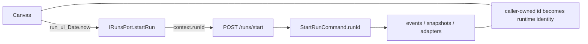
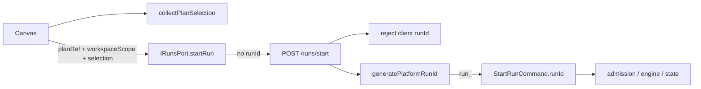
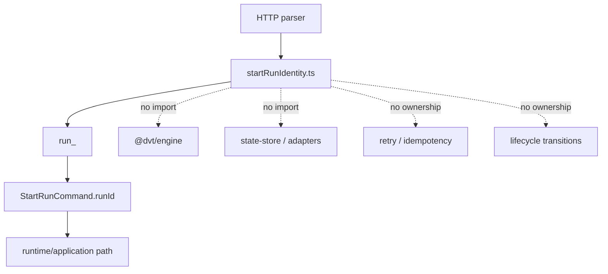
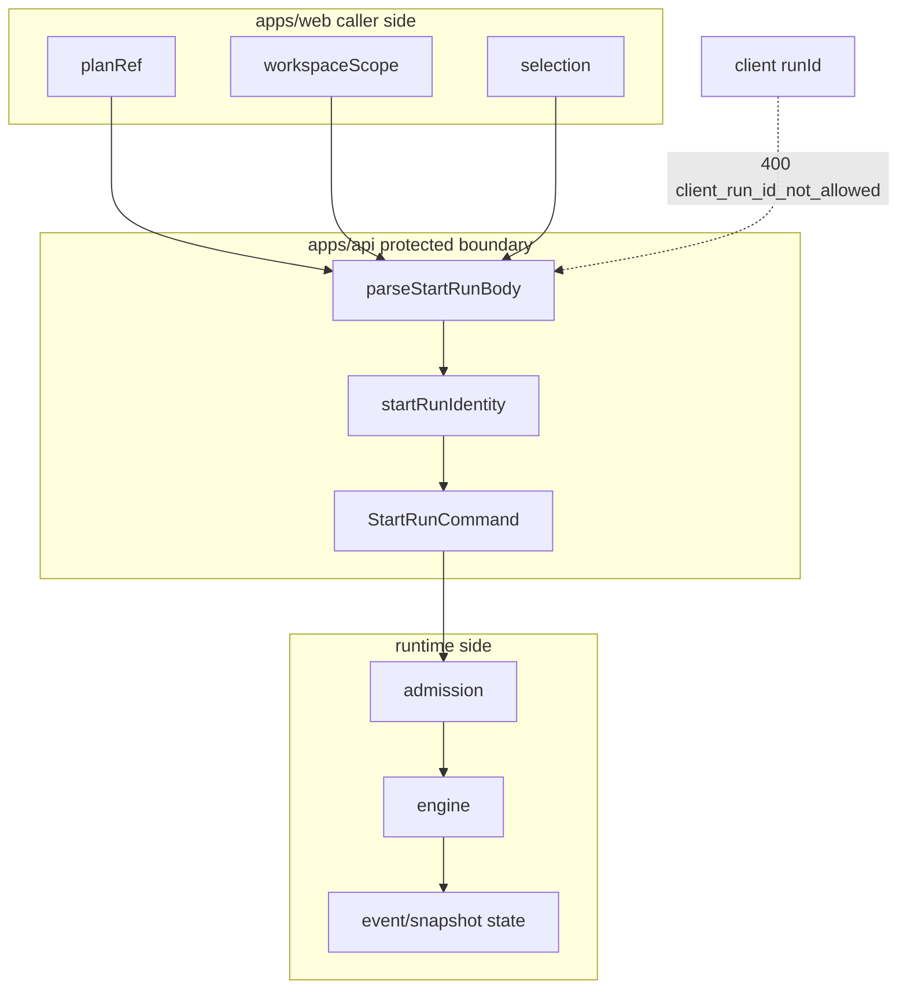
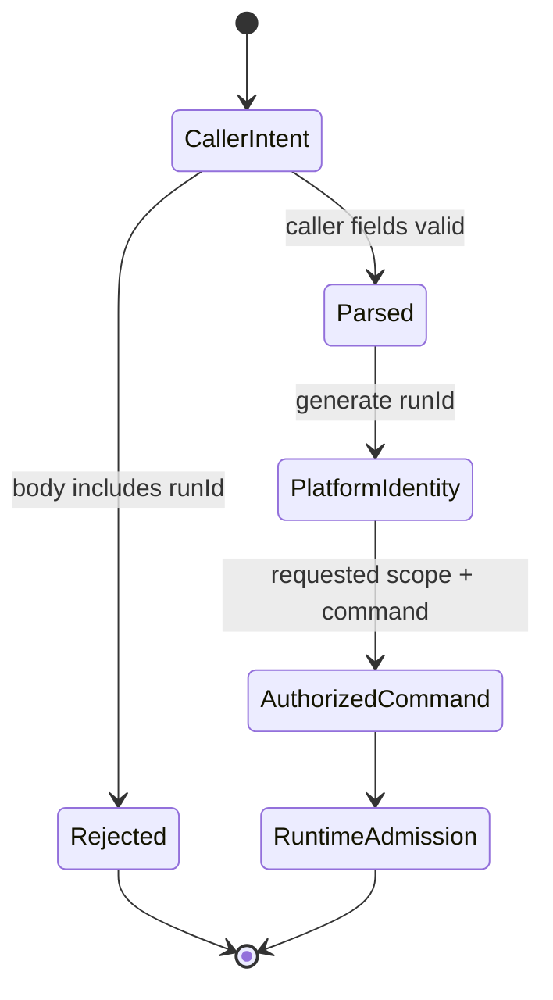

# Fowler architecture analysis - tenant/run identity remediation

## Scope

This mailbox entry reviews the branch work that closed the 2026-04-23 P0
tenant/run identity finding:

- API `POST /runs/start` parsing and command assembly
- web `StartRunInput`, API/mock runs services, and Canvas run-start action
- ADR/proposal/closeout docs for platform-owned run identity
- new semantic component docs and architecture fitness tests

It does not review plan-record tenant indexing. That remains the separate P1
storage-indexing risk from the system architecture review.

## System Context

Before the branch, Canvas minted `run_ui_${Date.now()}` and the API accepted
that value as canonical `StartRunCommand.runId`. That leaked an internal
runtime identity requirement into the caller-facing HTTP contract.

After the branch, the system shape is:

- web owns caller intent: `planRef`, `workspaceScope`, and `selection`
- API owns protected transport parsing and platform `run_<UUIDv7>` generation
- application/runtime keep receiving a concrete `StartRunCommand.runId`
- clients only observe canonical run identity after `EngineRunRef` is returned
- API identity allocation remains a control-plane concern, not a second engine:
  lifecycle, recovery, retry, duplicate-run policy, and provider workflow ids
  stay out of the HTTP entrypoint allocator

## Fowler Reading

The important Fowler-style movement is not "more layers". It is a cleaner
boundary between presentation input, transport adaptation, application
orchestration, and runtime identity.

| Fowler concept             | Current owner                                      | Branch delta                                                                 |
| -------------------------- | -------------------------------------------------- | ---------------------------------------------------------------------------- |
| Gateway                    | `runsService.api.ts`, `startRunRoute.ts`           | web/API boundary now adapts caller intent instead of leaking runtime context |
| Published Language         | `StartRunInput`, `StartRunCommand`, `EngineRunRef` | external and internal vocabularies are no longer collapsed                   |
| Separated Interface        | `IRunsPort`, `StartRunAuthorizedFacade`            | presentation code depends on caller-owned start-run intent                   |
| Application Controller     | `executeCanvasRunStartAction`, `startRunRoute`     | controllers orchestrate readiness/translation, not identity authority        |
| Special Case / Fail Closed | `client_run_id_not_allowed`                        | malicious or stale clients are rejected explicitly                           |
| Identity Field             | `startRunIdentity.ts`                              | API-owned `run_<UUIDv7>` is opaque to consumers and sortable for operations  |

## Mature-System Comparison

Mature control planes usually separate request correlation from resource
identity:

- clients can supply intent and sometimes an idempotency key
- servers allocate canonical resource ids
- protected boundaries reject stale or privileged identity fields
- adapters receive provider-specific ids only after platform admission

The remediated DVT+ posture now matches that direction. It is closer to systems
such as payment APIs, workflow orchestrators, and Kubernetes-style control
planes where the API server is the authority for persisted object identity.

The additional UUIDv7 migration aligns with mature control planes that need
multi-instance allocation without central coordination while still benefiting
from storage locality and operationally readable chronology. The key maturity
constraint is opacity: consumers may store and display the id, but they must not
derive ordering, authorization, lifecycle, or retry behavior from UUID bits.

The remaining maturity gap is idempotency. Platform-owned `runId` is correct,
but repeated accepted start requests still create distinct runs unless a future
governed idempotency contract is added.

## Patterns Improved

- **Boundary isolation**
  Web no longer mirrors the internal `RunContext` shape for execution.
- **Explicit identity authority**
  API parsing inserts the platform-owned `runId` after validating caller-owned
  fields.
- **Fail-closed parsing**
  Incoming `runId` is rejected with `client_run_id_not_allowed` instead of
  being ignored.
- **Dependency grouping**
  `startRunRoute` takes one dependency object instead of accumulating
  positional seams.
- **Semantic component guidance**
  API and web start-run identity boundaries now have local component docs with
  public API, invariants, transitions, consumers, and diagrams.
- **Allocator-level encapsulation**
  `startRunIdentity.ts` now has a dedicated local guide, so the platform
  identity owned concern is not hidden inside the broader HTTP entrypoint
  component.
- **Architecture fitness**
  Tests now check identity semantics and ownership, not only file size or
  barrel thinness.
- **Opaque sortable identity**
  The API generator now emits `run_<UUIDv7>` values with time locality and
  cryptographic random entropy while keeping the value opaque outside platform
  allocation concerns.
- **Shadow-engine prevention**
  The architecture test now proves the allocator does not import engine,
  persistence, adapter, or authenticated-facade semantics.

## Antipatterns Detected

### Resolved in this pass

- **Client-authored runtime identity**
  Browser-generated `run_ui_*` ids were promoted to canonical runtime ids.
- **Internal command leakage**
  The external request shape mirrored the internal `StartRunCommand.runId`
  requirement.
- **Silent authority ambiguity**
  Without a stable rejection reason, stale clients could keep believing they
  owned `runId`.
- **Selection derivation hidden inside orchestration**
  Canvas run-start action contained both readiness orchestration and plan-node
  selection traversal.
- **Doc/code drift**
  Runtime contract docs described API-owned `runId` only partially and lacked a
  local component guide for the web identity boundary.

### Still present or deliberately deferred

- **No start-run idempotency key**
  This branch does not introduce retry-safe client idempotency semantics.
- **No API retry loop for rare id collision**
  This is deliberate. The allocator provides practical collision resistance and
  persistence uniqueness remains the final guard; retry semantics require a
  governed idempotency contract, not an ad hoc HTTP loop.
- **Global run-id storage posture**
  Platform-owned ids reduce tenant spoofing risk but do not by themselves add
  tenant-scoped storage keys.
- **Plan-record tenant indexing**
  The architecture review's P1 storage-index item remains open.

## Components That Now Group Cleanly

### API start-run HTTP identity boundary

- `startRunRoute.ts`
- `startRunRouteParser.ts`
- `startRunRouteCommandBuilder.ts`
- `startRunIdentity.ts`
- `httpErrorReasonCatalog.ts`
- `startRunIdentity.architecture.test.ts`

### API platform identity allocator

- `startRunIdentity.ts`
- `start-run-platform-identity-component.md`
- `startRunIdentity.architecture.test.ts`

### Web start-run client identity boundary

- `ports/runs.ts`
- `runsService.api.ts`
- `runsService.mock.ts`
- `canvasRunStartAction.ts`
- `canvasRunSelection.ts`
- `PluginServices.ts`
- `canvasRunStartIdentity.architecture.test.ts`

### Governed documentation cluster

- `adr-0050-platform-owned-start-run-identity.md`
- `tenant-run-identity-platform-owned-run-id-plan-20260423.md`
- `20260423-tenant-run-identity-platform-owned-run-id-closeout.md`
- `start-run-http-entrypoint-component.md`
- `start-run-client-identity-boundary.md`
- `frontend-backend-mvp-contract.md`

## Diagrams

### Before remediation

### After remediation

### API allocator is not an engine

### Ownership boundary

### Transition state

## Repetitions Fixed

- repeated UI/runtime identity construction was removed from Canvas start-run
  and web service payloads
- plan-node selection traversal was extracted to `canvasRunSelection.ts`
- repeated test payloads in API app tests were grouped behind local helpers
- route dependency seams were grouped into a dependency object

## Drift Fixed

- `frontend-backend-mvp-contract.md` now states that frontend start-run payloads
  carry `StartRunInput` caller-owned start intent and that API owns generation
- API local component docs now include the run-id generator seam and rejection
  invariant
- web local component docs now explain `StartRunInput` as caller-owned input
- top-of-module owned-concern docblocks were added for touched web boundary
  modules and were already present for the API modules
- architecture tests now enforce semantic ownership on both sides of the
  boundary
- docs now identify `run_<UUIDv7>` as the API allocation format and declare
  that consumers must treat returned ids as opaque
- docs now explicitly prevent the API allocator from becoming a shadow engine
- the active web client-identity guide now states the positive request
  contract, `StartRunInput = planRef + workspaceScope + selection`, instead of
  documenting retired implementation names as compatibility prohibitions

## Opportunities

1. Add a governed start-run idempotency key that is separate from `runId`.
2. Close the P1 plan-record tenant-indexing item from the architecture review.
3. Add an API request-contract schema for `/runs/start` if external clients
   need a published OpenAPI-like surface.
4. Extend identity fitness tests to cover plugin-provided run operations if
   plugins become allowed to start runs directly.
5. Consider a shared architecture-test helper for "owned concern" checks across
   API and web once more components adopt this style.
6. Add a storage-level duplicate-id error translation only if production
   evidence shows UUIDv7 collisions or database constraint diagnostics are not
   actionable enough for operators.

## Future Lessons

- If an internal command needs a field, that does not mean the external
  request contract should expose it.
- A caller-owned idempotency key and a platform-owned resource id are different
  concepts; mixing them creates multi-tenant risk.
- Local component docs should be written when a boundary is changed, not after
  enough drift accumulates to require reverse engineering.
- Architecture tests are most useful when they verify stable semantic
  boundaries, such as complete `StartRunInput` shape and opaque returned
  `EngineRunRef.runId`.
- A small extraction is worthwhile when it names an owned concept; extraction
  for thinness alone is not architecture.
- A time-sortable id is still just an id. If a caller needs chronology,
  idempotency, or lifecycle truth, expose that through governed runtime fields
  instead of encouraging UUID parsing.

## Remediation Evidence

- API semantic fitness:
  `apps/api/test/entrypoints/http/startRunIdentity.architecture.test.ts`
- Web semantic fitness:
  `apps/web/src/app/views/canvas/canvasRunStartIdentity.architecture.test.ts`
- Web selection seam:
  `apps/web/src/app/views/canvas/canvasRunSelection.ts`
- API component guide:
  `apps/api/docs/start-run-http-entrypoint-component.md`
- API identity allocator guide:
  `apps/api/docs/start-run-platform-identity-component.md`
- Web component guide:
  `docs/architecture/components/web/runs/start-run-client-identity-boundary.md`
