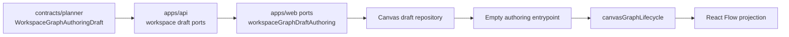
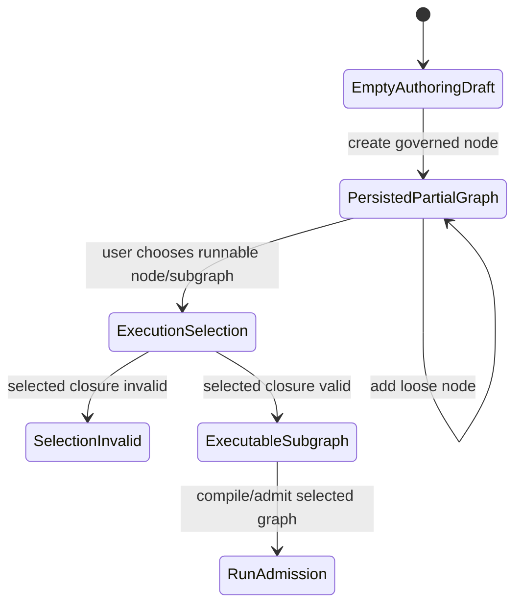

# Fowler architecture analysis - workspace authoring draft aggregate and first-node entrypoint

Plan-driven. Outcome-agnostic.

Sources used: `AGENTS.md`, governance inventory, AI work protocol, reference
architecture, ADR-0005/0006, contracts index, TF-A2 persistence plan, TF-A2
aggregate-roots plan, TF-E2 empty-authoring entrypoint design, Canvas route
presentation docs, and the workspace authoring draft aggregate guide.

## Verdict

The branch moves the system toward a mature graph-authoring architecture. The
central correction is that editable draft persistence now owns a
`WorkspaceGraphAuthoringDraft` aggregate instead of forcing a compile-ready
`DesignGraphDraft` through the save boundary.

That is the same separation mature systems use:

- NiFi lets a flow contain disconnected processors while execution targets a
  runnable processor group or component path.
- Dagster separates asset graph authoring from selected materialization.
- dbt editors allow model files to exist before the full project is runnable.

DVT should follow the same model: authoring validity, persistence validity, and
execution validity are different states.

## Improved patterns

- Aggregate root: `WorkspaceGraphAuthoringDraft` owns editable graph truth:
  semantic nodes, semantic edges, visible node ids, and positions.
- Hexagonal boundary: API and web ports consume the shared contract instead of
  local route DTOs.
- Anti-corruption projection: web projection converts protected authoring truth
  into Canvas/read-model shapes without making React Flow canonical.
- Command split: first-node creation is a command over governed node-kind
  registration; auth, CAS, idempotency, audit, and telemetry stay outside the
  pure aggregate.
- Passive View: `CanvasCenterSurface.tsx` is now a thin facade over transport
  and workbench renderers.
- Fitness functions: architecture tests now validate semantic boundaries, not
  just barrel thinness.

## Components to group

Component guides created or updated:

- `docs/architecture/components/planner/workspace-authoring-draft-aggregate.md`
- `docs/architecture/components/web/graph/canvas-empty-authoring-entrypoint-component.md`

## Antipatterns detected

- Compile DTO as persistence root: fixed by replacing compile-shaped draft save
  payloads with authoring aggregate truth.
- Local-only first-node path: prevented by using the same `dropCanonicalNode`
  and draft lifecycle path as drag/drop authoring.
- Ad hoc node catalog: prevented by consuming `DVT_AUTHORING_NODE_KINDS`.
- God component tendency: `CanvasCenterSurface.tsx` was split into facade,
  transport renderer, workbench renderer, and shared types.
- Documentation drift: active docs still mixed "target" and "current" language
  around authoring draft persistence; corrected with the component guide and
  planning updates.

## Lessons

- Save success must not require compile success.
- A loose node can be persisted even when it is not executable.
- Execution must be selected-subgraph based; whole-draft compile is a separate
  downstream concern.
- UI catalogs must be derived from governed vocabularies, not copied into view
  components.
- Every new slice that changes command semantics needs a local component guide
  and a semantic architecture test.

## Repetitions fixed

- First-node creation no longer repeats drop logic; it reuses
  `dropCanonicalNode`.
- Center-surface route branching is no longer repeated in one large component.
- Docs now describe the component API/invariants/transitions once in local
  component docs instead of scattering them across plans.

## Opportunities

- Define `ExecutionSelection` and `ExecutableSubgraph` as the next slice.
- Add browser proof that empty protected draft can create a first node against
  live runtime.
- Move more authoring mutations into a small domain service once command
  execution becomes product behavior.
- Generate component-doc coverage checks for files with owned-concern
  docblocks.

## Drift check

Current drift closed in this branch:

- `WorkspaceGraphDraft.v1` no longer describes compile-shaped persistence as
  current truth.
- Canvas empty-state docs now state graph-first authoring and selected
  execution semantics.
- `CanvasCenterSurface` docs/tests now match the split implementation.

Drift to keep watching:

- any import of `DesignGraphDraft` in draft persistence save paths
- any second node-kind catalog outside `DVT_AUTHORING_NODE_KINDS`
- any direct React Flow node mutation that bypasses `canvasGraphLifecycle`
- any docs that imply project creation is required before graph authoring

## Static quality closure

The final pass also removed implementation smells that were unrelated to the
domain model but could erode maintainability:

- `canvasAuthoringNodeCommand.ts` no longer uses regex replacement chains for
  node-kind slugging. The command now expresses the invariant directly:
  collect ASCII alphanumeric words from the governed node-kind tail and join
  them with `-`.
- `markdownAdrFields.ts` no longer stringifies unknown frontmatter values
  through `String(value)`. It handles primitives, arrays, symbols, nullish
  values, and object JSON explicitly.
- `markdownLinks.ts` no longer depends on a regex replacement to strip inline
  code before link extraction. Inline-code stripping is a small state walk,
  which is easier to reason about and avoids regex intent drift.

This is consistent with Fowler's "intention revealing interface" reading: the
helpers now say what semantic operation they own instead of encoding the
operation in opaque replacement patterns.

## State model

## Closure posture

This slice is architectural hardening, not just UI polish. It aligns contracts,
API, web command seams, local docs, and architecture tests around one model:
editable graph authoring first; compile/run only through explicit executable
selection later.
