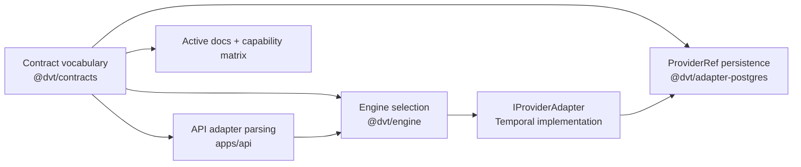

# Fowler QA - Provider Vocabulary Hard-Cut

## Scope

Review scope: AR-A8 provider-vocabulary hard cut across contracts, engine,
API, Postgres persistence, web fixtures, and active architecture docs.

Governing sources:

- `AGENTS.md`
- `docs/planning/status/governance-document-rule-inventory.md`
- ADR-0003, ADR-0004, ADR-0005, ADR-0006, ADR-0014
- `docs/guides/ai-work-protocol.md`
- `docs/planning/state/agent-lane-a.yaml`
- ARC-2 evidence/risk policy

## Fowler Assessment

The pre-change shape mixed an implemented runtime provider with a
paper-provider vocabulary. In Fowler terms, the issue was not only Primitive
Obsession; it was a Feature Envy smell at the architecture level: future
adapter ambitions were leaking into contract, storage, docs, and tests before
the adapter implementation existed.

The remediation applies these refactorings:

- Replace Magic Literal with Named Constant:
  `RUNTIME_PROVIDER` and `RUNTIME_PROVIDER_VALUES` become the shared vocabulary
  root.
- Consolidate Conditional Expression:
  provider selection, run-ref parsing, and persistence hydration collapse to
  the single implemented runtime variant.
- Remove Dead Code:
  fake provider stubs are deleted instead of retained as future placeholders.
- Separate Test Double from Production Vocabulary:
  in-memory provider support remains test-only and models the active provider
  id.
- Encapsulate Boundary Vocabulary:
  active docs, capability matrices, event schemas, API parsing, and storage now
  point to one vocabulary source.

## Mature-System Comparison

Mature workflow platforms usually do not expose adapter IDs as public truth
until there is a deployable adapter, conformance suite, and operational
runbook. This change moves DVT+ toward that posture. The system still keeps a
hexagonal port (`IProviderAdapter`), but active vocabulary now reflects
production capability rather than roadmap intent.

## Improved Patterns

| Area                | Before                                                                   | After                                                    |
| ------------------- | ------------------------------------------------------------------------ | -------------------------------------------------------- |
| Provider vocabulary | Union included future/runtime-inactive ids                               | Single implemented provider value                        |
| Runtime validation  | Schemas accepted provider refs that could not execute                    | Schemas reject non-active provider refs                  |
| Engine testing      | Public test stubs looked like adapter products                           | In-memory double is explicitly test support              |
| Storage             | Provider-ref JSON allowed variant-specific fields for inactive providers | Storage hydrates contract-validated active provider refs |
| Docs                | Active adapter docs advertised a future provider draft                   | Active docs describe only executable runtime support     |

## Antipatterns Removed

- Paper portability: active contracts promised a runtime that was not wired.
- Test stub as architecture claim: package-level stubs implied support.
- Stringly typed provider drift: API, engine, and docs could diverge.
- Active-doc roadmap leakage: future-provider notes sat beside production docs.
- Storage schema fossilization: inactive provider columns and JSON branches
  created long-term migration cost.

## Repetitions Fixed

- Provider allowed values now derive from one contract constant instead of
  repeated literal arrays.
- Runtime provider parsing and engine selection agree on the same vocabulary.
- Capability matrices and event schema docs no longer duplicate stale provider
  names.
- Postgres mapping no longer has parallel provider-ref branches for inactive
  variants.

## Drift Fixed

| Drift                                                      | Fix                                                             |
| ---------------------------------------------------------- | --------------------------------------------------------------- |
| Contract types and schemas accepted inactive provider refs | Narrowed `Provider`, `ProviderSchema`, and `EngineRunRefSchema` |
| Engine exported fake provider stubs                        | Deleted stubs and removed testing barrel exports                |
| Active adapter docs linked a future provider draft         | Deleted active future-provider adapter docs                     |
| Operational docs assumed second-provider fallback          | Reworded runbooks/SLOs to single-runtime truth                  |
| C4/current-state diagrams showed dead stubs                | Removed stub nodes and updated current topology                 |
| Lane A still showed AR-A8 queued                           | Updated lane state to done with evidence refs                   |

## Component Grouping

This should remain a named component, not a loose set of literal arrays. The
local component guide is
`docs/architecture/components/engine/contracts/engine/runtime-provider-vocabulary-component.md`.

## Residual Risks

- Existing historical evidence and risk files still mention old provider
  variants as past context. They are not active runtime docs, but broad text
  search will still find them.
- Future second-runtime work can still enter through tests unless the semantic
  architecture guard remains in the contracts suite.
- The contract break is intentional. Consumers pinned to inactive provider refs
  must update; no compatibility alias was added.

## Action Plan

1. Keep `provider-vocabulary.architecture.test.ts` in the contracts package as
   the semantic regression guard.
2. Require ARC-2 evidence and risk updates for any provider vocabulary change.
3. Do not add a second provider id until adapter code, conformance tests,
   capability docs, operational docs, and composition wiring land together.
4. Keep unit tests free to use provider doubles, but only behind active provider
   ids.
5. Review generated docs and indexes after this slice to avoid stale links from
   deleted adapter docs.
