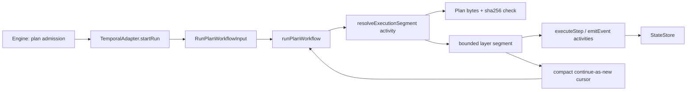
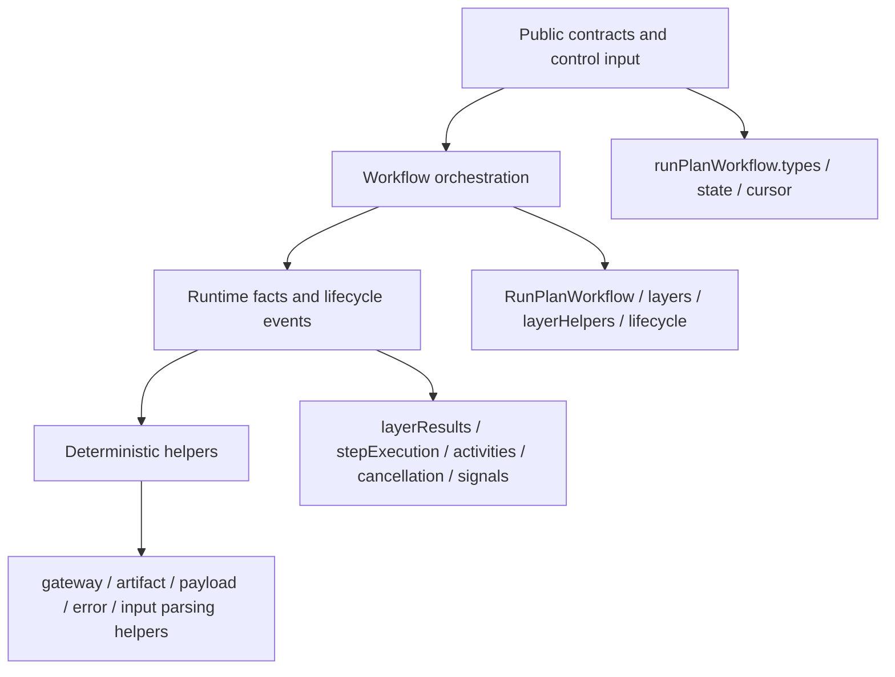
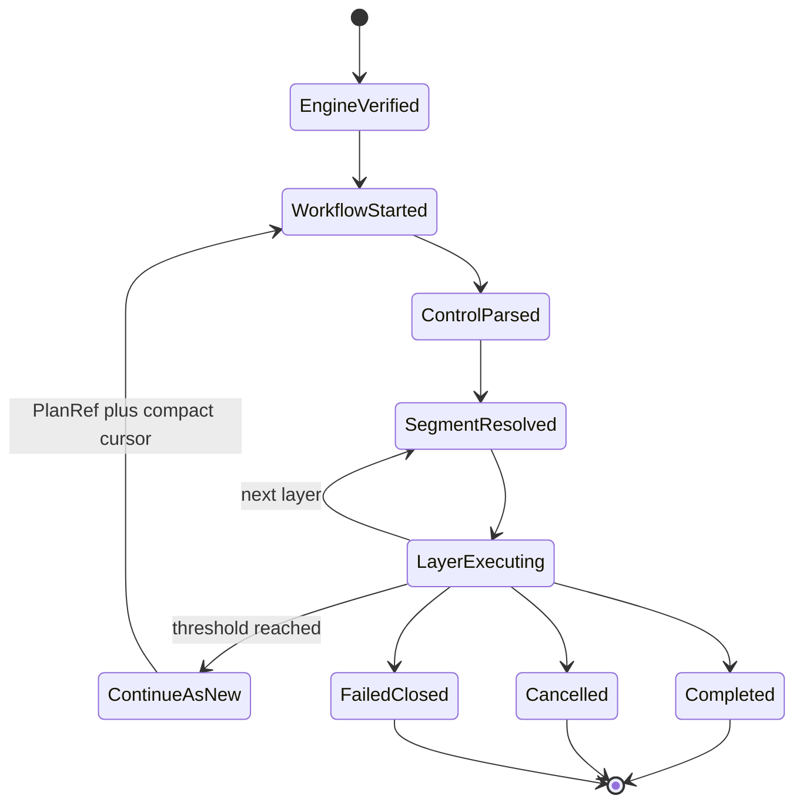

# Fowler architecture analysis - Temporal PlanRef workflow boundary

## Scope

This mailbox entry reviews the branch work around PlanRef execution in the
Temporal adapter:

- PlanRef-only workflow start and continue-as-new input
- required `continueAsNewAfterLayerCount` budget input
- bounded cursor state across Temporal history rollover
- hash-verified activity-time segment resolution
- runbooks, evidence, risk register, and adapter tests added in the branch
- this pass: semantic module ownership, component guide, and architecture
  fitness test

The review intentionally excludes frontend behavior.

## System context

The branch moves Temporal from a large-payload execution posture toward a mature
control-plane shape:

- engine admission validates executable plan bytes and metadata
- Temporal receives `PlanRef`, resolved context, and explicit rollover budgets
- workflow code orchestrates deterministic layer progress
- activities own side effects, plan materialization, hash verification, and
  StateStore writes
- continue-as-new carries compact cursor state rather than plan structure

## Fowler reading

The important movement is semantic encapsulation, not just smaller files.

| Fowler concept                   | Current owner                                | Branch movement                                                       |
| -------------------------------- | -------------------------------------------- | --------------------------------------------------------------------- |
| Published Interface              | `RunPlanWorkflowInput`                       | durable input now names PlanRef, context, and explicit budget values  |
| Gateway                          | activity-time segment resolution             | plan material is fetched and hash-verified outside workflow state     |
| Separated Interface              | workflow ports in `runPlanWorkflow.types.ts` | deterministic orchestration is isolated from activity side effects    |
| Unit of Work                     | one bounded execution layer                  | continue-as-new advances by layer cursor instead of full plan state   |
| Fail Fast                        | input parsing and payload guards             | missing threshold and oversized rollover payload reject early         |
| Domain Event / Event Sourcing    | StateStore command port activities           | lifecycle truth remains DVT-owned, not Temporal-owned                 |
| Specification / Fitness Function | architecture test added in this pass         | ownership, API, invariants, transitions, and consumers are executable |

## Comparison with mature systems

Mature workflow and data platforms usually avoid durable scheduler payloads
that contain the full work graph. Kubernetes controllers, Temporal
applications, payment control planes, and Airflow-style schedulers tend to:

- receive a stable reference or resource id
- validate the referenced material near the execution boundary
- keep workflow history bounded
- encode progress as compact cursor or status state
- document which module owns orchestration, side effects, identity, and
  lifecycle truth

DVT+ is now closer to that model. The component still has one maturity gap that
belongs to future runtime packaging work: DBT plugin materialization remains a
worker/executor concern that can dominate operational failure modes, but it is
not owned by the PlanRef workflow boundary itself.

## Patterns improved

- **Semantic boundary**: `RunPlanWorkflowInput` is PlanRef plus compact cursor,
  not an accidental transport for `ExecutionPlan`.
- **Explicit budget contract**: `continueAsNewAfterLayerCount: number` is
  required in workflow input, so rollover posture is not hidden in parser
  defaults.
- **Fail-closed runtime validation**: missing budget input, hash drift, gateway
  fact gaps, and oversized continue-as-new payloads reject before creating a
  false lifecycle success.
- **Deterministic workflow shell**: workflow modules orchestrate; activities
  execute provider side effects and persistence writes.
- **Semantic component documentation**: the new component guide states public
  API, invariants, transitions, consumers, and diagrams.
- **Executable architecture fitness**: the new architecture test checks exact
  owned-concern strings and component-guide substance, not just barrel shape.

## Antipatterns detected

### Resolved in this pass

- **Semantic anonymity**: workflow modules had good ADR metadata but did not
  state the owned concern each file protects.
- **Documentation drift**: the adapter spec described the PlanRef runtime
  posture, but there was no component-level local guide for API, invariants,
  transitions, consumers, and module map.
- **String-thin architecture guard**: behavior tests existed, but there was no
  component fitness test proving semantic ownership across the workflow module
  family.

### Still watched outside this pass

- **Worker runtime coupling**: DBT packaging and plugin discovery remain a
  separate operational component. Treating that as workflow code would recreate
  provider coupling.
- **Repeated architecture-test scaffolding**: several repo slices hand-code
  doc-section and owned-concern checks. A shared helper can reduce repetition
  after one more Temporal or API component adopts the same convention.
- **Per-segment plan re-materialization cost**: PlanRef validation is correct,
  but large plans may need a governed immutable cache after correctness and
  tenant isolation are proven.

## Components that can be grouped

The workflow code now has four natural component clusters:

| Cluster             | Modules                                                              |
| ------------------- | -------------------------------------------------------------------- |
| Public contract     | `runPlanWorkflow.types.ts`, `runPlanWorkflow.state.ts`               |
| Cursor and rollover | `workflowCursorHelpers.ts`, `runPlanWorkflow.layerHelpers.ts`        |
| Orchestration       | `RunPlanWorkflow.ts`, `runPlanWorkflow.layers.ts`, lifecycle helpers |
| Runtime facts       | `runPlanWorkflow.layerResults.ts`, `workflowGatewayHelpers.ts`       |
| Activity boundary   | `runPlanWorkflow.activities.ts`, `runPlanWorkflow.stepExecution.ts`  |
| Payload helpers     | artifact, runtime-payload, error, and primitive-input helper modules |

This is close to a mature "interpreter workflow" component. A future refactor
could introduce folders for these clusters, but the current branch does not
need that churn because the semantic ownership is now explicit and guarded.

## Repetitions fixed

- The same PlanRef/cursor invariant no longer lives only in scattered tests and
  runbooks; it is centralized in the component guide and asserted by the
  architecture test.
- Each workflow module now has one short `@ownedConcern` declaration rather
  than relying on longer ADR prose to imply file ownership.
- Public API, invariants, transitions, consumers, and diagrams now have one
  component document instead of being split between adapter spec, runbook, and
  review notes.

## Drift fixed

- Code and docs now agree that `continueAsNewAfterLayerCount` is required
  workflow input.
- Code and docs now agree that the full `ExecutionPlan` cannot cross workflow
  start or continue-as-new input.
- The Temporal adapter spec points to the local component guide instead of
  standing alone as the only architecture artifact.
- The module family now has executable ownership evidence, so future helper
  edits cannot silently become generic utility dumping grounds.

## Future teachings

1. If a module owns behavior, make that owned concern executable in a fitness
   test early.
2. A component guide should be introduced when a slice changes public API,
   invariants, transition rules, or consumers.
3. Required runtime budgets belong in public input contracts, not hidden inside
   parser defaults.
4. A pointer-based runtime pattern is mature only when pointer fetches are
   immutable, verified, bounded, and observable.
5. Avoid creating "utility" modules that hide domain language. Helper modules
   still need named ownership.

## Opportunities

- Extract a shared architecture-test helper for `@ownedConcern` checks and
  component-guide section checks once a second Temporal component follows this
  model.
- Add an immutable, tenant-safe plan materialization cache if profiling shows
  segment resolution cost dominates large DAG execution.
- Create a separate DBT worker-runtime component guide that owns plugin
  packaging, discovery, installation, and executor evidence.
- Add metrics around continue-as-new cadence, segment resolution latency, hash
  validation failure, and payload guard rejections.

## Remediation applied

- Added exact `@ownedConcern` docblocks to every
  `packages/@dvt/adapter-temporal/src/workflows/*.ts` module.
- Added
  `docs/architecture/components/engine/adapters/temporal/temporal-planref-workflow-boundary.md`
  with public API, invariants, transitions, consumers, module map, and diagrams.
- Added
  `packages/@dvt/adapter-temporal/test/workflow-component-semantics.architecture.test.ts`
  to validate semantic ownership and guide substance.
- Updated the Temporal adapter spec to reference the component guide.

## Resulting boundary

The branch now has architecture narrative, local component documentation, and a
semantic fitness function aligned with the implemented code.
