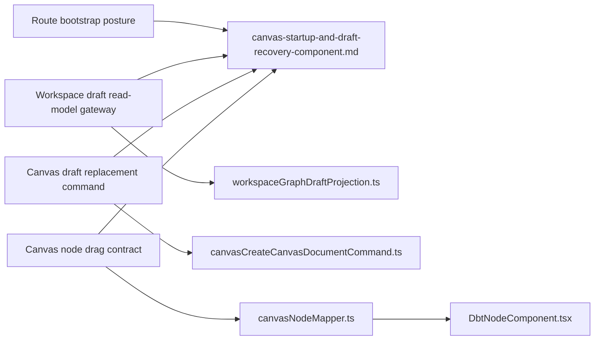
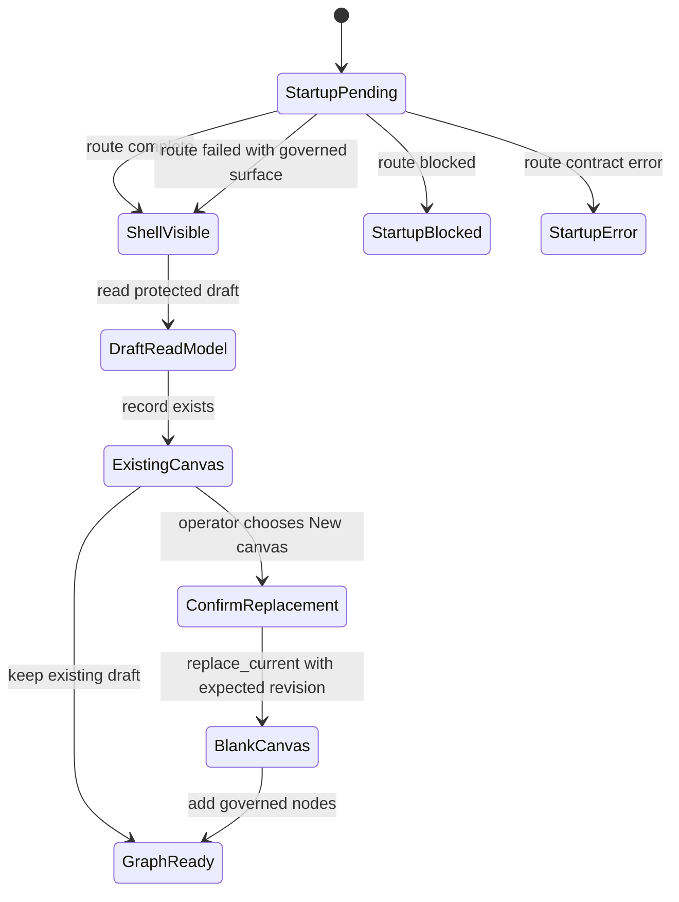

# Fowler architecture analysis - web graph startup and draft recovery

Plan-driven. Outcome-agnostic.

Sources used: `AGENTS.md`, governance inventory, AI work protocol, reference
architecture, domain language, Graph frontend architecture, Graph route
bootstrap architecture, App bootstrap screen component, Canvas playground host
component, Canvas authoring projection component, and the active local diff.

## Fowler verdict

The branch improves the web graph architecture in a material way. The important
shift is not the "New canvas" button or drag styling by themselves. The shift
is that startup, protected draft read-models, recovery, and viewport gestures
now have named application semantics instead of being incidental UI behavior.

This matches how mature workflow and data-authoring systems behave:

- NiFi can show an editable flow while some processors or services are invalid.
  Startup visibility and authoring validity are not the same state.
- Dagster separates asset graph authoring, selection, and materialization.
  A partial graph can be visible while run admission stays narrower.
- dbt editors let users edit project files before a full project is runnable.
  Persistence and execution are separate gates.
- Airflow and similar schedulers expose failed DAG metadata as an operable
  route state instead of hiding the UI behind process startup forever.

DVT should keep the same split:

- app bootstrap decides whether the shell can reveal;
- route bootstrap decides whether the first route surface is governed;
- workspace graph draft persistence owns authoring truth;
- Canvas owns visible authoring projection and gesture policy;
- execution remains a later selected-subgraph concern.

## Improved patterns

### Application Controller

`routeBootstrapContract.ts` now has a separate `failed` posture. A route-local
failure that already has a governed error surface can complete shell startup.
That avoids treating product data failures as process boot failures.

### Gateway and Projection Layer

`workspaceService.api.ts` now derives canonical `WorkspaceGraphSnapshot`
consumers from `GET /workspace/graph/draft` and
`workspaceGraphDraftProjection.ts`. The snapshot is explicitly a read-model
projection, not a second authority.

### Explicit Command

`CanvasCreateCanvasDocumentCommand` now distinguishes `create_first` from
`replace_current`. Replacement is not an accidental retry or local reset. It is
an explicit command with confirmation and CAS revision protection.

The follow-up CodeScene pass extracted command eligibility, blank draft input
construction, save success, and save conflict into named helpers. The command
now reads as a small application service orchestration instead of embedding
CAS policy, DTO construction, and session mutation in one complex method.

### Decision Table

`workspaceGraphDraftProjection.ts` now expresses DBT node-type projection with
`DBT_NODE_TYPE_RULES` and `matchesDbtNodeTypeRule(...)`. That keeps plugin-kind
and role mapping extensible without growing a long conditional chain.

### Parameter Object

`canvasNodeMapper.ts` now accepts `MapCanonicalNodeToCanvasNodeArgs` for
canonical-to-viewport projection. That names layout index, column-lineage
visibility, overlay decoration, and persisted position at each callsite instead
of hiding four projection concerns behind positional arguments.

### Passive View

`CanvasPlaygroundTabStrip.tsx` renders host tabs and a confirmed replacement
action. It does not own protected draft DTOs and it does not reach into service
or controller internals.

The follow-up CodeScene pass first split the host surface into tab and
replacement presenters. The next SRP/i18n pass tightened that further:
`CanvasPlaygroundTabStrip.tsx` is now only the coordinator,
`canvasPlaygroundTabStripModel.ts` owns replacement policy, locale-backed copy
state, and command DTO creation, and `CanvasPlaygroundTabStrip.templates.tsx`
owns the JSX templates. The template layer receives resolved labels and state;
it does not import locale catalogs or construct destructive commands.

The post-commit Fowler review tightened the boundary further with
`CanvasReplacementActionViewState`: templates now receive only renderable
enablement and labels, while `activeCanvasKind` stays in the model/coordinator
side of the command boundary.

### Intention Revealing Interface

React Flow dragging now has a named selector:
`.canvas-node-drag-surface`. The mapper and rendered node shell share that
contract instead of depending on incidental event propagation.

## Antipatterns detected

- Bootstrap as global error jail: Fixed. Controlled route failures publish
  `failed` and can reveal the governed route surface.
- Retired snapshot endpoint as graph authority: Fixed. API-mode snapshots
  project from the protected workspace draft endpoint.
- Hidden local reset for stale drafts: Avoided. Replacement is explicit,
  confirmed, and CAS-guarded.
- UI event coincidence as drag contract: Fixed. React Flow drag handle is a
  named selector owned by mapper and node shell.
- Semantic promise without component boundary: Fixed in this slice. Added a
  local component guide and semantic architecture test.
- Copy drift around destructive action: Reduced. Replacement copy is
  centralized in the Canvas toolbar copy catalog.
- Complex conditional as policy: Fixed. Command eligibility and DBT projection
  policy moved behind named helpers and rules.
- Positional argument train: Fixed. Canonical-node viewport projection now uses
  a named parameter object.
- God render method: Fixed. Tab rendering and destructive replacement action
  are split into presenter seams.
- Template owns application policy: Fixed. Tab-strip templates render resolved
  state only; model code owns command and copy DTO.
- Command state leaked into template props: Fixed. Templates now consume
  render-only view state, not active canvas kind.

## Components to group

The changed code belongs to one branch component, with four sub-seams:

Local component guide:

- `docs/architecture/components/web/graph/canvas-startup-and-draft-recovery-component.md`

Semantic architecture test:

- `apps/web/src/app/views/canvas/canvasStartupAndDraftRecovery.architecture.test.ts`

## Repetitions fixed

- Route-local errors no longer repeat bootstrap-blocking semantics. They use
  the shared `createFailedRouteBootstrapPresentation(...)` factory.
- API graph snapshot reads no longer maintain a second endpoint path. They use
  `workspaceGraphDraftHttp.ts` for scope, endpoint, and HTTP error matching.
- Canvas replacement reuses the existing draft save boundary instead of adding
  a separate local clear path.
- Drag wiring is not repeated per node. The selector is exported once from
  `canvasNodeMapper.ts` and consumed by every mapped node.
- DBT type inference no longer repeats `kind.includes(...)` checks in a method.
  It is a declarative rule list with one matcher.
- Draft replacement no longer repeats cache/session/status mutation in the
  orchestration path. Save success and conflict are separate named transitions.
- Canonical-node viewport projection no longer repeats ambiguous positional
  arguments at callsites; layout, column visibility, overlay, and persisted
  position are named together.
- The tab-strip render path no longer repeats tab presentation, replacement
  enablement, dialog state, and command creation in one method.
- Replacement action copy no longer flows directly through JSX. The model
  resolves locale-backed labels once and the template renders the resulting
  state.
- Replacement templates no longer receive command-selection state. The model
  separates `activeCanvasKind` from `CanvasReplacementActionViewState`.

## Drift fixed

- Documentation now states that `failed` route posture is non-blocking for
  shell reveal when the route owns a governed failure surface.
- Graph architecture now describes protected draft replacement and drag-handle
  ownership as current behavior.
- The new component guide ties the code, diagrams, public API, invariants,
  transitions, and consumers together.
- Source modules touched by the branch now start with owned-concern docblocks
  for the semantic behavior they own.

## Remaining drift to watch

- The current data model still has one workspace draft canvas document. Any UI
  that suggests multiple persisted canvases before the backend model exists
  would be drift.
- `WorkspaceGraphSnapshot` remains a projection-only route read model. If new
  code treats it as authoritative graph truth, the projection layer regresses.
- `failed` route posture is for controlled route-local failures only. Startup
  contract violations must continue using `error`.
- Node drag must remain permission-gated by the viewport. The drag selector is
  not permission by itself.

## Opportunities

- Introduce a small route-bootstrap posture mapper for common list/detail
  workbench shapes if more routes repeat the same loading/error/empty/ready
  transitions.
- Add generated coverage for owned-concern docblocks on component source files.
- Add a browser-level negative test once Playwright MCP is stable in this
  environment: backend unavailable should reveal the governed route blocker,
  while graph mutation stays disabled.
- Move the single-canvas replacement vocabulary into a future multi-canvas
  aggregate only when the backend model supports multiple draft documents.
- Keep new graph consumers on protected draft or selected execution read models
  instead of adding another snapshot authority.

## Lessons for future slices

- A startup gate should not hide a mature product route that can render its own
  safe failure state.
- Any destructive recovery action needs command vocabulary, confirmation, and a
  persistence-side guard.
- Read-model projection must be named as projection, not treated as a second
  source of truth.
- UI gesture fixes should end in a named contract, not a CSS coincidence.
- Architecture tests should validate behavior words such as `failed`,
  `replace_current`, protected draft endpoint, and drag handle ownership.
- Complexity warnings are useful when they point at missing domain vocabulary.
  The durable fix is to name the transition or rule, not only to split lines.
- Argument-count warnings are useful when an application boundary is carrying
  several concepts at once. Prefer a parameter object when each argument is a
  named part of one projection decision.
- JSX complexity warnings are useful when a passive view starts hiding
  application decisions. Split the view by presenter responsibility before
  extracting generic UI abstractions.
- For React surfaces, keep three distinct reasons for change: the coordinator
  reacts to state transitions, the model owns policy/copy/commands, and the
  template owns HTML structure.

## Solution state

## Closure posture

This slice moves DVT closer to mature frontend architecture because the route
can now reveal controlled failure states, graph snapshots are projected from
the protected authoring source, stale draft recovery is explicit, and node
dragging is a named contract. The next maturity step is not more UI polish. It
is keeping read-model, command, and startup semantics documented and tested as
component-level contracts.
