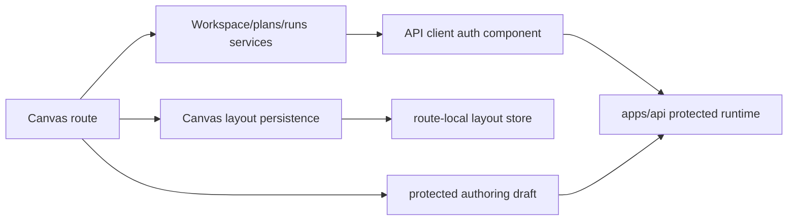
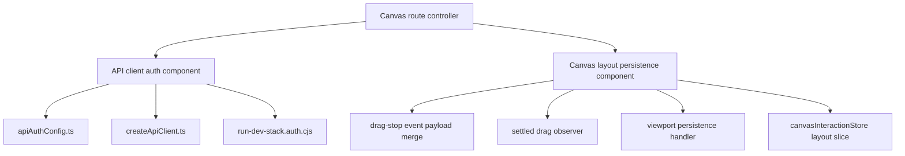

# Canvas Operability Auth And Drag Fowler Review

## Fowler verdict

The branch improves maturity by separating two concerns that were causing
operator-visible failure:

- protected-runtime authentication freshness is now an API client concern;
- Canvas card coordinates are now route-local layout observations, not draft
  graph authority.

This follows Fowler's preference for named application boundaries over smart
screens: token expiry, request retry, viewport persistence, and drag-stop
hazards are all expressed through local components with public APIs and tests.

## Comparison with mature systems

Mature data-platform UIs do not let a long-lived browser tab keep using a dead
token and then blame the domain route. They refresh or omit stale credentials
inside the transport boundary, keep the product screen honest, and retry only
when the request is safe to replay.

Mature graph workbenches also separate graph semantics from layout. Dragging a
card changes presentation coordinates; it does not rewrite the meaning of the
workspace graph. This branch now reflects that split.

## Pattern improvements

- **Gateway**: `createApiClient()` owns auth/session headers and bounded retry.
- **Policy Object**: `apiAuthConfig.ts` owns token expiration and refresh
  eligibility.
- **Application Controller**: `useCanvasLayoutPersistence()` coordinates
  layout persistence without owning draft saves.
- **Presentation Model**: `useCanvasViewportGraphModel()` keeps live drag
  coordinates in the viewport model.
- **Intention-Revealing Interface**: `mergeDraggedNodePosition(...)` names the
  stale React Flow snapshot hazard.
- **Semantic architecture guard**: architecture tests now enforce the auth and
  layout promises, not only import shape.

## Antipatterns removed or reduced

- **Token primitive leaked into route behavior**: reduced by centralizing
  bearer-token posture in `apiAuthConfig.ts`.
- **Expired-token false denial**: reduced by refreshing before protected calls
  and retrying a safe `401` once.
- **Layout and draft authority confusion**: reduced by documenting and testing
  that layout persistence does not import draft authoring ports.
- **Hook doing too much**: reduced by splitting node-position save, drag-stop
  persistence, settled-drag observation, and viewport persistence into named
  local roles.
- **Documentation drift**: reduced by adding component guides and story coverage
  for the exact auth and drag scenarios that triggered the browser failures.

## Components and grouping

The components are intentionally local. Moving either into a broad global
framework would add indirection without improving the system boundary.

## Drift fixed

- The runbook now describes local protected-runtime refresh as a dev-stack
  bootstrap aid, not a product login model.
- Component docs now state that stale JWT handling belongs to the API client
  component.
- Component docs now state that card dragging persists route-local layout and
  must not call protected draft saves.
- The architecture guard now requires docs for auth refresh and layout
  persistence before the branch can pass.

## Repetitions fixed

- Token refresh checks no longer need to be repeated in workspace, plans, runs,
  or capabilities services.
- Node-position persistence no longer repeats the same readiness guard inside
  each Canvas gesture consumer.
- Drag-stop merge logic is named once instead of implied by every caller that
  receives `(draggedNode, allNodes)`.

## Opportunities

- **P0**: keep `createApiClient()` as the only web transport boundary for
  protected-runtime auth.
- **P0**: keep Canvas layout persistence out of protected draft authority.
- **P1**: add a browser proof for token expiry while the app is already open.
- **P1**: add visual regression coverage for the fifth startup step and the
  first-canvas entrypoint.
- **P2**: extract shared architecture-test helpers if more components add
  source-boundary guards.

## Lessons for future slices

- A route error message is not enough evidence. Check whether the upstream
  transport can recover before showing the route as denied.
- UI coordinates are not graph domain state.
- When a hook starts coordinating more than one effect type, name the effects
  locally before extracting a larger component.
- Documentation should describe the failure mode that produced the change, not
  only the final happy path.

## User-story coverage

The local stories now cover:

- `US-CANVAS-AUTH-001`: refresh expired local protected-runtime tokens before
  protected draft calls;
- `US-CANVAS-AUTH-002`: retry one safe `401` after a forced refresh;
- `US-CANVAS-LAYOUT-001`: persist the drag-stop event payload;
- `US-CANVAS-LAYOUT-002`: persist settled live drag positions;
- `US-CANVAS-LAYOUT-003`: block layout writes while hydration or graph queries
  are pending.

## TDD red/green

Red:

- the semantic architecture test expected this review, the API auth component
  guide, the Canvas layout persistence guide, and owned-concern docblocks;
- the review and guides were absent, and the targeted test failed with
  `ENOENT`.

Green:

- add the review and component guides;
- add/normalize owned-concern docblocks;
- split layout persistence into named local subroles;
- rerun the architecture guard and web validation.

## ADR decision

No new ADR is required. This slice does not introduce a new public auth model,
durable graph aggregate, endpoint contract, or cross-package runtime policy. It
applies existing reference architecture rules:

- UI routes are not execution or auth authorities;
- adapters and gateways own transport concerns;
- route-local layout remains separate from protected draft authority.

A future ADR is warranted if the product adds a real browser login/session
renewal model or durable multi-canvas layout persistence outside route-local
state.
