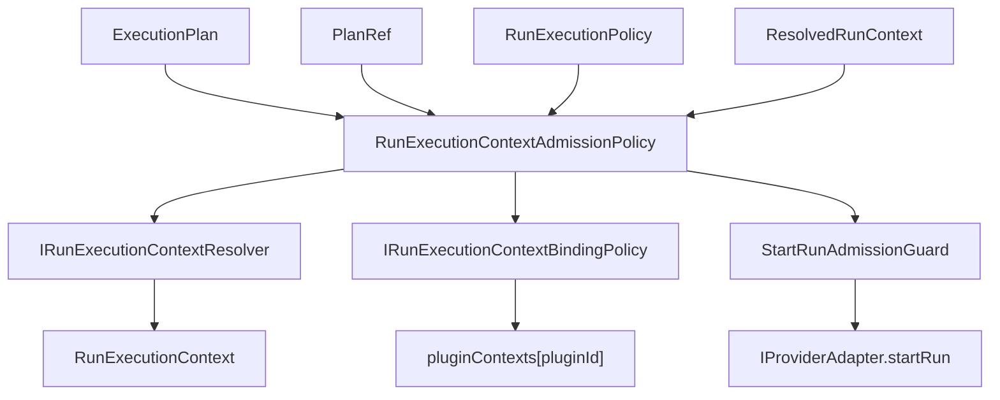
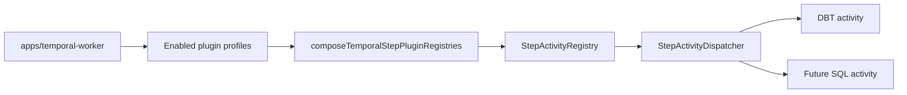
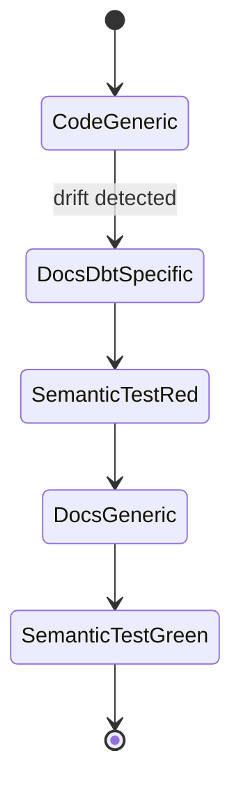

# Fowler Branch Architecture Analysis After Plugin And CodeScene Remediation

## Scope

This note records the architecture review of the current local slice after the
Temporal DBT plugin decoupling, run-execution-context admission split, DBT CLI
runner SRP pass, worker-host fixture cleanup, and CodeScene follow-up fixes.
The working tree is on `main`, but the reviewed work is the branch-local change
set currently pending in the workspace.

## Governing Sources

- `AGENTS.md`
- `docs/planning/status/governance-document-rule-inventory.md`
- `docs/guides/ai-work-protocol.md`
- `docs/architecture/reference-architecture.md`
- `docs/architecture/components/engine/adapters/temporal/temporal-step-plugin-profile.md`
- `docs/architecture/components/engine/adapters/temporal/temporal-dbt-worker-plugin-profile.md`
- `docs/architecture/components/engine/contracts/engine/StartRunProtocol.v1.md`
- ADR-0003: execution model sovereignty
- ADR-0004: event sourcing strategy
- ADR-0005: contract formalization
- ADR-0014: run-driven adapter model

## Think-First Analysis

### Problem Summary

The work moved in the right architectural direction, but the review found three
remaining quality risks:

1. semantic documentation lagged behind the implementation;
2. some tests still encoded repeated setup or unclear local ownership;
3. architecture fitness functions proved file thinness and symbol absence more
   strongly than they proved the component semantics reviewers need.

### Root Cause

The branch had several independent hardening passes. Each pass improved one
local concern, but the documentation and tests were not all updated at the same
semantic level. That created drift: the code was generic by plugin, while
`StartRunProtocol.v1.md` still described DBT-bearing start-run rejection.

### Constraints And Invariants

- ADR-0003 keeps execution semantics inside DVT, not inside Temporal, DBT, or
  future executor plugins.
- ADR-0004 keeps run lifecycle facts append-only and audit-safe.
- ADR-0005 requires executable validation assets for contract-like behavior.
- ADR-0014 keeps adapters run-driven; plugin step work must not re-enter engine
  core as a step-driven control path.
- DBT can be the first concrete plugin profile, but it must not become the
  generic plugin model by accident.

### Options Considered

| Option                                                       | Assessment                                                                                |
| ------------------------------------------------------------ | ----------------------------------------------------------------------------------------- |
| Leave docs as-is and rely on tests                           | Rejected. Mature systems fail when written contracts lag behind implementation semantics. |
| Add only another negative unit test                          | Rejected. The missing item is semantic traceability, not just runtime behavior.           |
| Add a local component guide and a semantic architecture test | Selected. It is small, reviewable, and converts the drift into a mechanical guard.        |

### Selected Option

Add a local run-execution-context admission component guide, update the
StartRun protocol wording from DBT-bearing to plugin-bearing, add owned-concern
docblocks to the admission-policy behavior modules, and extend the architecture
test so it validates semantics, not only the absence of a legacy barrel.

## Fowler Reading

The system is converging toward a mature hexagonal architecture:

- engine admission owns policy;
- resolvers and binding policies are ports;
- Temporal worker composition owns executor installation;
- DBT CLI execution is a plugin-local adapter detail;
- frontend projection guards are route-facing adapters, not core truth.

The strongest pattern is the move from vendor-specific logic to explicit
composition seams. The weakest remaining point is package-level plugin
co-location: DBT still lives inside `@dvt/adapter-temporal`, which is acceptable
while there is only one production executor but should not become the pattern
for every future executor.

## Comparison With Mature Systems

Mature workflow and data-platform systems usually show these traits:

| Mature pattern                                                         | Current DVT posture                                                                                        |
| ---------------------------------------------------------------------- | ---------------------------------------------------------------------------------------------------------- |
| Core scheduler knows plugin contracts, not plugin internals            | Improved. `StepActivityDispatcher` and engine admission are plugin-generic.                                |
| Worker image decides installed executors                               | Improved. `apps/temporal-worker` composes DBT only when enabled.                                           |
| Plugin manifests own executable kind claims                            | Improved. DBT owns its Temporal-supported subset in `dbtPluginManifest.ts`.                                |
| Architecture docs state public API, invariants, transitions, consumers | Improved for Temporal plugin and now for run-execution-context admission.                                  |
| Fitness functions verify semantic contracts                            | Improved. New admission architecture test checks guide content, ownership, and StartRun protocol language. |
| Plugin packages isolate dependency blast radius                        | Still open. DBT remains package-local to adapter-temporal.                                                 |

## Improved Patterns

- **Plugin profile seam:** DBT is composed as a profile, not default core
  activity behavior.
- **Generic admission policy:** engine admission now speaks in plugin
  requirements and binding policies, not DBT-specific context rules.
- **Focused DBT helpers:** CLI args, process execution, materialization,
  failure classification, and helper contracts are split inside `src/plugins/dbt`.
- **Fixture builders:** worker-host and admission-policy tests now reuse shared
  fixtures instead of repeated setup.
- **Semantic guards:** CodeScene-driven guard extraction turned complex inline
  conditionals into named predicates.
- **Contract wording:** Start-run docs now describe plugin-bearing rejection
  rather than a DBT-only rule.

## Anti-Patterns Detected

- **Semantic residue:** DBT terms remained in StartRun protocol docs after the
  code moved to generic plugin requirements. Fixed.
- **String-heavy function API:** `createDbtProjectMaterializer(bundleReader,
workdirRoot)` made same-typed positional arguments easy to invert. Fixed with
  an options object.
- **Fixture monolith pressure:** admission-policy tests had already been split,
  but fixtures lacked explicit ownership. Fixed with docblocks and an
  architecture guard.
- **Score-chasing risk:** CodeScene alerts could have caused superficial
  method splitting. The applied changes name real concepts: worker host
  fixture, object guard, materializer options, and plugin context record/string
  requirements.
- **Package-level plugin gravity:** not fixed in this slice. DBT code remains
  inside `@dvt/adapter-temporal` by design until a second production executor
  justifies extraction.

## Components That Can Be Grouped

| Component                               | Grouping decision                                         | Future extraction trigger                                                      |
| --------------------------------------- | --------------------------------------------------------- | ------------------------------------------------------------------------------ |
| Temporal step plugin profile            | Keep in `src/plugins` as generic adapter-temporal surface | Extract only if multiple provider adapters need the same plugin composer.      |
| DBT CLI runtime                         | Keep in `src/plugins/dbt` with focused modules            | Extract when dependency isolation or independent release becomes necessary.    |
| Run-execution-context admission         | Keep in engine start-run services plus ports              | Version as a contract if external plugin authors consume it directly.          |
| Worker host lifecycle fixtures          | Keep in test file; no production abstraction              | Extract only if another lifecycle suite repeats the same setup.                |
| Workspace graph draft projection guards | Keep local to projection service                          | Extract only if another service needs the same canonical DBT read-model guard. |

## Repetitions Fixed

- Worker-host lifecycle tests no longer repeat Temporal env/config setup.
- DBT project materializer construction no longer repeats positional bundle
  reader/workdir parameters.
- Admission fixtures no longer repeat invalid plugin-context error messages or
  record/string checks.
- Workspace DBT column validation no longer repeats primitive type checks.
- StartRun docs no longer repeat DBT-specific policy as the generic protocol.

## Drift Fixed

- `StartRunProtocol.v1.md` now matches the generic plugin-bearing admission
  model implemented in `RunExecutionContextAdmissionPolicy`.
- Admission-policy behavior suites now declare local semantic ownership.
- A new local component guide defines the public API, invariants, transitions,
  consumers, user stories, diagrams, and drift guards for admission semantics.
- The architecture test now verifies the guide and protocol wording, not just
  the old monolith removal.

## Opportunities

1. Add a real SQL executor profile before extracting a plugin package; the
   current SQL proof is architectural, not product execution.
2. Promote plugin binding policy to a versioned public contract only when
   external plugin authors need to implement it.
3. Add a plugin conformance suite once two production plugins exist.
4. Keep DBT package extraction as a risk-controlled follow-up, not a premature
   ceremony task.
5. Add a docs generated summary for plugin manifests if executor count grows.

## User Stories

| ID   | Story                                                                                                         | Acceptance scenario                                                                                                                                         |
| ---- | ------------------------------------------------------------------------------------------------------------- | ----------------------------------------------------------------------------------------------------------------------------------------------------------- |
| US-1 | As an engine maintainer, I want plugin-free plans admitted without external plugin context.                   | Given no required plugin step kind, when `runExecutionContextRef` is absent, then admission succeeds without resolver work.                                 |
| US-2 | As a runtime operator, I want plugin-bearing plans rejected before provider dispatch when context is missing. | Given `EXAMPLE_MODEL`, when no context ref exists, then `RunExecutionContextRejectedError` is raised.                                                       |
| US-3 | As a plugin author, I want plugin-specific invariants owned by a binding policy.                              | Given mismatched artifact tenant, when the example policy checks the context, then it rejects without engine DBT vocabulary.                                |
| US-4 | As a future SQL executor author, I want SQL step kinds admitted through the same generic policy.              | Given `SQL_TRANSFORM` and a SQL binding policy, when context alignment holds, then admission does not require engine changes.                               |
| US-5 | As a worker operator, I want DBT omitted unless the worker profile enables it.                                | Given DBT disabled, when the worker host starts, then core registry has no DBT activities.                                                                  |
| US-6 | As a reviewer, I want DBT CLI runner responsibilities split by concern.                                       | Given the runner file, when architecture tests inspect it, then it imports focused helpers instead of owning tar, subprocess, and failure mapping directly. |
| US-7 | As a frontend maintainer, I want DBT column guards named by semantic role.                                    | Given a draft projection, when malformed column data arrives, then the guard rejects through named object/string/boolean checks.                            |
| US-8 | As a CI reviewer, I want architecture tests to prove semantic docs and transition rules.                      | Given the admission policy component, when docs drift to DBT-only language, then the architecture test fails.                                               |

## Diagrams

## TDD Record

Red was established by adding semantic expectations to
`RunExecutionContextAdmissionPolicy.srp.architecture.test.ts` before creating
the component guide or changing protocol docs. The failing expectations were:

- missing owned-concern docblocks in admission behavior modules;
- missing local admission component guide;
- `StartRunProtocol.v1.md` still lacking generic plugin-bearing wording.

Green is established by the closeout validation for the task that carries this
analysis.

## ADR Assessment

No new ADR is required for this slice. The work applies existing decisions:
ADR-0003, ADR-0005, and ADR-0014. A new ADR becomes necessary only if plugin
binding policy is promoted to a public extension contract or if plugin runtime
execution moves to a sandboxed process/package model.
