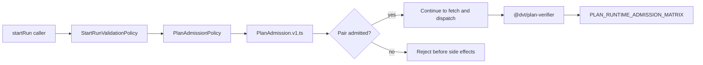

# Fowler Plan Admission Hard-Cut Analysis And Remediation

## Fowler Architecture Analysis

The branch moved plan/schema runtime acceptance from an implicit version-prefix
rule to an explicit admission component. In Fowler terms, this is a move from
scattered conditional logic toward a small policy object backed by a published
contract artifact. The important improvement is not the rename; it is that the
decision is now a named domain concept with one executable source of truth.

The current component has a clean bounded responsibility:

- `PlanAdmission.v1.ts` publishes the admitted pair registry.
- `PlanAdmissionPolicy.ts` turns the registry into an engine ingress assertion.
- `StartRunValidationPolicy` invokes the assertion before run creation.
- `@dvt/plan-verifier` now verifies runtime plan-version admission without a
  semver compatibility fallback.
- Contract and architecture tests make the behavior and documentation
  executable.

## Mature-System Comparison

Mature runtime systems usually make boundary admission explicit and auditable:

- API gateways keep allowlists and schema gates near ingress.
- Event-sourced systems fail before appending irreversible records.
- Plugin runtimes separate plugin capability admission from execution.
- Contract-heavy platforms keep machine-readable policy and docs aligned with
  tests.

The branch is now closer to that posture. The admission matrix is small, but it
has the right operational shape: a hard fail before state mutation, testable
negative cases, and a local component guide that reviewers can inspect without
reading the full engine.

## Improved Patterns

- **Explicit Policy**: `PlanAdmissionPolicy` names the runtime decision instead
  of hiding it behind a generic schema-version check.
- **Published Contract Registry**: `PlanAdmission.v1.ts` is the canonical
  contract-side truth for admitted pairs.
- **Fail-Fast Ingress**: unsupported pairs fail before plan fetch, bootstrap, or
  provider dispatch.
- **Semantic Fitness Function**: the architecture test checks component docs,
  stories, mailbox analysis, docblocks, and retired naming.
- **Traceable Documentation**: the guide links API, invariants, transitions,
  consumers, user stories, diagrams, and drift guards.
- **Single Admission Vocabulary**: engine and plan verifier now use admission
  language instead of maintaining a compatibility vocabulary in parallel.

## Antipatterns Removed Or Prevented

- **Stringly Runtime Policy**: no broad prefix rule decides runtime admission.
- **Parallel Truth**: docs no longer describe a different surface than code.
- **Decorative Architecture Docs**: the new architecture test makes the docs
  part of the build signal.
- **Alias Drift**: old names are not kept as migration aliases.
- **Late Failure**: unsupported pairs are rejected before side effects.
- **Semver Compatibility Fallback**: `supportedMajor` and `strictSameMinor`
  were removed from active plan verification.

## Component Grouping

The component should stay grouped around admission, not generic versioning:

- Executable admitted pair:
  `packages/@dvt/contracts/src/contracts/planner/PlanAdmission.v1.ts`.
- Engine ingress assertion:
  `packages/@dvt/engine/src/contracts/PlanAdmissionPolicy.ts`.
- Invocation point:
  `StartRunValidationPolicy.validateStartRunPreconditions`.
- Adapter verification:
  `packages/@dvt/plan-verifier/src/planVersion.ts`.
- Behavior tests:
  `plan-admission-matrix.contract.test.ts`, `WorkflowEngine.test.ts`.
- Semantic tests:
  `plan-admission-matrix.architecture.test.ts`,
  `planVersionAdmission.architecture.test.ts`.
- Local docs:
  `plan-admission-matrix.md`, `plan-admission-user-stories.md`,
  `plan-verifier-admission.md`.

## Repetitions And Drift Fixed

- Retired pre-admission component names were replaced with admission names.
- The contract index language now speaks about admission-oriented plan schemas.
- ADR-0017 and ADR-0036 now describe the helper and matrix as admission
  surfaces.
- The evidence and risk entries now point at `PlanAdmission.v1.ts` and
  `PlanAdmissionPolicy.ts`.
- The contract behavior test now starts with an owned-concern docblock.
- `PlanVersionPolicy.ts` was removed; `UnsupportedPlanVersionError` now lives
  in the engine admission policy.
- `PLAN_RUNTIME_COMPATIBILITY_MATRIX` was replaced by
  `PLAN_RUNTIME_ADMISSION_MATRIX`.
- API and adapter tests no longer use future version literals as examples; they
  derive unsupported values from the active `1.0` line.

## Future Lessons

- Rename-only work is not enough when the old term encodes the wrong domain
  model.
- A policy object should be introduced when a boundary decision has runtime
  consequences.
- Every public boundary change needs negative tests first; otherwise the system
  proves only the happy path.
- Documentation should have local component ownership and test-backed drift
  checks when it describes an active runtime gate.
- If a future pair is admitted, replace the pair deliberately and update tests,
  docs, evidence, and risk in the same slice.

## Opportunities

- Add a generated view of admitted contract pairs if the registry grows beyond
  one current pair.
- Promote a reusable architecture-test helper for docs that require API,
  invariants, transitions, consumers, user stories, diagrams, and drift guards.
- Consider a shared `AdmissionDecision` value object only if more ingress
  policies start returning structured rejection metadata instead of throwing.
- Keep policy modules tiny; the orchestration belongs in start-run validation,
  not inside the contract registry.

## ADR Decision

No new ADR is needed for this slice. ADR-0012, ADR-0017, and ADR-0036 already
authorize strict pre-bootstrap plan admission. This work applies those decisions
and adds executable semantic guards around the local component.
