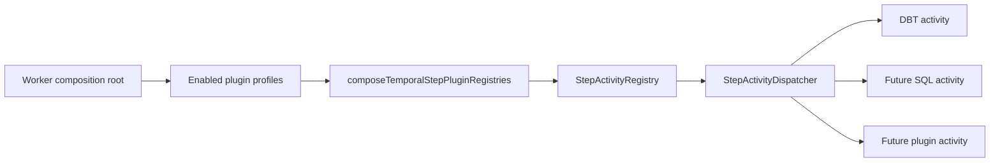
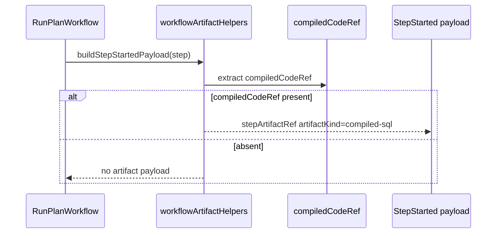
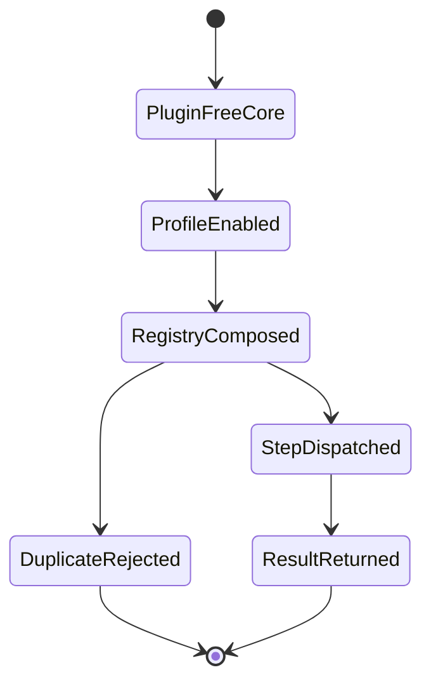

# Fowler Analysis And Remediation For Temporal Step Plugin Architecture

## Scope

This note reviews the work in branch `codex/ar-d-plan-pointer-qa1` that moved
DBT out of Temporal core dispatch and into a worker-composed plugin profile. It
evaluates the branch in the context of DVT architecture, compares the shape with
mature workflow/data-platform systems, records anti-patterns and drift, and
documents the remediation applied on 2026-04-29.

## Governing Sources

- `AGENTS.md`
- `docs/planning/status/governance-document-rule-inventory.md`
- `docs/guides/ai-work-protocol.md`
- `docs/architecture/reference-architecture.md`
- `docs/architecture/components/engine/adapters/temporal/temporal-adapter-spec.md`
- `docs/architecture/components/engine/adapters/temporal/temporal-dbt-worker-plugin-profile.md`
- ADR-0003: execution model sovereignty
- ADR-0012: plan integrity ownership
- ADR-0014: run-driven adapter model
- ADR-0040: retry ownership and attempt authority

## Fowler Reading

The direction is correct: DBT is no longer engine semantics and is no longer a
default Temporal activity. The branch improves SRP by moving DBT runner
construction into `apps/temporal-worker/src/runtime/temporalWorkerDbtProfile.ts`
and leaving `StepActivityDispatcher` as a generic dispatcher.

The remaining issue was semantic, not just structural: workflow artifact
emission still knew the DBT step-kind set. That kept a DBT allowlist in workflow
core even though DBT execution had moved to a plugin. The fix was to make
artifact emission depend on the portable contract field `compiledCodeRef`, not
on DBT step-kind names.

## Comparison With Mature Systems

Mature workflow and data-platform runtimes usually split four concerns:

1. workflow orchestration stays deterministic and provider-owned;
2. worker images decide which executors are installed;
3. plugin manifests own executable step-kind claims;
4. artifact and lineage contracts stay plugin-agnostic.

The branch now matches that model more closely. DBT behaves like a concrete
profile behind the same profile seam that a future SQL plugin can use. The
core dispatcher owns routing, not DBT semantics. The workflow artifact helper
owns artifact extraction, not DBT classification.

## Improved Patterns

- **Plugin profile:** `TemporalStepPluginProfile` makes plugin installation an
  explicit worker composition input.
- **Registry composition:** `composeTemporalStepPluginRegistries(...)` creates
  one runtime registry and rejects duplicate step-kind claims.
- **Manifest ownership:** `dbtPluginManifest.ts` owns the DBT executable runtime
  subset and DBT CLI subcommand mapping.
- **Contract-first artifact emission:** `workflowArtifactHelpers.ts` emits
  `compiled-sql` from `compiledCodeRef`, so SQL or future plugins can emit the
  same artifact without becoming DBT.
- **Consumer contract alignment:** traceability and UI fixtures now consume
  `compiled-sql`; executor-prefixed artifact kinds are rejected rather than
  treated as a second active convention.
- **Semantic architecture tests:** tests now check behavior and ownership, not
  only barrel thinness.
- **Local component guides:** generic plugin and DBT plugin docs define public
  API, invariants, transitions, consumers, maps, diagrams, and drift guards.

## Anti-Patterns Detected

- **Default plugin:** already removed. DBT is no longer in the default core
  registry.
- **Semantic residue in core:** fixed in this pass. DBT step-kind gates were
  removed from workflow artifact emission.
- **Ambiguous constant naming:** fixed in this pass. The DBT manifest now uses
  `TEMPORAL_DBT_PLUGIN_EXECUTABLE_STEP_KINDS` to make clear that the list is
  the Temporal runtime subset, not the complete DBT universe.
- **Documentation drift:** partially fixed. The DBT guide and Temporal spec now
  point to the generic step plugin component and the plugin-agnostic artifact
  rule.
- **Plugin error-code leakage:** fixed in this pass. DBT plugin failure codes
  now live in the DBT activity module instead of the core activity failure
  catalog.
- **Package-level plugin coupling:** still accepted as residual risk. DBT plugin
  code remains inside `@dvt/adapter-temporal` until a dedicated plugin package
  is justified by a second production executor.

## Grouping Opportunities

Current grouping is now defensible:

| Component                    | Current grouping                                                                     | Fowler assessment                                               |
| ---------------------------- | ------------------------------------------------------------------------------------ | --------------------------------------------------------------- |
| Generic plugin composition   | `src/plugins/TemporalStepPluginProfile.ts`                                           | Cohesive and plugin-neutral                                     |
| DBT manifest/activity/runner | `src/plugins/dbt/*`                                                                  | Correct local grouping, future candidate for package extraction |
| Worker DBT profile           | `apps/temporal-worker/src/runtime/temporalWorkerDbtProfile.ts`                       | Correct composition-root ownership                              |
| Workflow artifact helpers    | `src/workflows/workflowArtifactHelpers.ts`                                           | Correct after removal of DBT kind gates                         |
| API DBT binding policy       | `apps/api/src/infrastructure/startRun/ArtifactStoreDbtProjectBundleBindingPolicy.ts` | Correct infrastructure plugin requirement, not engine core      |

Future extraction should happen only when a second real executor profile exists.
Extracting DBT into a package before that would add ceremony without reducing
current blast radius.

## Repetitions Fixed

- DBT executable step kinds are declared only by the DBT plugin manifest.
- DBT CLI command mapping is no longer repeated in the runner.
- Workflow artifact emission no longer repeats the DBT executable subset.
- Activity module owned-concern comments now cover supporting modules
  (`activityFailures`, `gatewayStepActivity`, `stepActivityValidation`) instead
  of only the main barrel/factory/dispatcher path.
- DBT-specific permanent failure codes no longer live in `activityFailures.ts`.

## Drift Fixed

- `workflowArtifactHelpers.ts` no longer imports `KNOWN_STEP_KINDS` for DBT.
- Step started payloads now use `artifactKind: compiled-sql`.
- `StepArtifactRef` contract commentary and fixtures now use the generic
  `compiled-sql` discriminator.
- Traceability and UI tests no longer model current StepStarted events with
  DBT-prefixed artifact kinds.
- The risk register no longer lists compiled SQL artifact mapping as unresolved
  DBT package coupling.
- The Temporal adapter spec now links the generic plugin component and states
  that plugin step manifests must not enter workflow core.
- The DBT guide now documents that artifact emission is `compiledCodeRef`
  driven and plugin-agnostic.
- Core activity modules are guarded against DBT vocabulary, not just DBT imports.

## Diagrams

## Residual Opportunities

- Add a real SQL plugin profile when the product needs one. The current tests
  prove the seam with a SQL-shaped test plugin, not a production SQL executor.
- Extract DBT plugin code from `@dvt/adapter-temporal` only when package-level
  ownership starts blocking independent release or dependency isolation.
- Add a plugin conformance suite once two real plugin implementations exist.
- Consider moving plugin manifest docs into a generated table once executor
  count grows beyond one production plugin.

## Evidence

- `packages/@dvt/adapter-temporal/src/workflows/workflowArtifactHelpers.ts`
- `packages/@dvt/adapter-temporal/src/plugins/dbt/dbtPluginManifest.ts`
- `packages/@dvt/adapter-temporal/src/plugins/TemporalStepPluginProfile.ts`
- `packages/@dvt/adapter-temporal/test/workflow-compiled-code-ref.test.ts`
- `packages/@dvt/adapter-temporal/test/dbt-core-decoupling.architecture.test.ts`
- `packages/@dvt/traceability-service/src/lineage/compiledCodeRef.ts`
- `packages/@dvt/traceability-service/test/lineage/compiledCodeRef.test.ts`
- `apps/web/src/app/views/runs/RunStates.test.tsx`
- `docs/architecture/components/engine/adapters/temporal/temporal-step-plugin-profile.md`
- `docs/architecture/components/engine/adapters/temporal/temporal-dbt-worker-plugin-profile.md`
- `docs/risk-register/quality/R-20260420-TEMPORAL-DBT-BUILTIN-COUPLING.yaml`

Validation evidence for this pass must be read from the task closeout and the
commit that carries these changes, not from this analysis note alone.
