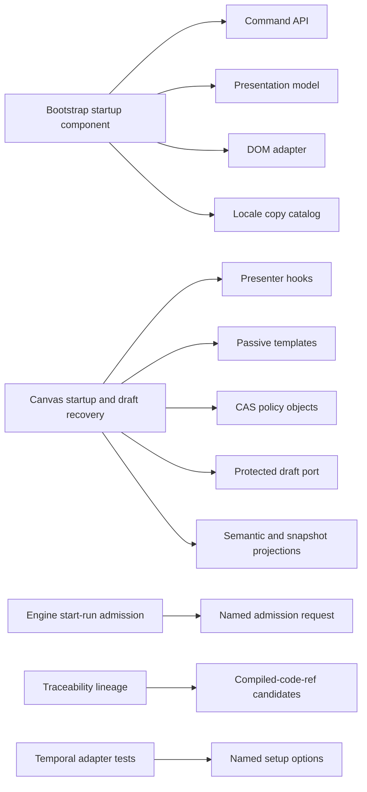
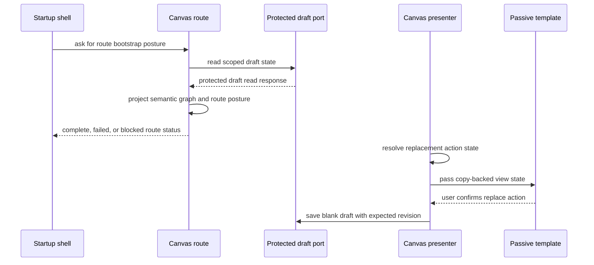

# Static Analysis Follow-Up Fowler Architecture Review

## Fowler verdict

The branch moves the system toward a mature Fowler-style architecture by
turning several procedural seams into named roles: command objects,
presentation models, passive templates, policy objects, projection layers, and
gateway adapters. The most important improvement is not cosmetic. Startup,
Canvas draft recovery, protected workspace projection, and run-admission checks
now speak through explicit application vocabulary instead of primitive
argument trains and mixed JSX/business logic.

The branch is still a bounded hardening slice, not a new product architecture.
It applies existing reference-architecture rules: hexagonal ports, explicit
read models, deterministic command ownership, and user-facing state derived
from canonical route posture.

## Comparison with mature systems

- **Explicit application commands**:
  `BootstrapStepStatusCommand` and `CanvasCreateCanvasDocumentCommand` let
  callers publish intent rather than string tuples.
- **Passive view or template boundary**: Canvas tab strip, host, and recovery
  banner templates receive resolved view state only.
- **Presentation model separate from DOM**: `appBootstrapPresentation.ts` and
  `appBootstrapScreen.ts` split state decisions from DOM writes.
- **Gateway and protected read-model boundary**: `workspaceGraphDraftHttp.ts`
  and draft snapshot projection keep API-mode reads behind the protected draft
  authority.
- **Policy object for guard logic**: Canvas create and replace rules are
  testable outside UI code.
- **Semantic architecture tests**: the Canvas startup and draft-recovery guard
  checks behavior vocabulary and module roles.
- **Scenario-to-test traceability**: this follow-up maps stories to tests and
  invariants.
- **ADR discipline**: existing ADR and reference-architecture rules apply; no
  new ADR is needed for this branch.

Mature systems avoid letting "screen that renders a thing" become the owner of
application policy. This branch now follows that rule in the touched web graph
surface: the component mounts a presenter, the presenter resolves actions, the
model owns command state, and the template renders labels and affordances.

## Improved patterns

- **Application Controller**: route bootstrap factories decide whether a route
  can publish `pending`, `complete`, `failed`, `blocked`, or `error`.
- **Command**: bootstrap and Canvas creation intents are typed objects.
- **Policy Object**: create-first and replace-current CAS eligibility is
  isolated in `canvasCreateCanvasDocumentCommandPolicy.ts`.
- **Gateway**: workspace graph draft HTTP endpoint and scope composition are
  centralized.
- **Projection Layer**: route-facing semantic projection and DBT-shaped
  snapshot projection no longer share one file.
- **Presentation Model**: tab-strip replacement state is resolved before JSX.
- **Passive Template**: tab strip, first-canvas host, and recovery banner HTML
  are separate from command construction.
- **Parameter Object**: Canvas node mapping and engine run-admission requests
  use named request shapes instead of positional primitive lists.
- **Decision Table**: DBT node-type projection uses a data-driven rule table.

## Antipatterns detected

- **Primitive obsession** in bootstrap step updates and run admission:
  replaced with command and request objects.
- **Smart UI component** in Canvas tab strip and recovery banner: extracted
  presenter, model, and template roles.
- **Mixed read-model concerns** in workspace draft projection: split semantic
  projection from DBT snapshot output.
- **Compound conditional as hidden policy** in Canvas create and replace
  command flow: extracted named CAS eligibility helpers.
- **Hardcoded presentation copy in orchestration** in bootstrap and route-error
  surfaces: moved copy into locale-aware catalogs.
- **Test body as fixture factory** in projection and bootstrap tests: moved
  large fixtures and assertions behind helpers.
- **Source-shape-only architecture testing** in prior architecture guard
  posture: added required user-story and review artifacts.

Residual risk: architecture tests still inspect source text in a few places.
That is acceptable for file-boundary invariants, but behavioral tests should
continue to own runtime semantics where a public function can express the rule.

## Components that can be grouped

Recommended component grouping:

- Keep bootstrap as a shell-startup component with four internal concerns:
  copy, commands, presentation model, and DOM adapter.
- Keep Canvas startup and draft recovery as the local component for route
  operability, protected draft projection, replacement command policy, and
  recovery presentation.
- Keep engine admission as a service-level policy boundary. It should not
  drift into web route logic.
- Keep traceability extraction as a lineage mapper concern. It should not be
  duplicated inside event handlers.

## Drift fixed

- Documentation now states that the bootstrap gate is not the Canvas backend
  readiness owner; Canvas publishes route posture into the shell.
- The Canvas guide now names passive templates and presenter seams instead of
  only listing the visible React component.
- Architecture tests now require the current branch review and user-story
  coverage, not an older mailbox review.
- The protected graph read model is documented as draft-derived, not as a
  separate `/workspace/graph` authority.
- i18n is documented as a boundary rule: templates receive resolved copy;
  controllers and command policies do not hardcode operator text.

## Repetitions fixed

- Startup copy no longer repeats across publishers and DOM presentation.
- Create-canvas CAS checks no longer repeat inside the command orchestrator.
- DBT node-type inference no longer repeats as scattered branch checks.
- Canvas tab-strip replacement labels no longer repeat inside JSX.
- Test setup no longer repeats positional `undefined` arguments for Temporal
  adapter activity setup.

## Remaining repetitions to watch

- Several Canvas tests still assert copy through the default catalog. That is
  valid when the behavior is copy-specific, but new tests should prefer view
  state or catalog-specific assertions.
- Source-text architecture tests can become repetitive if every boundary adds
  a bespoke scanner. Prefer one local semantic guard per component.
- Route bootstrap and Canvas route posture both describe readiness. Keep the
  shell gate and route-local blocker vocabulary distinct.

## Opportunities

- **P0: keep protected draft read path as the only graph authority for Canvas
  API mode**. This prevents split-brain startup and route recovery.
- **P0: preserve passive templates for new Canvas controls**. This stops HTML,
  i18n, and command policy from recombining.
- **P1: add behavioral tests for bootstrap retry posture**. This reduces
  reliance on DOM-source architecture assertions.
- **P1: extract shared architecture-test helpers**. This keeps semantic guards
  expressive as the suite grows.
- **P1: publish a component checklist template**. This makes future local
  guides consistent and cheaper to write.
- **P2: add visual regression coverage for startup gate**. This protects the
  mature startup UX after further styling.

## Lessons for future slices

- First name the owned concern, then choose the file boundary.
- A React component should be a mount or a template, not both a policy owner
  and a presentation owner.
- Route readiness and process startup are related, but they are not the same
  aggregate.
- Documentation drift often appears after several small cleanups; consolidate
  the branch story before creating a PR.
- A good architecture test validates a semantic promise: protected endpoint,
  route posture, command mode, CAS invariant, i18n source, or presentation
  boundary.

## User-story coverage

The branch scenarios are documented in the local user-story guide:

- `docs/architecture/components/web/graph/canvas-startup-and-draft-recovery-user-stories.md`

Branch-adjacent local component guides:

- `docs/architecture/components/engine/architecture/start-run-admission-component.md`
- `docs/architecture/components/engine/architecture/start-run-admission-user-stories.md`
- `docs/architecture/components/lineage-worker/compiled-code-ref-lineage-extraction-component.md`
- `docs/architecture/components/lineage-worker/compiled-code-ref-lineage-extraction-user-stories.md`
- `docs/architecture/components/engine/adapters/temporal/temporal-step-plugin-profile.md`

Coverage groups:

- bootstrap shell startup and route failure posture;
- Canvas draft read, empty state, replacement, and conflict recovery;
- passive presentation and locale-backed copy;
- protected workspace graph snapshot projection;
- engine run-admission request objects;
- traceability compiled-code-ref extraction;
- Temporal adapter named setup options.

## ADR decision

No new ADR is required for this branch. The changes do not introduce a new
cross-system contract, endpoint, event type, persistence model, or public
workflow policy. They apply existing governance:

- reference architecture: explicit boundaries and replaceable adapters;
- existing event and run-admission ADRs for engine authority;
- Canvas component documentation for local startup and draft-recovery
  semantics.

Create a new ADR only if a future slice introduces one of these decisions:

- multi-canvas persistence as a durable aggregate;
- a new public graph snapshot contract;
- a new startup lifecycle contract shared outside the web app;
- a new engine admission policy visible to external callers.

## Branch solution flow

## Quality posture

The branch is materially cleaner after the presentation and projection
extractions. It is not "done forever"; it is now in a better shape for the next
feature because the next feature has named extension points:

- add startup wording in the copy catalog;
- add shell startup transitions in the presentation model;
- add Canvas replacement behavior in command policy;
- add read-model projection rules in the snapshot projector;
- add HTML in passive templates;
- add scenario coverage in the local user-story guide.
