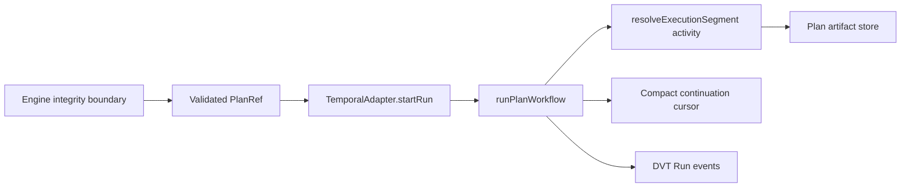
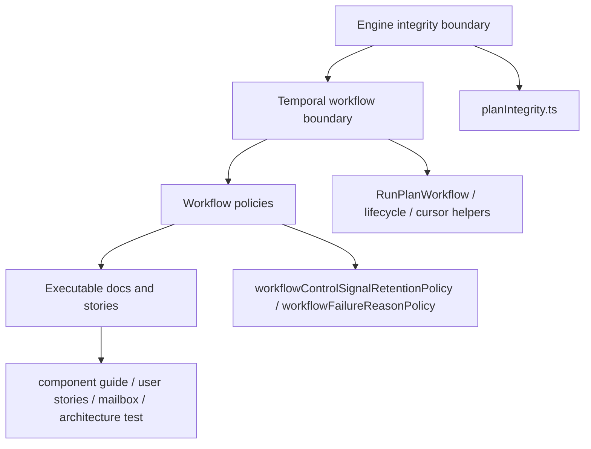

# Fowler architecture analysis - AR-D continuation safety

## Scope

This mailbox entry reviews the branch work that hardens AR-D PlanRef
continuation safety:

- expired `PlanRef` validation before fetch or provider dispatch;
- bounded control-signal id retention across `continueAsNew`;
- governed `RunFailed.reason` values for `PLAN_REF_EXPIRED`,
  `PLAN_REF_UNAVAILABLE`, and `CURSOR_OVERFLOW`;
- component guide, user stories, ADR, evidence, risk, and architecture tests.

Frontend behavior is intentionally out of scope.

## System context

The branch keeps DVT as lifecycle authority while using Temporal as the durable
workflow engine. The mature shape is a pointer-and-cursor runtime:

## Fowler reading

| Fowler concept      | Applied component                                   | Maturity signal                                           |
| ------------------- | --------------------------------------------------- | --------------------------------------------------------- |
| Published Interface | `RunPlanWorkflowInput`                              | PlanRef plus explicit budgets, not hidden full-plan input |
| Gateway             | `PlanIntegrityValidator` and segment resolver       | Plan bytes are verified at execution boundaries           |
| Domain Event        | `RunFailed.reason`                                  | Provider incidents become governed DVT lifecycle facts    |
| Specification       | ADR-0052 and component invariants                   | Runtime behavior is normative, not tribal knowledge       |
| Separated Interface | `workflowFailureReasonPolicy.ts`                    | Error classification is separate from payload rendering   |
| Unit of Work        | Bounded layer plus compact cursor                   | Temporal history is not used as hidden application state  |
| Fitness Function    | `workflow-component-semantics.architecture.test.ts` | Docs, stories, mailbox, and owned concerns are executable |

## Comparison with mature systems

Mature workflow systems treat durable workflow input as a control envelope, not
as an ever-growing data store. Kubernetes controllers, payment orchestration
systems, and Temporal production deployments typically:

- pass stable resource references instead of large mutable work graphs;
- validate referenced material at boundaries;
- encode terminal reasons in domain vocabulary;
- keep retry, dedupe, and cursor state bounded;
- maintain local component documentation for public API and invariants.

This branch moves DVT toward that model. The remaining maturity gap is AR-D2:
production thresholds for history size, segment count, retention windows, and
tenant profiles still need a capacity SLA.

## Patterns improved

- **Fail Fast**: expired `PlanRef` rejects before artifact fetch or provider
  dispatch.
- **Domain Event**: continuation failures now become governed `RunFailed`
  reasons instead of generic workflow failure text.
- **Policy Object**: failure classification is isolated in
  `workflowFailureReasonPolicy.ts`.
- **Bounded Context**: Temporal workflow code owns orchestration; engine owns
  plan approval; StateStore owns lifecycle truth.
- **Executable Documentation**: the architecture test validates module
  ownership, component guide, user stories, and this mailbox.

## Antipatterns detected

### Remediated in this pass

- **Magic string classifier**: failure reason mapping lived inside a generic
  payload helper. It is now an explicit policy module.
- **Documentation drift**: ADR-0052 introduced continuation safety semantics,
  but the component guide did not link the ADR, stories, or branch mailbox.
- **Scenario gap**: behavior tests existed, but no local user-story matrix tied
  expired pointers, unavailable artifacts, cursor overflow, and retention to
  maintainable acceptance criteria.

### Still open

- **Capacity thresholds as policy**: max history size, segment count, and
  retention duration are still AR-D2 work.
- **Plan artifact SLA**: `PLAN_REF_UNAVAILABLE` is observable, but the final
  deployment retention policy is still not fully specified.

## Components that can be grouped

The key grouping is semantic: retention policy and failure classification are
workflow policies, not generic payload or cursor utilities.

## Repetitions fixed

- Continuation failure labels no longer repeat as ad hoc conditions inside the
  payload helper.
- The same AR-D continuation scenarios now have one user-story matrix instead
  of being scattered across ADR, tests, and closeout prose.
- The component guide links ADR, mailbox, and stories instead of requiring
  reviewers to infer traceability from the branch.

## Drift fixed

- Code and docs now agree that `PLAN_REF_EXPIRED`,
  `PLAN_REF_UNAVAILABLE`, and `CURSOR_OVERFLOW` are first-class runtime
  outcomes.
- The architecture test now fails if ADR-0052, user stories, or mailbox
  traceability disappears from the component guide.
- Failure classification is now named as a workflow-owned component concern.

## Opportunities

- Define AR-D2 tenant-profile thresholds for workflow history, segment size,
  cursor budget, and plan retention duration.
- Promote shared architecture-test helpers after one more component uses the
  same component guide + user stories + mailbox guard.
- Add operational metrics for `PLAN_REF_EXPIRED`, `PLAN_REF_UNAVAILABLE`, and
  `CURSOR_OVERFLOW` once the observability cardinality policy is finalized.

## Future teachings

1. A runtime error code is domain vocabulary; isolate it in a policy module
   before it becomes string logic in presentation or payload code.
2. ADRs that introduce behavior need component docs and stories in the same
   slice, not later cleanup.
3. Bounded cursor state is a design invariant; test it as capacity behavior,
   not only as serialization shape.
4. “Green tests” are not enough when docs promise behavior; architecture tests
   should validate docs-to-code traceability.

## Remediation applied

- Added `workflowFailureReasonPolicy.ts` for governed failure classification.
- Refactored `workflowRuntimePayloadHelpers.ts` to render payloads through that
  policy instead of owning string matching.
- Added
  `docs/architecture/components/engine/adapters/temporal/temporal-planref-workflow-boundary-user-stories.md`.
- Updated the component guide to link ADR-0052, user stories, and this mailbox.
- Extended `workflow-component-semantics.architecture.test.ts` to guard the new
  semantic module and documentation surfaces.
