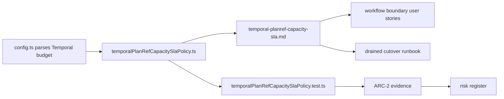

# Fowler architecture analysis - AR-D2 Temporal capacity SLA

## Fowler reading

The AR-D2 slice moves Temporal capacity from an implicit operational setting to
an explicit policy object. In Fowler terms, this is a useful shift from
transaction-script configuration toward a small domain policy: the workflow
budget remains parsed by adapter config, while `temporalPlanRefCapacitySlaPolicy.ts`
owns the production-readiness decision.

The important boundary is semantic, not mechanical. Temporal is still an
execution provider. DVT keeps the execution model, lifecycle meaning, capacity
profile, and evidence trail outside provider state. That matches the existing
hexagonal posture in ADR-0003 and the event/lifecycle ownership in ADR-0004.

## Mature-system comparison

Mature workflow platforms usually separate these concerns:

- admission config parsing
- execution runtime behavior
- production capacity policy
- operational runbooks
- evidence and risk records

The branch now follows that shape for PlanRef capacity. Config still accepts a
diagnostic zero threshold, workflow code still performs deterministic rollover,
and the SLA policy separately says whether those values are production-ready.
That is closer to mature systems than hard-coding production readiness into a
parser or hiding it in prose.

## Improved patterns

- Policy object: `temporalPlanRefCapacitySlaPolicy.ts` classifies capacity
  readiness without calling Temporal or mutating config.
- Explicit negative semantics: disabled rollover, payload-budget inversion,
  retention shortage, and profile overrun each produce named violations.
- Semantic fitness test: `workflow-component-semantics.architecture.test.ts`
  now guards docs, stories, component concerns, and this analysis.
- Documentation as contract surface: `temporal-planref-capacity-sla.md`
  publishes owned concern, public API, invariants, transitions, consumers, and
  a diagram.

## Antipatterns detected

- Primitive obsession remains partial: the policy still receives numeric
  counts and byte values. This is acceptable for this slice because the package
  already brands config numbers at the parser boundary, but production tenant
  profiles should eventually introduce explicit value objects.
- Profile singularity: only `standard` exists. That prevents premature
  abstraction, but enterprise/free-tier tenant profiles remain an open
  opportunity once real telemetry exists.
- Capacity-by-documentation risk: before this pass, some SLA facts were only in
  docs. The fix is the executable policy plus architecture test.

## Components and grouping

The useful grouping is:

- Temporal adapter config: parse and brand runtime inputs.
- PlanRef workflow runtime: execute deterministic rollover with compact cursor.
- Capacity SLA policy: decide whether a budget is production-ready.
- Component documentation: explain API, invariants, transitions, consumers, and
  diagrams.
- Planning/evidence/risk: record delivery state and residual risk.

## Drift and remediation

Drift found:

- AR-D2 said "maximum workflow history size and segment count policy", while
  the earlier code only had config defaults and rollover behavior.
- The capacity SLA document existed after the first pass, but there was no
  branch mailbox analysis preserving the Fowler reasoning.
- The architecture test guarded the SLA document but not the AR-D2 analysis
  itself.

Remediation applied:

- Added executable capacity SLA policy.
- Added negative/positive TDD coverage for production-readiness violations.
- Added local component SLA documentation with API, invariants, transitions,
  consumers, and diagram.
- Added this mailbox analysis and a semantic architecture assertion that guards
  it.

## Repetitions fixed

The branch avoids duplicating capacity rules across workflow code and docs. The
single executable source for production readiness is
`temporalPlanRefCapacitySlaPolicy.ts`; docs and stories reference that policy
instead of reimplementing the decision tree.

## Opportunities

- Add tenant profile variants only after production Temporal telemetry proves
  actual history, segment, and retention envelopes.
- Promote profile input to explicit value objects if more policies consume the
  same counts and byte budgets.
- Add an operator preflight command that evaluates the active environment
  against `evaluateTemporalPlanRefCapacitySla` before deployment.

## Future teachings

- Keep parser validity separate from production readiness. A value can be valid
  for incident rollback and still invalid for production scale.
- Do not let Temporal history become hidden application storage. Continue-as-new
  thresholds are architecture, not convenience config.
- Architecture tests should guard semantics that reviewers care about:
  ownership, API, invariants, transitions, consumers, and analysis records.

## User stories covered

- `US-TPW-006`: production capacity is evaluated before large-DAG readiness.
- Positive path: non-zero rollover, bounded payload, sufficient retention, and
  profile-compliant estimates evaluate as `production_ready`.
- Negative paths: disabled rollover, payload budget inversion, short retention,
  layer-count overrun, segment-count overrun, workflow event overrun, and
  workflow byte overrun evaluate as explicit violations.

## ADR decision

No new ADR is required for this slice. ADR-0003 already governs DVT-owned
execution semantics, ADR-0004 governs lifecycle/event ownership, and ADR-0052
governs PlanRef continuation safety. This work implements AR-D2 as an
executable policy and local component guide within those accepted decisions.
