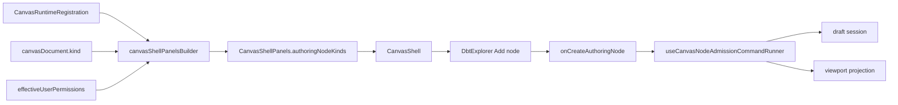
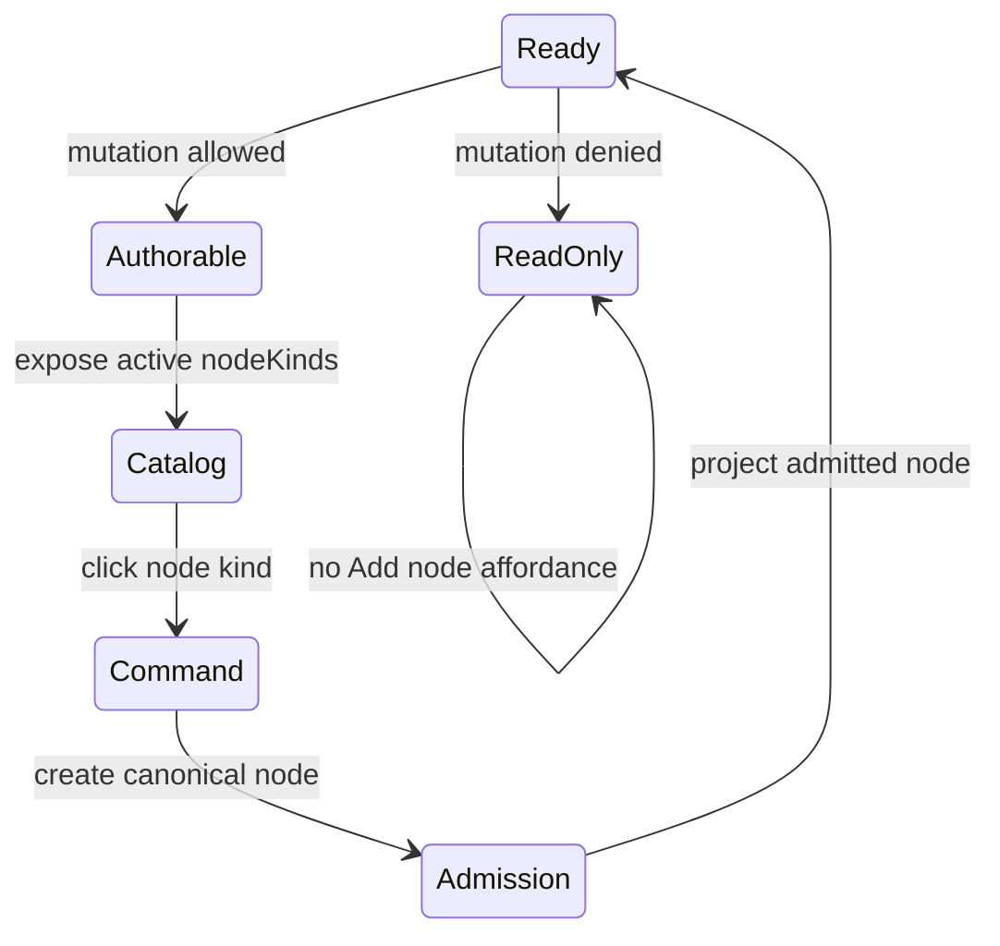

# Fowler Review - Canvas Ready Node Authoring

## Context

The branch fixes a product regression: once a Canvas already had nodes, there
was no explicit way to add new governed authoring nodes. The empty-state path
had a first-node catalog, and drag/drop could add existing project resources,
but the ready canvas state did not expose the active runtime node catalog.

## Fowler Analysis

The previous shape was a classic UI workflow gap caused by asymmetric
entrypoints. The application service existed (`onCreateAuthoringNode`), and the
aggregate admission path existed (`useCanvasNodeAdmissionCommandRunner`), but
only the empty-state UI consumed it. The ready shell became a passive inventory
view instead of an authoring workbench.

Mature graph systems separate three concerns:

- palette/catalog selection
- admission and graph mutation
- execution validation

This cut improves that separation. `DbtExplorer` now renders the active
catalog, `CanvasShell` wires shell contracts, and node admission remains in the
existing command runner.

## Improved Patterns

- **Application Service:** ready-canvas creation calls
  `onCreateAuthoringNode` instead of mutating graph state from the view.
- **Policy Derived From Runtime:** `canvasShellPanelsBuilder` derives node
  kinds from the active `canvasDocument.kind`.
- **Hexagonal UI Boundary:** the Explorer is an adapter over a shell contract,
  not a domain authority.
- **Fail Closed:** no canvas document or denied mutation yields an empty
  authoring catalog.
- **Semantic Architecture Test:** `CanvasShell.architecture.test.tsx` now
  checks runtime-catalog ownership and rejects a global catalog shortcut.
- **Executable User Flow:** `canvas-ready-node-authoring.cy.ts` now covers
  add, save, reload, remove, failed-save, and read-only behavior from the
  operator surface.

## Antipatterns Detected

- **Asymmetric Capability Surface:** empty canvas could create nodes, ready
  canvas could not.
- **Implicit Workflow By Drag Only:** creation depended on project inventory
  or drag/drop, which is not sufficient for local authoring.
- **Documentation Drift:** docs described node create/drop delegation but did
  not state ready-canvas creation as an invariant.
- **Fixture Repetition:** several tests rebuilt `NodeKindRegistration`; this
  was consolidated into `canvasKindRegistration.testSupport.ts`.

## Repetitions Fixed

- Repeated `NodeKindRegistration` and `CanvasKindRegistration` fixtures were
  replaced by local test builders.
- Ready and empty authoring now share the same command seam instead of growing
  separate mutation logic.
- Cypress draft fixtures now include stateful and failing save helpers so
  persistence flows are tested through a backend-like boundary instead of
  one-off static responses.

## Opportunities

- Rename `DbtExplorer` once product scope is no longer DBT-centered; it now
  renders active canvas authoring controls, not only DBT resources.
- Consider a dedicated `CanvasExplorerAuthoringCatalog` component if the
  Explorer rail gains filtering, search, or plugin-grouped palettes.
- Add a live protected-runtime lane for ready-canvas authoring once `apiBaseUrl`
  is available in the local/CI Cypress lane.

## Current Design

## Transition

## Future Teaching

- When a command exists only in one UI state, search for sibling states that
  should share the same application service.
- A visible catalog is not a policy authority; always pair it with runtime
  admission.
- Architecture tests should assert semantic ownership: active runtime catalog,
  permission gate, and command seam.

## ADR Assessment

No new ADR is needed. The change is within accepted frontend graph architecture
and does not alter backend contracts, execution semantics, or plugin contract
shape.
