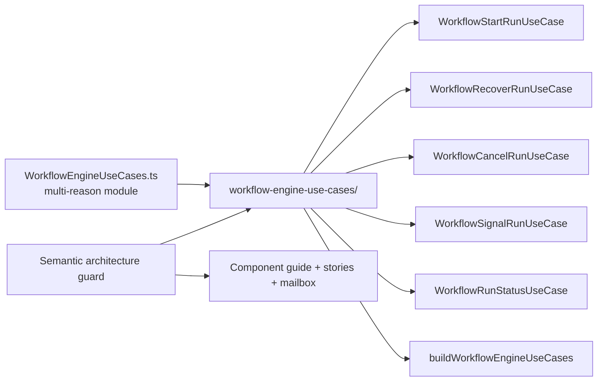

# Fowler Analysis And Remediation For WE-HX-2 Facade Use Cases

## Scope

This mailbox record reviews the `WE-HX-2` branch after `WorkflowEngine` was
narrowed to a compatibility facade over explicit use cases. It compares the
slice with mature hexagonal systems and records the remediation applied during
the hard QA pass.

## Fowler Architecture Analysis

The first cut improved the main smell: `WorkflowEngine` stopped hosting tracing,
resolved-context creation, direct application-service calls, direct control
service calls, and status-query service calls. That aligns with Fowler's
application service style: public entry points normalize commands and delegate
to behavior-owning services.

The remaining smell was a smaller but real semantic encapsulation issue:
`WorkflowEngineUseCases.ts` grouped contracts, five implementations, and the
composition helper in one file. That file was thin enough to pass basic review,
but it changed for several reasons: start tracing, recovery delegation,
cancellation, signal routing, status reads, and factory wiring. Mature systems
usually split that into a component folder with one module per reason to change.

## Mature-System Comparison

| Concern              | Corrected branch posture                                                          | Mature-system expectation                                        |
| -------------------- | --------------------------------------------------------------------------------- | ---------------------------------------------------------------- |
| Public facade        | `WorkflowEngine` parses, normalizes, and delegates                                | Facades should be adapters, not orchestration engines            |
| Use-case ownership   | each facade use case has its own module and port                                  | one behavior owner per command/query family                      |
| Cross-cutting traces | start-run tracing lives in `WorkflowStartRunUseCase`                              | cross-cutting concerns sit at use-case boundaries                |
| Query separation     | status reads use `IWorkflowRunStatusUseCase`                                      | read model access stays separate from command/control behavior   |
| Documentation        | component guide, stories, mailbox review, diagrams, and drift guard move together | docs describe API, invariants, transitions, consumers, and tests |
| Fitness function     | architecture test validates semantics, docs, stories, mailbox, and modules        | automated checks protect meaning, not only barrels               |

## Improved Patterns

- **Thin facade:** `WorkflowEngine` now follows the Facade pattern without
  becoming a Transaction Script host.
- **Application use cases:** start, recovery, cancel, status, and signal are
  explicit use-case ports.
- **Hexagonal dependency direction:** callers depend on `IWorkflowEngine`; the
  facade depends on use-case ports; use cases adapt to internal services.
- **Semantic module ownership:** each use-case module declares its owned concern
  before imports.
- **Architecture fitness function:** the test prevents direct service/tracing
  drift back into `WorkflowEngine` and prevents a monolithic use-case file from
  returning.

## Antipatterns Detected And Fixed

| Antipattern                     | Risk                                                       | Fix applied                                                    |
| ------------------------------- | ---------------------------------------------------------- | -------------------------------------------------------------- |
| Facade as orchestration host    | public contract changes could break internal runtime flow  | move tracing and service orchestration into use cases          |
| Multi-reason use-case file      | start, recovery, control, query, and factory churn collide | split into `workflow-engine-use-cases/` component modules      |
| Barrel-only architecture test   | tests could pass while semantics drifted                   | guard now validates docs, stories, mailbox, and module headers |
| Documentation without scenarios | reviewers see structure but not expected behavior          | add local user stories and negative scenarios                  |
| Hidden doc/code drift           | evidence could point at deleted files                      | update docs to component-folder paths                          |

## Components To Group

- `packages/@dvt/engine/src/core/WorkflowEngine.ts`: public contract
  normalization and delegation only.
- `packages/@dvt/engine/src/application/workflow-engine-use-cases/types.ts`:
  facade-facing use-case ports and component shape.
- `WorkflowStartRunUseCase.ts`: start-run resolved context and tracing boundary.
- `WorkflowRecoverRunUseCase.ts`: recovery use-case adapter.
- `WorkflowCancelRunUseCase.ts`: cancellation use-case adapter.
- `WorkflowSignalRunUseCase.ts`: signal use-case adapter.
- `WorkflowRunStatusUseCase.ts`: canonical status read adapter.
- `buildWorkflowEngineUseCases.ts`: composition helper from internal services
  to facade-facing use cases.

## Repetitions Fixed

- Repeated direct service knowledge in `WorkflowEngine` is replaced by five
  explicit use-case ports.
- Repeated component concerns in one file are split by command/query family.
- Documentation references to the deleted monolithic file are moved to the
  component folder.

## Opportunities

- `WE-HX-3` should apply the same component-folder standard to start-run
  application decomposition: admission, provider/capability resolution, intent
  creation, dispatch, and failure policy.
- `WE-HX-5` should standardize provider and telemetry seams after start-run
  decomposition so observability does not become another implicit facade
  responsibility.
- `WE-HX-6` should promote these semantic architecture guards into broader
  fitness checks for engine package boundaries.

## Drift Check

No ADR was required for this follow-up because the public `IWorkflowEngine`
contract did not change. The implementation remains consistent with ADR-0003,
ADR-0014, ADR-0015, ADR-0030, and ADR-0034.

The drift corrected in this pass was local:

- the code used a monolithic use-case file while docs described componentized
  use cases;
- local stories and mailbox analysis were missing for `WE-HX-2`;
- `WorkflowEngine.ts` had baseline/decision headers but did not state its
  owned concern explicitly.

## Future Lessons

- A facade split is incomplete if the extracted component is just a larger file
  with a new name.
- Architecture tests should assert at least one semantic invariant, one doc
  invariant, and one module-ownership invariant.
- User stories belong beside the component when they define acceptance for a
  local architecture slice.
- Mailbox reviews are useful only when they name the remaining smells and the
  remediations, not when they restate the implementation.

## Remediation Summary

