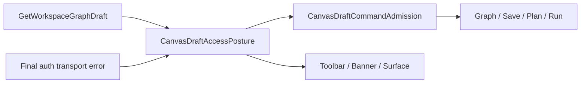

# TF-E2-M-B Canvas Draft Access Posture Fowler Review

## Fowler Verdict

The slice moves Canvas draft denial from scattered conditionals into a named
Presentation Model plus Policy Object. That is the right mature-system shape:
the route receives authoritative draft facts from `GetWorkspaceGraphDraft`,
normalizes final auth transport failure separately, and then exposes one
`CanvasDraftAccessPosture` to toolbar, banner, center surface, command
admission, and route interaction state.

## Mature-System Comparison

Mature workflow UIs do not let every widget decide whether the user can edit.
They resolve one access posture and fan it out to view state and command
admission. This change follows that model:

## Patterns Improved

- Presentation Model: `CanvasDraftAccessPosture` is the route-visible truth.
- Policy Object: `applyCanvasDraftPostureToRuntimePolicyInput()` gates command
  inputs before runtime policy resolves final availability.
- Gateway: `canvasDraftAuthTransportPosture.ts` keeps API auth transport facts
  outside Canvas route code.
- Passive View: `CanvasDraftAccessRecoveryTemplate` renders resolved banner
  state and receives resolved callbacks.

## Antipatterns Removed

- Duplicated permission conditionals across toolbar, banner, transport surface,
  and route interactions.
- Primitive obsession around raw `draftAccessMode` and capability reasons.
- Hidden authority where Plan/Run could remain enabled while the draft posture
  was not writable.
- JSX-level recovery branching.

## Remaining Risk

Local Cypress execution is currently blocked by the machine Cypress binary:
`cypress verify` fails before specs run with `Invalid or incompatible cached
data (cachedDataRejected)` / `bad option: --smoke-test`. The spec exists and
the mechanization guard verifies it does not use `cy.intercept()` or direct
`cy.request PUT` against `/workspace/graph/draft`, but browser execution still
needs a working Cypress runtime or CI confirmation.

## Future Teaching

New externally visible Canvas behavior must start from the command/query rail
and name its DDD owner before code. For route access states, add a posture kind
only when copy, command admission, architecture guard, and Cypress coverage are
planned together.
