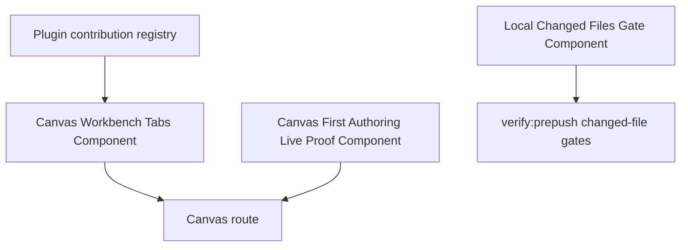
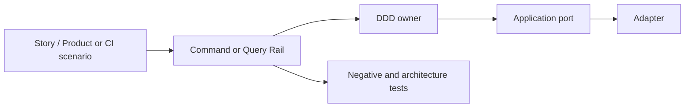

# Branch Fowler Hard QA Review

## Scope

This review covers the current branch work as an integrated slice:

- Canvas workbench tab placement and hard-cut removal of global
  Canvas-dependent menu entries.
- Canvas first-authoring live-proof SRP split.
- Local changed-files gate hardening for untracked, unstaged, staged, and
  branch-diff files.

## Governing Sources

- `AGENTS.md`
- `docs/planning/status/governance-document-rule-inventory.md`
- `docs/guides/ai-work-protocol.md`
- `docs/architecture/command-query-rail-governance.md`
- `docs/architecture/fowler-opportunity-planning-governance.md`
- `docs/guides/testing-and-ci-capabilities.md`
- `docs/adr/ADR-0000-Code-generation-with-normative-traceability-required.en.md`
- `docs/adr/ADR-0053-file-state-fingerprint-governance.md`

## Fowler Verdict

The branch improves architecture, but it only reaches mature-system posture
after the QA fixes added in this pass.

Before the fixes, the product and CI changes had useful behavior and tests, but
the CI changed-files slice still had documentation drift: the command/query
rail existed in the plan and code, while the component guide and semantic
architecture test did not exist. That meant future scripts could reintroduce
local `git diff` scattering without a component-level guard.

After this pass, the branch has one explicit component surface for the local
changed-files gate, a semantic test that proves the shared rail, and owned
concern docblocks on the changed CI modules.

## Comparison With Mature Systems

Mature systems normally separate four concerns:

1. Product intent in command/query rails.
2. Domain ownership in aggregates, policies, value objects, or read models.
3. Adapter behavior at the edge.
4. Mechanical validation for the boundaries that tend to regress.

The branch now matches that posture:

- Canvas tab placement uses `ViewPlacement`, `ShellNavigationReadModel`, and
  `CanvasWorkbenchTabsReadModel` instead of route-name shortcuts.
- First-authoring live proof uses small proof modules instead of one large
  method that owns vocabulary, policy, restored-layout checks, and invariants.
- Changed-file readiness uses `LocalChangedFileSet` and
  `ChangedFileValidationGate` instead of script-local name-only git queries.

The remaining mature-system gap is product breadth, not architecture: tenant
admin onboarding, project creation, and prepared asset persistence are still
separate planned product slices.

## Patterns Improved

| Area                  | Improved pattern                              | Evidence                                                            |
| --------------------- | --------------------------------------------- | ------------------------------------------------------------------- |
| Canvas menus          | Presentation Model plus registry projection   | `CanvasWorkbenchTabsReadModel`, `getCanvasWorkbenchTabViews()`      |
| Plugin placement      | Replace Primitive Type Code with value object | `ViewPlacement` hard cut from `nav`                                 |
| First authoring proof | SRP and Domain Service model                  | `canvasFirstAuthoringLiveProof.*` module family                     |
| Local changed files   | Query rail and policy boundary                | `listLocalChangedFiles()` plus `ChangedFileValidationGate`          |
| Governance            | Mechanized plan-first implementation          | feature manifests validate surfaces, symbols, Cypress draft posture |

## Antipatterns Detected

| Antipattern             | Branch signal                                                               | Resolution                                                                                          |
| ----------------------- | --------------------------------------------------------------------------- | --------------------------------------------------------------------------------------------------- |
| Boundary drift          | Canvas-dependent Code, Lineage, Diff, Artifacts were global route concepts. | Moved placement into Canvas workbench tabs.                                                         |
| Responsibility overload | `canvasFirstAuthoringLiveProof.ts` owned too many semantic decisions.       | Split into proof vocabulary, first-node policy, restored-layout policy, invariants, and derivation. |
| Duplicate semantics     | Global Runs and Canvas-scoped Runs were one ambiguous UI concept.           | Kept global Runs and added Canvas-scoped Runs tab surface.                                          |
| Hidden local authority  | Changed-only gates could skip local untracked files.                        | Centralized changed-file detection in `LocalChangedFileSet`.                                        |
| Documentation drift     | Local changed-files plan had rails but no component guide.                  | Added `ci-governance/local-changed-files-gate-component.md`.                                        |
| Test-only confidence    | CI gate proof was unit-heavy but not component-semantic.                    | Added semantic test in `scripts/git-local-changes.test.cjs`.                                        |

## Component Grouping



Component homes:

- `docs/architecture/components/web/graph/canvas-workbench-tabs-component.md`
- `docs/architecture/components/web/graph/canvas-first-authoring-live-proof-component.md`
- `docs/architecture/components/ci-governance/local-changed-files-gate-component.md`

## Repetitions Removed

- Removed the `ViewContribution.nav` single-field semantics that forced shell
  nav and workbench placement to be the same concept.
- Removed bootstrap alias shims for Canvas workbench tabs.
- Removed proof-state concentration from `canvasFirstAuthoringLiveProof.ts`.
- Reduced repeated local changed-file queries by routing changed-only consumers
  through `listLocalChangedFiles()`.

## Drift Fixed

| Drift                                                                         | Fix                                                                                                |
| ----------------------------------------------------------------------------- | -------------------------------------------------------------------------------------------------- |
| Plan promised CI changed-file rail but had no component guide.                | Added CI governance component docs with API, invariants, transitions, consumers, and user stories. |
| Changed CI scripts lacked short owned-concern module docblocks.               | Added module-level owned concern comments to changed scripts and docs tools.                       |
| Architecture guard checked behavior but not component semantic documentation. | Added semantic component-doc and consumer test to `scripts/git-local-changes.test.cjs`.            |
| Testing guide described behavior but did not link the component owner.        | Linked the Local Changed Files Gate component from `testing-and-ci-capabilities.md`.               |

## Opportunities Left

These are not implemented in this branch:

1. Split the broad `SYS-CI-GOVERNANCE-ROOT` governance component into smaller
   source-level units.
2. Add a dependency-cruiser rule preventing runtime packages from importing
   `scripts/**` or `tools/**`.
3. Move remaining raw changed-file logic in untouched docs tools, such as full
   markdown link checks, behind the local changed-file query if they become
   changed-only gates.
4. Implement tenant admin onboarding and empty-project startup as the next
   product slice, not as a refactor.

## Command And Query Coverage



Rails used by this branch:

- `ListShellNavigationItems`
- `ListCanvasWorkbenchTabs`
- `ResolveCanvasWorkbenchContext`
- `SelectCanvasWorkbenchTab`
- `RegisterPluginViewPlacement`
- `OpenCanvasScopedRunTab`
- `GetWorkspaceGraphDraft`
- `CreateCanvas`
- `CreateCanvasNode`
- `SaveWorkspaceGraphDraft`
- `PersistCanvasLayout`
- `GetCanvasLayout`
- `ListLocalChangedFiles`
- `ValidateChangedFiles`
- `SelectPrepushTypecheckScope`

## User-Story Coverage

| Story                                                                                        | Component                   | Covered by                                                         |
| -------------------------------------------------------------------------------------------- | --------------------------- | ------------------------------------------------------------------ |
| User opens Canvas and sees Graph, Code, Lineage, Diff, Artifacts, and Runs as Canvas tabs.   | Canvas Workbench Tabs       | `canvas-workbench-tabs.cy.ts`, `canvasWorkbenchTabs.test.ts`       |
| User opens `/canvas/unknown` and receives fail-closed recovery.                              | Canvas Workbench Tabs       | `canvasWorkbenchRouteState.test.ts`, `canvasWorkbenchTabs.test.ts` |
| User creates first canvas, first node, drags, saves, reloads, and sees restored state.       | First Authoring Live Proof  | `canvasFirstAuthoringLiveProof.test.ts`, live Cypress proof plan   |
| Agent adds untracked file and pre-push sees it.                                              | Local Changed Files Gate    | `scripts/git-local-changes.test.cjs`                               |
| Agent changes Cypress draft behavior and feature guard rejects forbidden seeding/intercepts. | Feature Mechanization Guard | `scripts/check-feature-mechanization.test.cjs`                     |

## TDD Evidence

Red/green cycle added during this QA:

1. RED:
   `node --test scripts/git-local-changes.test.cjs`
   failed because
   `docs/architecture/components/ci-governance/local-changed-files-gate-component.md`
   did not exist.
2. GREEN:
   the component guide, component index, manifest linkage, and owned-concern
   docblocks were added; the same command passed.

Follow-up semantic-encapsulation red/green cycles added on 2026-05-04:

1. RED:
   `pnpm --filter @dvt/web test -- src/app/views/canvas/canvasWorkbenchTabs.architecture.test.ts`
   failed because
   `docs/architecture/components/web/graph/canvas-workbench-tabs-component.md`
   did not include `## User Stories`.
2. GREEN:
   the Canvas workbench component guide gained user stories, scenario coverage,
   TDD traceability, and the owning plugin placement/query/shell modules gained
   short owned-concern docblocks; the same command passed.
3. RED:
   `pnpm --filter @dvt/web test -- src/app/views/canvas/canvasStartupAndDraftRecovery.architecture.test.ts`
   failed because
   `docs/architecture/components/web/graph/canvas-first-authoring-live-proof-component.md`
   did not include `## User Stories`.
4. GREEN:
   the first-authoring proof component guide gained user stories, scenario
   coverage, and TDD traceability for clean startup, first canvas, first node,
   layout persistence, restored route state, live runtime proof, and forbidden
   Cypress shortcuts; the same command passed.

## ADR Decision

No new ADR is required for this QA pass.

Reason: the branch applies existing governance decisions rather than changing
architecture policy. The governing ADRs remain ADR-0000 for traceable generated
and governed artifacts, and ADR-0053 for file identity and fingerprint
governance.

## Closeout Expectations

The branch should not be considered ready until these commands pass after docs
generation:

```text
node --test scripts/git-local-changes.test.cjs scripts/check-governance-changed-files.test.cjs scripts/check-feature-mechanization.test.cjs
pnpm --filter @dvt/web test -- src/app/views/canvas/canvasFirstAuthoringLiveProof.test.ts src/app/views/canvas/canvasStartupAndDraftRecovery.architecture.test.ts src/app/views/canvas/canvasWorkbenchTabs.test.ts src/app/views/canvas/canvasWorkbenchRouteState.test.ts src/app/views/canvas/canvasWorkbenchTabs.architecture.test.ts
pnpm --filter @dvt/web typecheck
pnpm docs:feature-mechanization:implementation
pnpm verify:prepush
```
