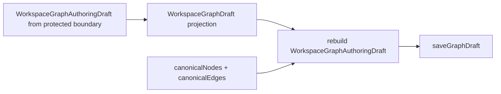
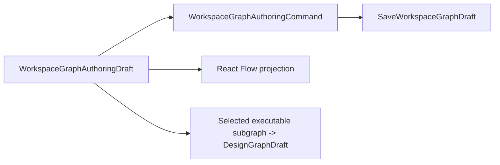

# TF-E2-A Authoring Draft Hard Cut Fowler Review

## Verdict

`TF-E2-A` is the next high-value Canvas slice. The protected contract and API
are already authoring-draft native, but the web route still contains a
transitional projection DTO that can make a lossy route shape look like the
editable aggregate.

The next implementation should remove that projection from the active save
path before adding more Canvas features.

2026-05-03 follow-up review: the component is directionally DDD-aligned, but
it was not strict enough. It allowed the route-local `WorkspaceGraphDraft`
record to survive as a presentation DTO and did not declare
`apps/web/src/app/ports/workspace.ts` as an implementation surface. That would
make the hard cut non-mechanical. The component and plan now require deleting
the route-local draft exports instead of adding aliases or compatibility paths.

## Mature-System Comparison

Mature authoring systems separate:

- editable aggregate truth;
- renderer projection;
- compile projection;
- protected persistence envelope;
- runtime execution admission.

The current system has the right backend contract but still carries this
web-local detour:

The target mature-system shape is:

## Patterns To Apply

| Finding                                                                                                | Fowler signal        | Pattern or correction                                                                                                                                                                                                                     |
| ------------------------------------------------------------------------------------------------------ | -------------------- | ----------------------------------------------------------------------------------------------------------------------------------------------------------------------------------------------------------------------------------------- |
| Route-local DTO named like draft truth                                                                 | Hidden authority     | Replace with aggregate-native model and intention-revealing projections.                                                                                                                                                                  |
| `projectedDraft`, `canonicalNodes`, and `canonicalEdges` move together                                 | Data clump           | Introduce `CanvasAuthoringDraftReadModel`.                                                                                                                                                                                                |
| Save path reconstructs aggregate truth                                                                 | Feature envy         | Let `WorkspaceGraphAuthoringDraft` own editable truth directly.                                                                                                                                                                           |
| Tests prove projected shapes                                                                           | Test-only confidence | Add semantic architecture guard for save input and compile-only imports.                                                                                                                                                                  |
| Lane state still described closed M work as open                                                       | Documentation drift  | Close `TF-E2-M-B`, `TF-E2-M-D`, and parent `TF-E2-M` in Lane E.                                                                                                                                                                           |
| Implementation plan omitted service barrels and secondary Canvas modules that reference the legacy DTO | Mechanical drift     | Add `apps/web/src/app/ports/workspace.ts`, `apps/web/src/app/services/workspace/workspaceService.ts`, projection, lifecycle, surface-type, create-canvas, autosave, session/cache, and affected fixture modules to the declared surfaces. |

## DDD Hardening Applied To The Design

- `CanvasAuthoringDraftRecord` becomes the Canvas-owned route record; projected
  `WorkspaceGraphDraftRecord` must be deleted.
- `CanvasAuthoringSemanticGraph` becomes the Canvas-owned semantic projection;
  `WorkspaceGraphDraftSemanticGraph` must not be used as route authority.
- `WorkspaceGraphDraft` remains only the protected contract/envelope term in
  `@dvt/contracts` and endpoint-facing authoring port names.
- The generic workspace port must stop exporting graph draft persistence types.
- `workspaceService.ts` must stop re-exporting those route-local draft types;
  otherwise the barrel becomes a hidden compatibility surface.
- Create-canvas save-result and autosave scheduling/execution must stop
  carrying `projectedDraft` or `CanvasDraftAuthoringPayload` as saved truth.
- Node duplication must reuse `WorkspaceGraphAuthoringCommand` `add_node`
  semantics with a new id, not introduce a duplicate-specific command.

## Antipatterns To Avoid

- Adding another route-local draft DTO with a new name.
- Keeping route-local `WorkspaceGraphDraft` through a compatibility alias.
- Treating `DesignGraphDraft` as a fallback save payload.
- Moving semantic draft ownership into React Flow state.
- Accepting Cypress seeding as proof of authoring behavior.
- Marking `TF-E2-A` done without browser and architecture proof.

## Teaching For Future Work

Every new Canvas behavior must answer three questions before code:

1. Which command/query rail owns the behavior?
2. Which DDD object owns the invariant?
3. Which projection is being rendered, persisted, or compiled?

If the same object appears to do all three jobs, the design is not mature
enough to implement.
