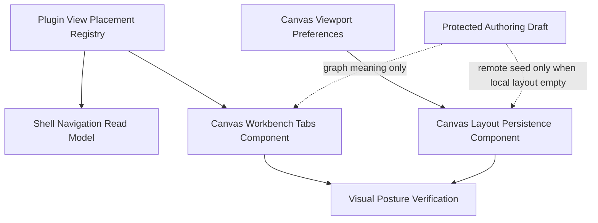

# Canvas Workbench Tabs And Layout Fowler Analysis And Remediation

## Scope

This mailbox records the Fowler/DDD review for the Canvas workbench tab and
route-local layout work now being regularized on `main`.

It covers:

- Canvas workbench tab placement and readable horizontal tab labels;
- shell navigation exclusion for Canvas-only views;
- route-local Canvas layout persistence;
- grid visibility, grid color, and snap-to-grid preferences;
- Cypress visual-posture proof;
- documentation and semantic architecture-test closure.

It does not cover backend Project Assets persistence, new API contracts,
adapter changes, or protected authoring draft semantics.

## Governing Sources

- `AGENTS.md`
- `docs/planning/status/governance-document-rule-inventory.md`
- `docs/guides/ai-work-protocol.md`
- `docs/architecture/reference-architecture.md`
- `docs/architecture/command-query-rail-governance.md`
- `docs/architecture/fowler-opportunity-planning-governance.md`
- `docs/architecture/components/web/frontend-fowler-implementation-pattern.md`
- `docs/architecture/components/web/graph/canvas-workbench-command-query-catalog.md`
- `docs/architecture/components/web/graph/canvas-workbench-tabs-component.md`
- `docs/architecture/components/web/graph/canvas-layout-persistence-component.md`
- `docs/planning/proposals/mandatory/frontend-and-ux/canvas-workbench-fowler-remediation-plan-20260504.md`
- `docs/planning/proposals/mandatory/frontend-and-ux/canvas-workbench-tabs-placement-design-plan-20260503.md`

## Mature-System Comparison

Mature workbench systems separate three layers:

1. global application navigation;
2. route-local workbench views;
3. route-local visual/layout preferences.

They do not let route names, toolbar buttons, or Cypress selectors become the
semantic authority. Instead, product intent is named by commands and queries,
route code acts as an application controller, plugin metadata is projected
through read models, and UI tests prove the rendered contract.

The Canvas workbench now moves toward that posture:

- `ViewPlacement` separates shell placement from Canvas workbench placement.
- `CanvasWorkbenchTabsReadModel` owns route-local tab presentation.
- `CanvasLayoutProjection` owns viewport and node-coordinate persistence.
- `CanvasViewportPreferences` owns grid visibility, grid color, and snap.
- `CanvasWorkbenchVisualPostureReadModel` names the Cypress verification
  concern instead of leaving visual correctness as informal screenshot review.

The remaining maturity gap is documentation and semantic guard completeness:
the code can behave correctly while docs, stories, mailbox, and architecture
tests fail to describe the same behavior. This remediation closes that gap.

## Patterns Improved

| Area                     | Improved pattern                    | Evidence                                                                   |
| ------------------------ | ----------------------------------- | -------------------------------------------------------------------------- |
| Shell versus Canvas tabs | Presentation Model and query split  | `ListShellNavigationItems`, `ListCanvasWorkbenchTabs`                      |
| Plugin placement         | Replace Type Code with Value Object | `ViewPlacement`, `ShellNavigationPlacement`, `CanvasWorkbenchTabPlacement` |
| Tab selection            | Intention-Revealing Command         | `SelectCanvasWorkbenchTab`                                                 |
| Layout persistence       | Projection plus Policy Object       | `PersistCanvasLayout`, `GetCanvasLayout`                                   |
| Grid preferences         | Value Object                        | `CanvasViewportPreferences`                                                |
| Browser proof            | Semantic Fitness Function           | `VerifyCanvasWorkbenchVisualPosture`                                       |

## Antipatterns Detected

| Antipattern          | Signal                                                                               | Remediation                                                                                                       |
| -------------------- | ------------------------------------------------------------------------------------ | ----------------------------------------------------------------------------------------------------------------- |
| Boundary drift       | Code, Lineage, Diff, and Artifacts can look like global shell views.                 | Keep only shell placements in `ListShellNavigationItems`; project Canvas views through `ListCanvasWorkbenchTabs`. |
| Primitive obsession  | A string route or tab label can act as product intent.                               | Use named C&Q rails and DDD read models.                                                                          |
| Duplicate semantics  | Global Runs and Canvas-scoped Runs can collapse into one mental model.               | Keep global Runs as shell nav and Canvas Runs as `OpenCanvasScopedRunTab`.                                        |
| Hidden authority     | Local layout and grid preferences can be mistaken for graph draft state.             | Keep layout rails local to `CanvasLayoutProjection` and `CanvasViewportPreferences`.                              |
| Test-only confidence | The previous Cypress assertion could pass while labels were visually truncated.      | Add geometry and label-readability assertions through `VerifyCanvasWorkbenchVisualPosture`.                       |
| Documentation drift  | Component docs did not have one local C&Q catalog for the combined tab/layout slice. | Add `canvas-workbench-command-query-catalog.md` and link it from component docs.                                  |

## Component Grouping



Component homes:

- `docs/architecture/components/web/graph/canvas-workbench-command-query-catalog.md`
- `docs/architecture/components/web/graph/canvas-workbench-tabs-component.md`
- `docs/architecture/components/web/graph/canvas-layout-persistence-component.md`
- `docs/architecture/components/web/graph/canvas-workbench-tabs-user-stories.md`
- `docs/architecture/components/web/graph/canvas-layout-persistence-user-stories.md`

## Repetitions

Fixed or being fixed:

- repeated shell/workbench placement language now routes through the C&Q
  catalog;
- repeated route-local tab semantics now use `CanvasWorkbenchTabsReadModel`;
- repeated grid preference language now maps to
  `ConfigureCanvasViewportPreferences`;
- repeated layout persistence rules now map to `PersistCanvasLayout` and
  `GetCanvasLayout`;
- repeated visual assertions now map to `VerifyCanvasWorkbenchVisualPosture`.

Still to watch:

- Canvas workbench tabs and Canvas layout docs can drift if they duplicate the
  catalog table instead of linking it;
- future Project Assets work must add separate rails instead of extending these
  local presentation rails silently.

## Opportunities

| Opportunity                                                             | Fowler classification         | Next action                                                                |
| ----------------------------------------------------------------------- | ----------------------------- | -------------------------------------------------------------------------- |
| Add user-story docs for workbench tabs and layout persistence.          | Documentation drift           | Create local story docs and semantic architecture guards.                  |
| Add component-level architecture guard for layout preference semantics. | Test-only confidence          | Add `canvasLayoutPersistence.architecture.test.ts`.                        |
| Normalize `Color de rejilla` placement in toolbar versus menu.          | Boundary drift / feature envy | Keep toolbar as command surface; shell menu remains secondary view option. |
| Make new node initial placement visible-viewport aware.                 | Hidden UI policy              | Future rail: `ResolveCanvasNodeInitialPosition`.                           |
| Prevent auto-layout from disabling node drag.                           | Responsibility overload       | Guard `ApplyCanvasLayout` as coordinate projection only.                   |

## Code And Documentation Drift

Observed drift:

- the tab label readability fix existed before this review and plan were
  committed;
- the C&Q list existed across component docs and plans but not as one local
  catalog;
- Cypress originally proved route flow but not visual posture;
- layout persistence docs named grid preferences but lacked user-story
  coverage tied to the workbench remediation plan.

Remediation:

- keep the existing readable-label implementation only if it remains supported
  by this mailbox, the plan, the C&Q catalog, and Cypress;
- add semantic docs and user stories before claiming completion;
- close C&Q drift by adding an explicit catalog exhaustiveness rule for routes,
  tabs, toolbar commands, plugin placements, layout preferences, and Cypress
  workflows;
- run the visual Cypress spec and final `pnpm verify:prepush`;
- record any remaining drift as explicit opportunity, not hidden debt.

## Remediation Plan

Execution follows
`docs/planning/proposals/mandatory/frontend-and-ux/canvas-workbench-fowler-remediation-plan-20260504.md`.

Required order:

1. mailbox review;
2. component guides and local user stories;
3. semantic architecture red;
4. implementation green;
5. Cypress visual proof;
6. drift/repetition and ADR decision;
7. generated governance and final validation.

## ADR Decision

No new ADR is required for the current scope.

Reason:

- no backend contract changes are introduced;
- no adapter, engine, planner, or protected draft authority changes are
  introduced;
- the work reuses accepted Web Graph component rails and the existing Canvas
  workbench placement plan;
- the decision is local presentation architecture and is sufficiently governed
  by component docs plus the C&Q catalog.

If a later slice persists Project Assets, stores workbench preferences outside
local Web state, or changes protected draft authority, that slice must revisit
ADR need before implementation.

## TDD Evidence

Completed red/green evidence:

- RED: enhanced `canvas-workbench-tabs.cy.ts` failed when a label-readability
  geometry assertion observed truncated tab labels.
- GREEN: `CanvasWorkbenchTabStrip.tsx` was changed to keep tab labels
  horizontal and readable; the same Cypress spec passed.
- RED: `canvasWorkbenchTabs.architecture.test.ts` and
  `canvasLayoutPersistence.architecture.test.ts` failed because
  `canvas-workbench-command-query-catalog.md` lacked
  `## Exhaustiveness Rule`.
- GREEN: the C&Q catalog now contains `## Exhaustiveness Rule`, and the layout
  component guide explicitly states grid preferences are not in protected graph
  drafts.
- GREEN: `pnpm --filter @dvt/web test -- src/app/views/canvas/canvasWorkbenchTabs.architecture.test.ts src/app/views/canvas/canvasLayoutPersistence.architecture.test.ts`
  passed with 2 files and 6 tests.
- GREEN: `pnpm --filter @dvt/web test:e2e:native -- --spec cypress/e2e/canvas/canvas-workbench-tabs.cy.ts`
  passed with 1 spec, 1 test, 0 screenshots, and video disabled.

## Validation Plan

Required commands before closeout:

```bash
pnpm lint:md:changed
pnpm --filter @dvt/web test -- src/app/views/canvas/canvasWorkbenchTabs.architecture.test.ts src/app/views/canvas/canvasLayoutPersistence.architecture.test.ts
pnpm --filter @dvt/web test -- src/app/plugins/registry.test.ts src/app/shell/shellNavigationModel.test.ts src/app/views/canvas/CanvasShell.test.tsx src/app/views/canvas/CanvasShell.architecture.test.tsx
pnpm --filter @dvt/web typecheck
pnpm exec eslint apps/web/src/app/views/canvas/CanvasWorkbenchTabStrip.tsx apps/web/cypress/e2e/canvas/canvas-workbench-tabs.cy.ts --max-warnings 0
pnpm --filter @dvt/web test:e2e:native -- --spec cypress/e2e/canvas/canvas-workbench-tabs.cy.ts
pnpm verify:prepush
```

Completion cannot be claimed if `pnpm verify:prepush` is interrupted or red.
