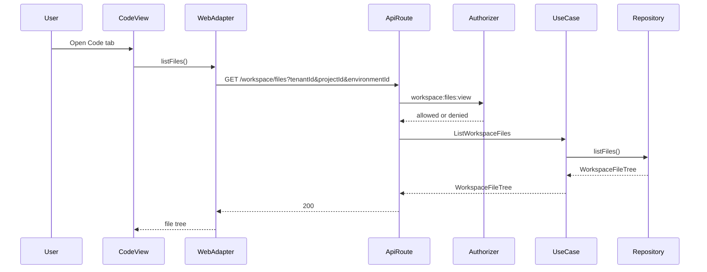

# Fowler Analysis And Plan For Code Tab Workspace Files

## Problem Summary

The Code workbench opens but shows `Workspace files unavailable` because the web
adapter calls `/workspace/files` and `/workspace/files/:path`, while `apps/api`
does not expose those protected query routes.

This is not a cosmetic empty state. It is an end-to-end product gap: the Code tab
already has a read-only file explorer and preview pane, but its live API rail is
missing.

## Root Cause

The frontend file read model was implemented before the backend operational
evidence query rail was promoted from proposal to implemented route.

Current state:

- `apps/web` owns `WorkspaceFileTree` and `WorkspaceFileContent` ports.
- `apps/web` maps canonical `workspace_file_not_found` envelopes to a typed
  `WorkspaceFileLoadError`.
- `docs/risk-register/quality/R-20260411-WEB-WORKSPACE-FILE-NOT-FOUND-CONTRACT-GAP.yaml`
  explicitly records that `/workspace/files` is not implemented in `apps/api`.
- `docs/planning/proposals/mandatory/frontend-and-ux/web-auth-project-onboarding-and-actionable-gaps-20260501.md`
  already names `ListWorkspaceFiles` and `GetWorkspaceFileContent`.
- `apps/api` lacks the route, application query use cases, outbound repository
  port, and negative tests for path traversal and missing file.

## Mature-System Comparison

Mature operator platforms keep code browsing behind read-model queries, not UI
fixtures or unauthenticated filesystem access.

The target pattern is:

- UI route consumes an application-facing workspace port.
- API route adapts a named query rail.
- Query service authorizes tenant, project, and environment scope.
- Repository adapter reads from a bounded workspace file root.
- Error envelopes are semantic, not transport-only.
- Tests cover unavailable, missing, invalid, and unauthorized paths.

The immature pattern currently visible is route-driven product behavior: the web
route knows the route URL, but the owning backend bounded context has not
accepted the query.

## Fowler Opportunity Matrix

| Scenario                              | Opportunity          | Fowler pattern                            | DDD owner                                              | Command/query rail                  | Allowed implementation surfaces                                                                                                                                                | Unit/package test                                   | Architecture test                                                                             | User-flow test                                                         | Out of scope        |
| ------------------------------------- | -------------------- | ----------------------------------------- | ------------------------------------------------------ | ----------------------------------- | ------------------------------------------------------------------------------------------------------------------------------------------------------------------------------ | --------------------------------------------------- | --------------------------------------------------------------------------------------------- | ---------------------------------------------------------------------- | ------------------- |
| Code tab lists files in live API mode | Boundary drift       | Query Object + Repository + Service Layer | `WorkspaceFileTree` read model in Operational Evidence | `ListWorkspaceFiles` query          | `apps/api/src/application/ports`, `apps/api/src/application/services`, `apps/api/src/entrypoints/http`, `apps/api/src/infrastructure/workspaceFiles`, web API endpoint builder | API route test returns scoped tree                  | Semantic architecture test requires route registration, C&Q entry, and no unscoped file route | Cypress Code tab happy path loads tree                                 | File write/save     |
| Code tab previews selected file       | Boundary drift       | Query Object + Gateway                    | `WorkspaceFileContent` read model                      | `GetWorkspaceFileContent` query     | Same as above plus web adapter scope                                                                                                                                           | API route test returns content and language         | Guard file-content route uses canonical error envelope                                        | Cypress selects file and sees Monaco preview                           | Editing             |
| Missing file                          | Test-only confidence | Special Case + Error Mapper               | `WorkspaceFileReadPolicy`                              | `GetWorkspaceFileContent` rejection | API translator and web strict mapper                                                                                                                                           | 404 `workspace_file_not_found` maps to typed error  | Guard reason token is canonical                                                               | Cypress keeps explorer visible on missing selected file when practical | Auto-creating files |
| Path traversal or unsupported path    | Primitive obsession  | Value Object / Policy                     | `WorkspacePath` value object                           | `GetWorkspaceFileContent` rejection | Workspace path parser and repository adapter                                                                                                                                   | 400 `invalid_workspace_path` for `../package.json`  | Guard repository rejects absolute and parent paths                                            | Not required for browser happy path                                    | Binary preview      |
| Code tab scope                        | Hidden authority     | Policy + Explicit Parameter Object        | `WorkspaceFileReadPolicy`                              | Both queries                        | Web endpoint builder and API auth scope parsing                                                                                                                                | Missing/invalid tenant/project/environment rejected | Guard route cannot list without scope                                                         | Cypress uses real selected shell scope                                 | New auth model      |

## C&Q Catalog Decision

No new product intent is invented. The implementation must reuse these rails:

| Rail                      | Type  | Owning context                   | DDD owner                                                          | Inbound port/use case            | Outbound port                            | Adapter surface              | Scope                                        | Negative tests                                              |
| ------------------------- | ----- | -------------------------------- | ------------------------------------------------------------------ | -------------------------------- | ---------------------------------------- | ---------------------------- | -------------------------------------------- | ----------------------------------------------------------- |
| `ListWorkspaceFiles`      | query | Operational Evidence Read Models | `WorkspaceFileTree`                                                | `ListWorkspaceFilesUseCase`      | `WorkspaceFileRepository.listFiles`      | `GET /workspace/files`       | authenticated tenant + project + environment | missing token, denied action, missing scope                 |
| `GetWorkspaceFileContent` | query | Operational Evidence Read Models | `WorkspaceFileContent`, `WorkspacePath`, `WorkspaceFileReadPolicy` | `GetWorkspaceFileContentUseCase` | `WorkspaceFileRepository.getFileContent` | `GET /workspace/files/:path` | authenticated tenant + project + environment | missing file, invalid path, unsupported file, denied action |

## Component Boundary

```mermaid
flowchart LR
  CodeView["CodeView"]
  WorkspacePort["IWorkspacePort"]
  WebApi["workspaceService.api"]
  ApiRoute["workspaceFilesRoutes"]
  QueryUseCases["List/Get Workspace Files Use Cases"]
  RepositoryPort["WorkspaceFileRepository"]
  LocalAdapter["LocalWorkspaceFileRepository"]
  Root["Configured workspace file root"]

  CodeView --> WorkspacePort
  WorkspacePort --> WebApi
  WebApi --> ApiRoute
  ApiRoute --> QueryUseCases
  QueryUseCases --> RepositoryPort
  RepositoryPort --> LocalAdapter
  LocalAdapter --> Root
```

## Sequence

## Antipatterns Detected

- API route missing for a web-consumed live behavior.
- Web API adapter calls `/workspace/files` without explicit query scope today.
- Risk register correctly names the issue, but the active component docs do not
  yet promote it to an implemented component boundary.
- The Code workbench is honest about read-only state, but its live mode depends
  on a missing backend query.
- `registerProtectedRuntimeRoutes.ts` must not become the construction owner for
  every delegated route group. The mature pattern is a global registrator that
  delegates to component-local route-group composition.

## Repetitions And Drift To Fix

- `workspaceGraphDraftHttp.ts` owns scope helpers for draft reads only. The Code
  file API needs its own explicit `workspaceFilesHttp.ts` helper or a shared
  workspace scope helper to avoid route-specific scope duplication.
- `WORKSPACE_HTTP_ERROR_REASON.fileNotFound` exists in web, but the API reason
  catalog does not yet contain `workspace_file_not_found`.
- The risk entry still says the API route is absent; it must be updated when the
  implementation lands.

## Selected Solution

Implement a hard query rail:

1. Add `WorkspaceFileTree`, `WorkspaceFileContent`, `WorkspacePath`, and
   `WorkspaceFileReadPolicy` semantics at the API application port boundary.
2. Add `ListWorkspaceFilesUseCase` and `GetWorkspaceFileContentUseCase`.
3. Add a read-only `LocalWorkspaceFileRepository` adapter with a bounded root,
   extension allow-list, size ceiling, and traversal rejection.
4. Register protected API routes under a delegated
   `workspaceFilesRouteGroup.ts` composer, then call that composer from the
   protected runtime route group.
5. Add web endpoint scope builder and require `tenantId`, `projectId`, and
   `environmentId` on both file queries.
6. Add API route, web adapter, architecture, and Cypress tests. The architecture
   guard must prove `registerProtectedRuntimeRoutes.ts` delegates instead of
   constructing the workspace-file repository or use cases directly.
7. Update docs and the risk register to reflect implemented or mitigated state.

## ADR Decision

No new ADR is required for this slice. The governing architecture already exists
in:

- Command And Query Rail Governance;
- Fowler Opportunity Planning Governance;
- Reference Architecture;
- the existing web onboarding proposal;
- the existing risk register entry.

Create an ADR only if the selected storage authority changes from bounded local
workspace root to a cross-tenant remote workspace-files service with new
compatibility or persistence guarantees.

## TDD Plan

1. RED: API route registration test expects `GET /workspace/files` and
   `GET /workspace/files/:path`.
2. RED: API route test expects scoped file tree and file content.
3. RED: API route test expects `workspace_file_not_found`.
4. RED: API route test expects `invalid_workspace_path` for traversal.
5. RED: web adapter test expects file endpoints to include selected
   tenant/project/environment scope.
6. RED: semantic architecture test expects the Code workspace files component to
   declare C&Q rails and forbids unscoped `/workspace/files` calls.
7. GREEN: implement the smallest query rail satisfying those tests.
8. REFACTOR: extract only repeated scope/endpoint building after green.
9. Cypress: prove Code tab loads a real tree and file preview without intercepting
   `/workspace/files`.

## Closeout Validation Plan

- `pnpm --filter dvt-api test -- registerProtectedRuntimeRoutes.test.ts workspaceFilesRoutes.test.ts`
- `pnpm --filter @dvt/web test -- workspaceService.files.test.ts CodeView.test.tsx`
- `pnpm --filter dvt-api typecheck`
- `pnpm --filter @dvt/web typecheck`
- `pnpm docs:status:generate`
- `pnpm docs:sync`
- `pnpm verify:prepush`

## No-Debt Boundary

This slice must not add:

- fake file data in API mode;
- fallback to web mock data when live `/workspace/files` fails;
- write support through `saveFileContent`;
- traversal-tolerant filesystem access;
- broad route names that bypass the accepted query rail;
- silent relaxations of canonical error envelopes.
