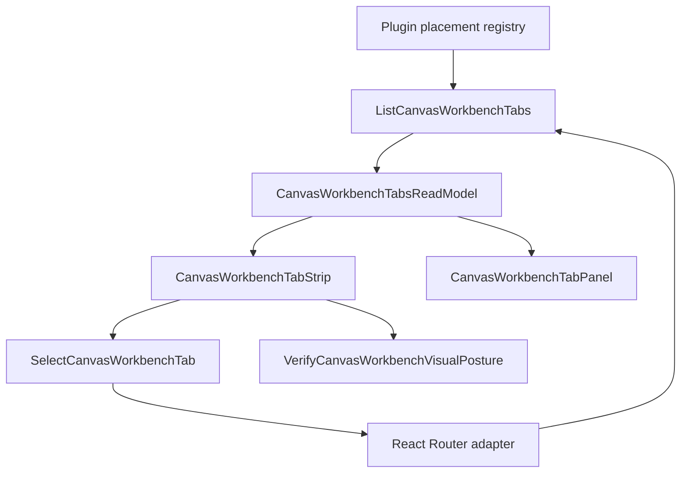
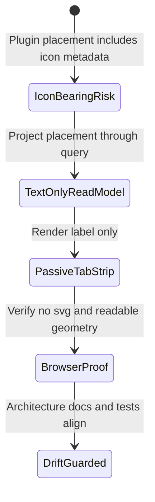
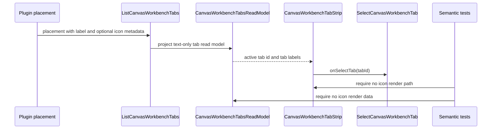

# Canvas Workbench Stage 1 Text Only Tabs Fowler Review

## Scope

This mailbox records the Fowler/DDD review for the Stage 1 Canvas workbench
tab change merged through the `codex/f28-stage1-tabs` branch.

It covers:

- the text-only Canvas workbench tab read model;
- the passive `CanvasWorkbenchTabStrip` renderer;
- browser proof for readable route-local tabs;
- documentation drift introduced by the new Stage 1 posture;
- future component grouping and semantic encapsulation guidance.

It does not cover Save, Export, Import, protected draft authority, backend
contracts, adapter changes, RBAC, or multi-canvas persistence.

## Governing Sources

- `AGENTS.md`
- `docs/planning/status/governance-document-rule-inventory.md`
- `docs/guides/ai-work-protocol.md`
- `docs/architecture/command-query-rail-governance.md`
- `docs/architecture/fowler-opportunity-planning-governance.md`
- `docs/architecture/components/web/graph/canvas-workbench-command-query-catalog.md`
- `docs/architecture/components/web/graph/canvas-workbench-tabs-component.md`
- `docs/architecture/components/web/graph/canvas-workbench-tabs-user-stories.md`
- `docs/planning/proposals/mandatory/frontend-and-ux/canvas-workbench-shell-save-export-sequence-plan-20260505.md`
- `docs/planning/proposals/mandatory/frontend-and-ux/canvas-workbench-stage-1-chrome-simplification-implementation-plan-20260506.md`

## Mature-System Comparison

Mature workbench systems separate visual placement from product authority.
Route-local view tabs are not global navigation, and presentation renderers do
not decide what a capability means. They receive an intention-revealing read
model, render it passively, and let a command or router adapter own selection.

The Stage 1 tab work now follows that mature posture more closely:

- `ListCanvasWorkbenchTabs` returns a Canvas-owned presentation read model.
- `CanvasWorkbenchTabsReadModel` carries tab identity, label, route target,
  enabled state, scope, and active state.
- `CanvasWorkbenchTabStrip` renders the read model without plugin icon data.
- `SelectCanvasWorkbenchTab` remains the command intent for route selection.
- `VerifyCanvasWorkbenchVisualPosture` names Cypress as a verification query
  instead of letting screenshot confidence stand in for architecture.

The remaining maturity gap is semantic encapsulation in docs and guards. The
code can stay correct while the local guide, user stories, and architecture
tests fail to describe the specific text-only component boundary.

## Patterns Improved

- Presentation Model: plugin placement is projected into a route-owned read
  model before React rendering.
- Command Query Separation: selection remains a command and tab listing remains
  a query.
- Passive View: `CanvasWorkbenchTabStrip` renders `tabsState` and delegates tab
  intent through `onSelectTab`.
- Semantic Fitness Function: Cypress checks DOM semantics, geometry, and
  absence of SVG icons rather than relying on a screenshot.
- Replace visual primitive leakage: plugin `icon` metadata no longer becomes
  tab-strip render data.

## Antipatterns Detected

- Boundary drift: plugin placement metadata previously leaked visual posture
  into the route tab strip.
- Primitive visual confidence: a passing route-flow test did not prove the
  text-only invariant.
- Documentation drift: the generic component guide had text-only notes, but no
  local `TabStrip` API guide with invariants, transitions, and consumers.
- Test-only thinness: the architecture test checked source strings but did not
  require the specific component guide or owned-concern headers for the Cypress
  verifier and tab tests.
- Duplicate explanation: Stage 1 scope, the component guide, and user stories
  described readability in overlapping terms without a local component anchor.

## Component Grouping



Component homes:

- `canvasWorkbenchTabs.ts` owns read-model projection.
- `CanvasWorkbenchTabStrip.tsx` owns passive tab-list rendering.
- `CanvasWorkbenchTabPanel.tsx` owns active tab component rendering and
  unavailable recovery.
- `canvasWorkbenchRouteState.ts` owns route parsing and tab selection command
  results.
- `canvas-workbench-tabs.cy.ts` owns browser visual-posture verification.
- `canvas-workbench-tab-strip-component.md` should own the local renderer API,
  invariants, transitions, and consumers.

## Repetitions

Fixed by the Stage 1 branch:

- icon semantics no longer repeat across plugin placement and tab render data;
- route-local tab labels no longer repeat shell navigation visual semantics;
- Cypress now reuses helper assertions for visibility, header scope, and
  text-only posture.

Still being fixed by this follow-up:

- component documentation needs one local guide for the tab strip renderer;
- user stories need Stage 1 text-only scenarios, not only tab placement
  stories;
- architecture tests need to validate semantic docs and owned concerns, not
  only a thin barrel or source-string absence.

## Opportunities

- Add a local `CanvasWorkbenchTabStrip` component guide and link it from the
  broader workbench tabs component guide.
- Add Stage 1 user stories for text-only tabs, no SVG/icon leakage, browser
  proof, and future plugin icon isolation.
- Require owned-concern docblocks for the Cypress verifier and local tab tests.
- Keep future Save and Export work out of this component until their rails own
  persistence or project I/O authority.
- If more Cypress specs need tab geometry, consider a support-layer
  `CanvasWorkbenchVisualPostureReadModel` helper. Do not extract it until
  repeated specs make that duplication real.

## Code And Documentation Drift

Observed drift:

- code now renders text-only tabs, but no component-specific guide explains
  the renderer boundary;
- the generic component guide links the older 2026-05-04 mailbox but not the
  Stage 1 text-only review;
- local user stories stop at readable labels and do not name the no-icon
  invariant as its own acceptance scenario;
- test modules participating in the proof do not all declare their owned
  concerns at the top of the module.

Remediation:

- add a new local `CanvasWorkbenchTabStrip` guide with public API, invariants,
  transitions, consumers, and diagrams;
- update the workbench tabs component guide to link the guide and this mailbox;
- update local user stories with Stage 1 text-only scenarios;
- add a semantic architecture guard for the new guide, stories, mailbox link,
  and owned-concern headers;
- keep code changes limited to documentation headers and tests unless the red
  guard exposes a true implementation mismatch.

## Applied Patterns

The selected response is a docs-and-test hardening slice:

1. Presentation Model remains the core pattern for
   `CanvasWorkbenchTabsReadModel`.
2. Passive View remains the core pattern for `CanvasWorkbenchTabStrip`.
3. Semantic Fitness Function becomes the guard pattern for the architecture
   test and Cypress proof.
4. Component guide as local public contract removes semantic encapsulation
   drift.

## Stage 1 Transition



## Sequence



## Teachings For Future Work

- A visual simplification can still be an architecture change when it changes
  which layer owns presentation authority.
- Text-only is not a CSS preference here; it is a read-model invariant.
- Cypress visual posture should have a named read-model concern when it guards
  product architecture.
- Component guides should be local enough that a reviewer can inspect public
  API, invariants, transitions, and consumers without reading the whole
  planning proposal.
- Future Save, Export, Import, and workspace context work must reuse their
  command/query rails instead of borrowing tab-strip placement as a shortcut.

## ADR Decision

No new ADR is required for this follow-up.

Reason:

- no contract, adapter, engine, planner, protected draft, persistence, or
  project I/O boundary changes are introduced;
- the work remains local to accepted Canvas workbench presentation rails;
- the normative decision already lives in the Stage 1 plan, command/query rail
  governance, Fowler planning governance, and component docs.

An ADR should be revisited if a later slice changes Save, Export, Import,
protected draft authority, project snapshot format, or cross-package contracts.

## Validation Plan

Required closeout commands:

```bash
pnpm --filter @dvt/web test -- src/app/views/canvas/canvasWorkbenchTabs.architecture.test.ts
pnpm --filter @dvt/web test -- src/app/views/canvas/canvasWorkbenchTabs.test.ts src/app/views/canvas/canvasWorkbenchTabs.architecture.test.ts
pnpm --filter @dvt/web test:e2e:native -- --spec cypress/e2e/canvas/canvas-workbench-tabs.cy.ts
pnpm docs:sync
pnpm docs:feature-mechanization:implementation
pnpm lint:md:changed
pnpm --filter @dvt/web typecheck
pnpm closeout:changed
pnpm verify:prepush
```
