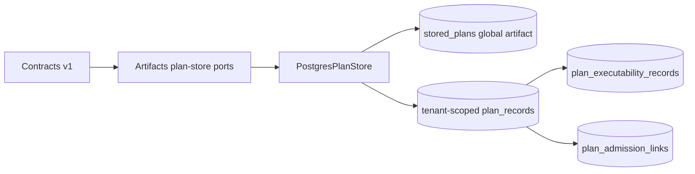
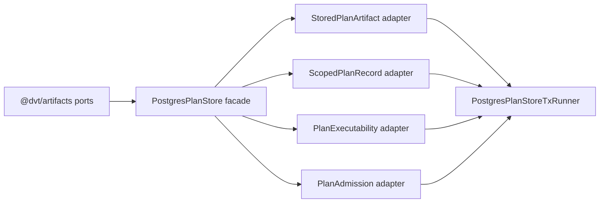

# Fowler Plan Store Scoped Records Analysis And Remediation

## Fowler Architecture Analysis

The branch improved the plan-store read model by moving planning/governance
query surfaces toward Postgres, but the plan-store record model still carried a
Fowler "anemic integration boundary" smell: ports accepted a naked `planId`
even though the domain language says persisted run and plan evidence is
tenant-owned. The core correction is to make `PlanStoreScope` part of every
tenant-owned record command and query.

The mature pattern is a Repository plus Gateway split:

- immutable plan blobs keep content identity in `stored_plans`
- tenant-owned records use `PlanStoreScope + planId`
- ports carry the full identity tuple
- adapters enforce the same tuple in primary keys and foreign keys

## Mature-System Comparison

Mature multi-tenant systems rarely use a globally unique content hash as the
only business key for tenant-owned state. They keep content-addressed blobs as
deduplicated artifacts, then project ownership and lifecycle into scoped
records. This is the same split used by artifact registries, package indexes,
and data-catalog read models: blob identity is global, business use is scoped.

## Improved Patterns

- Explicit Value Object: `PlanStoreScope`.
- Scoped Repository API: `ScopedPlanId` and `ScopedPlanRef`.
- Aggregate consistency: plan record, executability, and admission link share
  the same scope tuple.
- Database-level invariant: composite primary keys and composite foreign keys.
- Semantic architecture guard: test validates ownership semantics, not only
  barrel thinness.

## Antipatterns Detected

- Naked ID crossing bounded contexts: `getPlanRecord(planId)`.
- False global aggregate: `plan_records(plan_id primary key)`.
- Contract drift: docs described `PlanRecord.v1` without ownership while code
  had begun adding ownership.
- Fixture drift: test fixtures were named V2 while the governed contract is v1.
- Generated-status overconfidence: drift was not a content-hash issue; it was
  a semantic ownership issue.

## Component Grouping

The work groups into one component with four owned surfaces:

- Contract shapes: `PlanRecord`, `PlanExecutabilityRecord`,
  `PlanAdmissionLink`, `PlanStoreScope`, `ScopedPlanId`.
- Validation pack: schema and canonical ownership checks.
- Artifacts ports: scoped command/query APIs plus the canonical stored-plan
  artifact reader/writer/store port.
- Postgres adapter: scoped repository and table invariants.

## Repetitions

Repeated naked `planId` parameters appeared in ports, Postgres repository
methods, tests, and API evidence reads. The fix is a single scoped input object
instead of repeated positional arguments.

## Drift

Code drift:

- records were tenant-owned in intent but global in port signatures and SQL
- lifecycle blob storage and record storage were mixed in one adapter facade
- stored-plan artifact ports were duplicated across planner, API, and engine
  instead of owned once by the Artifacts bounded context
- V2 fixture names contradicted `ExecutionPlan.v1`

Documentation drift:

- ADR-0043 named the three-part record model but did not require scoped record
  identity
- `plan-store-records-v1.md` did not list scope fields
- no local component guide existed for API, invariants, transitions, and
  consumers

## Future Lessons

- Every tenant-owned read model needs a first-class scope value object before
  SQL or adapter work starts.
- A content hash is not an authorization boundary.
- Architecture tests should check semantic API shapes, not only exports.
- Test fixture names are architecture signals; wrong names create false mental
  models.

## Opportunities

- Keep semantic port ownership enforced by architecture tests whenever a
  component boundary crosses API, engine, planner, and artifacts.
- Add migration tooling for existing unscoped local schemas if a retained local
  database must be upgraded in place.
- Add query-store views that expose scoped plan-record status by tenant,
  project, environment, plan, adapter, and run.

## Applied Fixes

- Renamed ExecutionPlan fixture surfaces from V2 to V1.
- Added `PlanStoreScope` and `ScopedPlanId`.
- Scoped artifacts command/query ports.
- Scoped Postgres plan-record, executability, and admission tables.
- Added red architecture coverage for documentation, module ownership, ports,
  and SQL invariants.
- Moved stored-plan artifact lifecycle and materialization to
  `IStoredPlanArtifactStore` in `@dvt/artifacts`; API, planner, and engine
  duplicates were removed.

## Second Fowler Pass

### What improved against mature systems

The branch now looks closer to mature artifact registries and multi-tenant data
catalogs: immutable content identity stays global, while tenant-owned lifecycle
state is modeled as scoped records. The improved pattern is not only stronger
SQL; it is the same semantic object (`ScopedPlanId` or `ScopedPlanRef`) carried
from contracts to ports, adapters, API services, engine integrity validation,
tests, and documentation.

### Remaining antipatterns

- `PostgresPlanStore` still implements three canonical ports in one class. This
  is acceptable as a composition facade today, but it can become a God Adapter
  if command, read-model, and artifact-materialization code keep growing.
- `stored_plans.validation_state` remains as artifact-lifecycle state. It is no
  longer a tenant-owned record authority, but a future slice should decide
  whether validation state belongs only to executability records.
- Shared hashing/canonicalization utilities still appear in multiple bounded
  contexts. This is outside the scoped plan-store slice, but it remains a
  shared-kernel cleanup opportunity.

### Components to group next

If the adapter grows again, split by port role:

- artifact lifecycle/materialization adapter for `IStoredPlanArtifactStore`;
- record write adapter for `IPlanStoreWriter`;
- read-model adapter for `IPlanStoreReader`;
- shared transaction/schema composition kept behind the composer.

### Drift fixed in this pass

- Added explicit command/query API tables to the local component guide.
- Mapped user stories to `PS-Cxx` and `PS-Qxx` rails so stories are not generic
  requirements prose.
- Added owned-concern module comments to active Postgres plan-store modules.
- Updated the operations inventory so it no longer lists unscoped plan-store
  port signatures as the current state.
- Strengthened the architecture test to validate semantic documentation,
  owned-concern comments, current API signatures, and status-doc alignment.

### Lessons for future slices

- A status inventory must be updated in the same slice as the code. Otherwise it
  becomes an attractive nuisance for the next agent.
- A barrel-thinness test is not enough. The useful guard names the semantic API
  shape, expected owner, current documentation, and retired signatures.
- Component docs should include public API, invariants, transitions, consumers,
  and diagrams before implementation is called complete.
