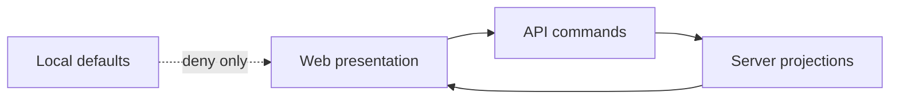

# Fowler Analysis - Web API Authority Hardcut

## Scope

This analysis covers the branch work that follows the web/API mock runtime
hardcut: local web authorization defaults, runtime capabilities fallback, and
plugin registry readiness projection.

## Fowler Architecture Analysis

Mature systems keep a hard separation between presentation state and authority.
The current web system has strong API-backed rails for session, workspace
context, plans, runs, graph drafts, and file reads. The weaker seam is not
transport anymore; it is authority interpretation inside the browser.

The Fowler move is Replace Implicit Authority With Explicit Projection:

- local stores cache projections;
- API read models own authority;
- static declarations describe composition only;
- missing or failed backend projections fail closed for execution.

## Mature-System Comparison

| Mature-system trait                     | Current branch posture                                                  | Remediation                                            |
| --------------------------------------- | ----------------------------------------------------------------------- | ------------------------------------------------------ |
| Policy enforcement point is server-side | API routes enforce, but UI default permissions are optimistic           | Default web permissions deny.                          |
| Capability discovery is explicit        | `/capabilities` exists, but network failure can fabricate local payload | Capability network failures reject.                    |
| Plugin execution is backend-confirmed   | Static registry can treat missing backend rows as available             | Backend-backed plugins require explicit available row. |
| Test doubles are visible                | Mock runtime moved to `apps/web/src/testing`                            | Keep explicit test grants and test-only doubles.       |

## Pattern Improvements

- API-only web composition remains intact from the previous hardcut.
- Plugin registry becomes a projection over static declarations plus backend
  capability read models.
- Authorization store becomes a server-projected cache instead of a default
  allow-list.
- Architecture tests validate semantic invariants, not only import thinness.

## Antipatterns Detected

- Hidden Authority: default permissions grant executable actions.
- Fail Open: missing backend plugin rows are interpreted as available.
- Parallel Model: static plugin declarations can compete with backend
  readiness.
- Primitive Obsession: `frontend-local` capability payload hides whether the
  backend failed.

## Component Grouping

The work belongs to one component:
`docs/architecture/components/web/workspace/web-api-authority-hardcut-component.md`.

Code groups:

- Authorization projection: `apps/web/src/app/stores/authorizationStore.ts`
- Runtime capabilities query adapter:
  `apps/web/src/app/services/capabilities/capabilitiesPort.ts`
- Plugin projection:
  `apps/web/src/app/plugins/registry.ts`
- Plugin inspection presentation:
  `apps/web/src/app/views/PluginsView.tsx`
- Semantic guard:
  `apps/web/src/app/services/composition/appServicesAuthorityHardcut.architecture.test.ts`

## Repetitions

- Permission fixtures repeat the same five booleans across Canvas and admin
  tests.
- Plugin readiness logic repeats the distinction between backend missing,
  backend unavailable, and backend available in registry and view code.
- Capability fallback wording is split between bootstrap and plugin inspection.

The current slice fixes the authority behavior first. A later cleanup can
extract shared test permission builders and plugin readiness helpers if the
duplication grows after this hardcut.

## Opportunities

- Add a backend authorization read model for web command enablement.
- Add typed shared contracts for `/capabilities`.
- Add a backend plugin manifest query if static registry and backend plugin
  discovery need to converge.
- Move admin roles/audit and diff read models behind real API rails.

## Drift Review

Code drift:

- `authorizationStore` names authorization but defaulted to allow.
- `createCapabilitiesPort` hid network failure behind local shell data.
- `registry.ts` treated missing backend plugin rows as available.

Documentation drift:

- The web/API gap review already names this drift, but no dedicated component
  doc existed for authority projection.
- The previous hardcut docs focused on mock runtime removal, not authority
  projection.

## Future Lessons

- A frontend fallback must be classified as presentation fallback or authority
  projection. If it can enable execution, it must fail closed.
- A static contribution registry is not a backend capability registry.
- Test doubles should grant permissions explicitly; product defaults should
  stay denied.

## ADR Decision

ADR-0056 is needed because this slice turns a review finding into an accepted
system rule: web UI authority must be server-projected and fail closed when the
projection is absent.
