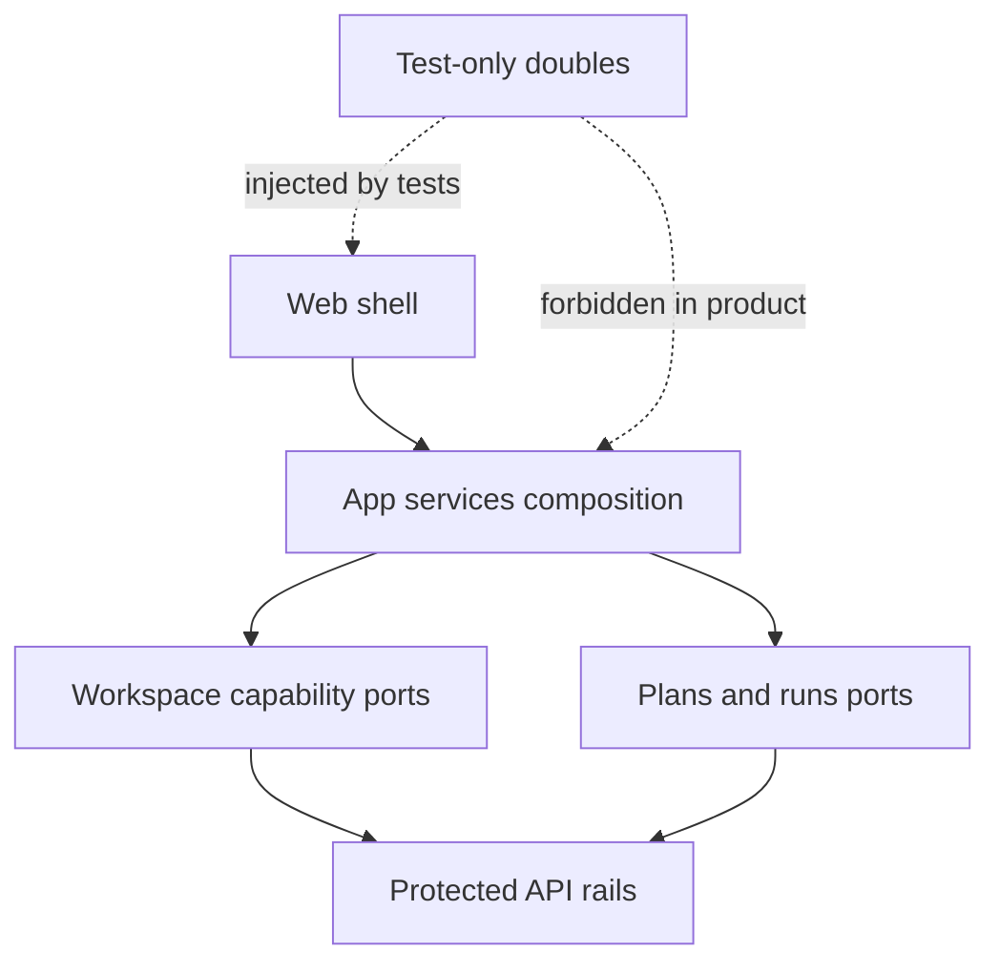
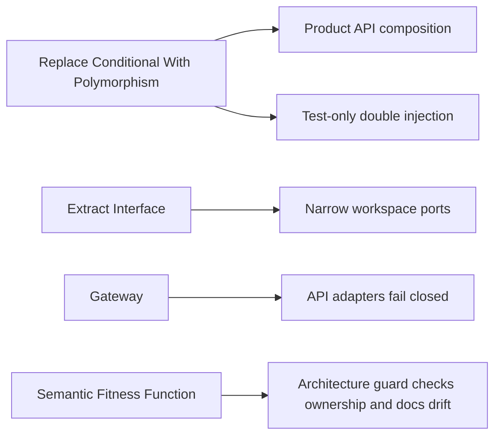

# Fowler Review: Web API Mock Runtime Hardcut

Date: 2026-05-10
Branch context: `codex/web-api-mock-hardcut`
Scope: `apps/web/src`, web architecture docs, hardcut tests, and web/API integration review.

## Executive Finding

The branch improves the web architecture by moving product runtime composition
from a parallel mock/API model to an API-only composition root with explicit
test-only doubles. Compared with mature systems, this is the right direction:
production code now has one source of backend truth, while fixtures are
confined to test harnesses.

The main residual risk is not the hardcut itself. It is the next boundary:
some web capabilities still wait for backend command/query rails, and the UI
still has local authorization, plugin, cost, lineage, and artifact decisions
that should become server-published read models or stay presentation-only.

## Improved Patterns

- Replaced Hidden Authority: product web composition no longer creates runs,
  plans, audit entries, workspace graph changes, or warehouse imports from
  fixture-backed services.
- Replaced Parallel Model: API adapters are the only product app-service
  composition path; test doubles live under `apps/web/src/testing`.
- Extracted Interface by capability: the old broad workspace shape was split
  into graph, files, diff, plugin catalog, admin read, warehouse import, and
  file-write ports.
- Applied Gateway per rail: missing backend rails fail closed at the port
  boundary rather than calling invented routes.
- Added Semantic Fitness Function: architecture tests now guard ownership
  docblocks and documentation vocabulary, not only import thinness.

## Antipatterns Detected

- Parallel Model, now reduced: previous service composition allowed both API
  and fixture-backed runtime authority.
- God Port, now reduced: the former broad workspace service mixed unrelated
  query and command responsibilities.
- Primitive Obsession, now reduced: runtime meaning was carried by a mode
  string instead of by product/test composition boundaries.
- Documentation Drift, now guarded: docs still used retired fixture/runtime
  vocabulary after the code had become API-only.
- Remaining Browser Authority: authorization, plugin readiness, cost posture,
  lineage interpretation, and local artifact import still need explicit
  backend rails or presentation-only containment.

## Mature-System Comparison

| Concern                    | Mature system posture                    | Current branch posture                                | Gap      |
| -------------------------- | ---------------------------------------- | ----------------------------------------------------- | -------- |
| Runtime composition        | One product composition path             | API-only product path                                 | Good     |
| Test data                  | Test harness only                        | Test-only doubles under `apps/web/src/testing`        | Good     |
| Missing backend capability | Fail closed and visible                  | Workspace ports fail closed                           | Good     |
| Authorization              | Server read model plus route enforcement | Route enforcement exists; UI store remains optimistic | Remains  |
| Capability registry        | Backend-published manifest               | Mixed backend capability and static registry          | Remains  |
| Documentation fitness      | Automated drift checks                   | Hardcut docs guarded by architecture test             | Improved |

## Component Grouping Opportunities

Recommended component boundaries:

- Web API Composition Root: `buildAppServices`, `AppServicesProvider`,
  `DataSourceMode`, and protected route startup.
- Workspace Capability Ports: graph snapshot, files, diff, plugin catalog,
  admin read, source import, file write.
- Plans/Runs API Ports: plan preview/import and run list/detail/events/start.
- Test Double Harness: app-service overrides and fixture-backed doubles.
- Web Authority Read Models: future backend-published authorization,
  capabilities, plugin readiness, cost, and lineage views.

## Drift Fixed In This Slice

- Hardcut docs now describe fixture behavior as test-only, not product
  runtime posture.
- The web/API review no longer instructs future workers to keep missing
  capabilities behind local runtime semantics.
- `dataSource.ts`, `plansService.ts`, the hardcut architecture test, and the
  affected test doubles now declare their owned concern at the module boundary.
- The hardcut guard now validates semantic ownership and docs vocabulary.

## Drift Still To Address

- The UI still has optimistic authorization state. Commands are API-enforced,
  but action availability can be shown as enabled before server evidence.
- Static plugin registry composition can imply readiness unless backend
  capability evidence denies or confirms execution.
- Cost and lineage are still largely browser-derived read models.
- Artifact import has local parsing behavior that needs either a backend rail
  or explicit local-inspection containment.

## Patterns Applied

## Future Lessons

- Do not keep fixture language in product architecture docs after a hardcut.
- A port split is not complete until every port states ownership, invariants,
  transitions, consumers, and negative tests.
- Architecture tests should guard semantic intent: ownership, product/test
  separation, unavailable rails, and doc vocabulary.
- Missing rails should be named explicitly and fail closed; they should not be
  filled by browser-local behavior.
- Commit reviews should look for the pair: code boundary and documentation
  boundary. If only one changes, drift is likely.

## User Stories Added Or Reinforced

- Product route startup resolves API session and workspace context.
- Missing backend rails return unavailable rather than fixture truth.
- Tests inject doubles explicitly.
- Product composition rejects test-double imports.
- Hardcut modules declare `Owned concern:`.
- Hardcut docs reject retired runtime vocabulary.
- Fixture-backed data remains outside product composition.

## ADR Decision

No new ADR is required for this slice. The change implements the existing
web/API hardcut plan, command/query rail governance, and Fowler opportunity
planning rule. A new ADR would be justified only if the next slice changes the
authority model for authorization, plugin readiness, cost, lineage, or artifact
ingestion.
